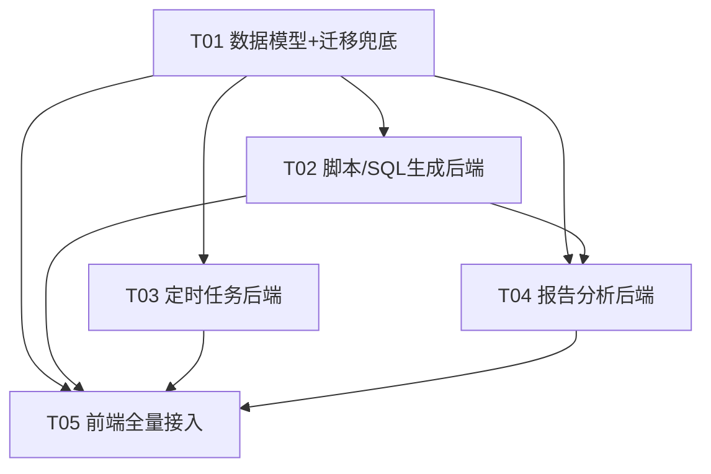

# AI 接口自动化测试平台 — 能力 5-9 系统架构设计 + 任务分解

| 项目 | 内容 |
|------|------|
| 作者 | 高见远（架构师） |
| 版本 | v1.0 |
| 日期 | 2025-07-17 |
| 语言 | 中文 |
| 关联能力 | 能力5（前置脚本）· 能力6（后置脚本）· 能力7（SQL 脚本）· 能力8（定时任务）· 能力9（测试报告分析） |
| 上游依赖 | `docs/cap59-prd.md`（许清楚 v1.0） |

---

## 第一部分：系统设计（Part A）

### 1. 实现方案 + 框架选型

#### 1.1 核心难点与总体思路

能力 5-9 的共同点是「自然语言 → 结构化产出 → 持久化/调度/分析」，均复用现有的 `ModelRouter` 多插槽路由 + `UnifiedModelClient` 统一客户端。每个能力的难点与选型如下：

| 能力 | 核心难点 | 框架/方案选型 | 理由 |
|------|---------|--------------|------|
| 5/6 脚本生成 | 自然语言 → Python 代码；上下文注入；安全边界 | 复用 `script_generation` 插槽 + 现有 `ModelRouter.call`；MVP **不做沙箱执行**（仅生成 + 预览 + 语法校验 `ast.parse`） | PRD 明确 MVP 不执行；`ast.parse` 零依赖做语法校验，避免引入 RestrictedPython/Docker 沙箱的复杂度 |
| 7 SQL 生成 | 表结构感知；密码加密；SQL 安全白名单 | 复用 `crypto.encrypt/decrypt`（Fernet/AES-256）存库密码；用 `sqlglot` 做 SQL 语法解析 + 语句类型提取；白名单基于解析出的语句类型（SELECT/INSERT/UPDATE/DELETE） | `sqlglot` 是纯 Python 的 SQL 解析器，比正则更可靠；白名单默认四种 DML，支持项目级扩展 |
| 8 定时任务 | NL → Cron；动态调度；执行历史 | NL → Cron 用**规则解析 + LLM 辅助**（不新增模型插槽，PRD 明确）；动态调度用 `django-celery-beat` 的 `DatabaseScheduler`（存 PostgreSQL） | DatabaseScheduler 通过数据库表动态增删定时任务，避免改代码重启；符合 PRD Q4 建议 |
| 9 报告分析 | 失败分析/摘要/对比三类场景；上下文组装 | 复用 `report_analysis` 插槽；从 `test_results`/`test_reports` 读取数据组装 prompt；分析结果落 `ai_analysis_results` 表 + 回写 `test_reports.report_data.ai_summary` | 与现有报告生成链路解耦，分析结果可追溯、可复现 |

#### 1.2 架构模式

沿用现有 **分层架构**（API 路由层 → 业务模块层 → 数据模型层），与能力 1-4 保持一致：

- **API 层**：`app/api/*.py`，router 不带 prefix，由 `main.py` 统一注册。
- **业务模块层**：`app/modules/<能力>/`，封装 prompt 构造 + LLM 调用 + 降级兜底逻辑。
- **Schema 层**：`app/schemas/*.py`，Pydantic 请求/响应模型。
- **数据模型层**：`app/models/database.py`，SQLAlchemy 模型 + 枚举 + 幂等迁移兜底。

关键约束（必须遵守）：
- 新枚举必须 `SAEnum(SomeEnum, name="<小写唯一名>")` 显式指定 name。
- 新路由不设 prefix，由 main.py 统一 `include_router(..., prefix="/api/xxx")`。
- 模型插槽在 **7 处**同步扩展（见 7.3 共享知识）。
- 旧库迁移用 `ALTER TABLE ... ADD COLUMN IF NOT EXISTS` + `AUTOCOMMIT` + `try/except`。

---

### 2. 文件列表及相对路径

#### 2.1 后端新增文件

```
backend/app/modules/script_gen/__init__.py          # 脚本生成业务模块（能力5/6）
backend/app/modules/script_gen/script_generator.py   # pre/post/sql 脚本生成 + prompt + 降级
backend/app/modules/sql_gen/__init__.py              # SQL 生成业务模块（能力7）
backend/app/modules/sql_gen/sql_generator.py         # 表结构感知 SQL 生成
backend/app/modules/sql_gen/sql_security.py          # SQL 白名单校验（sqlglot）
backend/app/modules/scheduler/__init__.py            # 定时任务业务模块（能力8）
backend/app/modules/scheduler/cron_parser.py         # NL → Cron（规则 + LLM 辅助）
backend/app/modules/scheduler/scheduler_service.py   # 任务 CRUD + beat 同步
backend/app/modules/report_analysis/__init__.py      # 报告分析业务模块（能力9）
backend/app/modules/report_analysis/analyzer.py      # 失败分析/摘要/对比
backend/app/api/scripts.py                           # /api/scripts 路由（统一脚本入口）
backend/app/api/databases.py                         # /api/databases 路由（数据库连接管理）
backend/app/api/scheduled_tasks.py                   # /api/scheduled-tasks 路由
backend/app/api/report_analysis.py                   # /api/reports/{id}/ai-analysis + /api/results/{id}/...
backend/app/schemas/script.py                        # 脚本生成请求/响应 Schema
backend/app/schemas/database_conn.py                 # 数据库连接 Schema
backend/app/schemas/scheduled_task.py                # 定时任务 Schema
backend/app/schemas/report_analysis.py               # 报告分析 Schema
```

#### 2.2 后端修改文件

```
backend/app/models/database.py         # 新增枚举 + 3 个新表 + 扩展 TestCaseAsset/ModelRouting + 迁移兜底
backend/app/modules/ai/model_router.py # 新增 3 个插槽路由映射 + use_cases
backend/app/modules/ai/model_config.py # ModelRoutingConfig 新增 3 字段
backend/app/api/model_config.py        # ROUTING_FIELDS + UpdateRoutingRequest 新增 3 字段
backend/app/main.py                    # 注册 4 个新路由
backend/app/celery_app.py              # include 新模块 + beat 配置
backend/app/config.py                  # 可选：SQL 白名单默认项 / beat 开关（可放 Settings）
backend/requirements.txt               # 新增 sqlglot / django-celery-beat
```

#### 2.3 前端新增文件

```
frontend/src/views/ScriptPanel.vue        # 脚本生成面板（复用组件，能力5/6/7）
frontend/src/views/DatabaseManage.vue     # 数据库连接管理（能力7）
frontend/src/views/ScheduledTasks.vue     # 定时任务管理（能力8）
frontend/src/views/ReportAnalysis.vue     # 报告 AI 分析（能力9，可嵌入 Report.vue）
```

#### 2.4 前端修改文件

```
frontend/src/api/index.ts        # 新增 scriptsApi / databaseApi / scheduledTaskApi / reportAnalysisApi
frontend/src/router/index.ts     # 新增 /database-manage、/scheduled-tasks、/report-analysis 路由
frontend/src/components/Layout.vue  # 新增侧边栏菜单项
frontend/src/views/ModelConfig.vue  # useCaseLabels + routingFields 新增 3 项
frontend/src/views/CaseLibrary.vue  # 用例详情新增「生成脚本」入口（可选）
frontend/src/views/Report.vue       # 报告页嵌入 AI 摘要 / 失败分析入口（可选）
```

---

### 3. 数据结构和接口

#### 3.1 新增枚举

```python
class ScriptType(PyEnum):
    """脚本类型 — 统一脚本生成入口的 type 参数"""
    PRE_SCRIPT = "pre_script"
    POST_SCRIPT = "post_script"
    SQL_SCRIPT = "sql_script"

class ScheduledTaskStatus(PyEnum):
    """定时任务状态"""
    ACTIVE = "active"
    PAUSED = "paused"
    DELETED = "deleted"

class ScheduledTaskTargetType(PyEnum):
    """定时任务关联对象类型"""
    SCENARIO = "scenario"
    CASE_COLLECTION = "case_collection"

class AnalysisType(PyEnum):
    """AI 分析类型（能力9）"""
    FAILURE = "failure"          # 单用例失败分析
    REPORT_SUMMARY = "report_summary"  # 报告摘要
    COMPARE = "compare"          # 两次执行对比
```

#### 3.2 新增数据模型

```python
class ScriptGenerationRecord(Base):
    """脚本生成记录（审计） — 能力5/6/7"""
    __tablename__ = "script_generation_records"
    id = Column(UUID(as_uuid=True), primary_key=True, default=uuid.uuid4)
    project_id = Column(UUID(as_uuid=True), ForeignKey("projects.id"), nullable=False)
    user_id = Column(UUID(as_uuid=True), ForeignKey("users.id"), nullable=True)
    script_type = Column(SAEnum(ScriptType, name="scripttype"), nullable=False)
    nl_input = Column(Text, nullable=False)
    context = Column(JSONB, default={})
    generated_script = Column(Text, nullable=False)
    model_used = Column(String(64), nullable=True)
    created_at = Column(DateTime, default=datetime.utcnow)
    # Index: (project_id, created_at), (script_type)

class DatabaseConnection(Base):
    """数据库连接配置 — 能力7（密码加密存储）"""
    __tablename__ = "database_connections"
    id = Column(UUID(as_uuid=True), primary_key=True, default=uuid.uuid4)
    project_id = Column(UUID(as_uuid=True), ForeignKey("projects.id"), nullable=False)
    name = Column(String(200), nullable=False)
    db_type = Column(String(20), default="postgresql")  # postgresql / mysql / ...
    host = Column(String(255), nullable=False)
    port = Column(Integer, nullable=False)
    database = Column(String(200), nullable=False)
    username = Column(String(200), nullable=False)
    password_encrypted = Column(Text, nullable=False)  # AES-256 加密
    extra_config = Column(JSONB, default={})  # sslmode 等
    created_by = Column(UUID(as_uuid=True), ForeignKey("users.id"), nullable=True)
    created_at = Column(DateTime, default=datetime.utcnow)
    updated_at = Column(DateTime, default=datetime.utcnow, onupdate=datetime.utcnow)
    # Index: (project_id)

class ScheduledTask(Base):
    """定时任务 — 能力8"""
    __tablename__ = "scheduled_tasks"
    id = Column(UUID(as_uuid=True), primary_key=True, default=uuid.uuid4)
    project_id = Column(UUID(as_uuid=True), ForeignKey("projects.id"), nullable=False)
    name = Column(String(200), nullable=False)
    description = Column(Text)
    nl_schedule = Column(Text)                          # 原始自然语言
    cron_expression = Column(String(100), nullable=False)  # 解析后的 cron
    target_type = Column(SAEnum(ScheduledTaskTargetType, name="scheduledtasktargettype"), nullable=False)
    target_id = Column(UUID(as_uuid=True), nullable=True)  # scenario id 或 case_collection 虚拟 id
    target_config = Column(JSONB, default={})            # 用例 ID 列表等
    env_config = Column(JSONB, default={})               # 执行环境
    status = Column(SAEnum(ScheduledTaskStatus, name="scheduledtaskstatus"), default=ScheduledTaskStatus.ACTIVE, nullable=False)
    last_run_at = Column(DateTime)
    last_run_status = Column(String(20))
    next_run_at = Column(DateTime)
    created_by = Column(UUID(as_uuid=True), ForeignKey("users.id"), nullable=True)
    created_at = Column(DateTime, default=datetime.utcnow)
    updated_at = Column(DateTime, default=datetime.utcnow, onupdate=datetime.utcnow)
    # Index: (project_id, status)

class ScheduledTaskRun(Base):
    """定时任务执行历史 — 能力8"""
    __tablename__ = "scheduled_task_runs"
    id = Column(UUID(as_uuid=True), primary_key=True, default=uuid.uuid4)
    task_id = Column(UUID(as_uuid=True), ForeignKey("scheduled_tasks.id"), nullable=False)
    status = Column(String(20), nullable=False)  # running / success / failed
    test_run_id = Column(UUID(as_uuid=True), ForeignKey("test_runs.id"), nullable=True)
    started_at = Column(DateTime, default=datetime.utcnow)
    finished_at = Column(DateTime)
    error_message = Column(Text)
    # Index: (task_id, started_at)

class AIAnalysisResult(Base):
    """AI 分析结果 — 能力9（失败分析/摘要/对比统一落库）"""
    __tablename__ = "ai_analysis_results"
    id = Column(UUID(as_uuid=True), primary_key=True, default=uuid.uuid4)
    project_id = Column(UUID(as_uuid=True), ForeignKey("projects.id"), nullable=False)
    analysis_type = Column(SAEnum(AnalysisType, name="analysistype"), nullable=False)
    test_run_id = Column(UUID(as_uuid=True), ForeignKey("test_runs.id"), nullable=True)
    test_result_id = Column(UUID(as_uuid=True), ForeignKey("test_results.id"), nullable=True)
    input_summary = Column(JSONB, default={})    # 送入 LLM 的上下文摘要
    analysis_json = Column(JSONB, default={})    # LLM 结构化输出
    model_used = Column(String(64), nullable=True)
    created_by = Column(UUID(as_uuid=True), ForeignKey("users.id"), nullable=True)
    created_at = Column(DateTime, default=datetime.utcnow)
    # Index: (project_id, analysis_type, created_at), (test_result_id)
```

#### 3.3 现有表扩展

```python
# TestCaseAsset 新增三列（nullable=True）
pre_script = Column(Text, nullable=True)    # 能力5
post_script = Column(Text, nullable=True)   # 能力6
sql_script = Column(Text, nullable=True)    # 能力7

# ModelRouting 新增三列（nullable=True，运行时降级）
script_generation_model_id = Column(String(64), ForeignKey("ai_model_configs.id"), nullable=True)
sql_generation_model_id = Column(String(64), ForeignKey("ai_model_configs.id"), nullable=True)
report_analysis_model_id = Column(String(64), ForeignKey("ai_model_configs.id"), nullable=True)
```

#### 3.4 Pydantic Schema

```python
# app/schemas/script.py
class GenerateScriptRequest(BaseModel):
    project_id: str
    script_type: str            # pre_script / post_script / sql_script
    nl_input: str
    context: dict = {}          # 接口信息/请求参数/响应示例/表结构等
    case_id: str | None = None  # 可选：生成后绑定到用例资产

class GenerateScriptResponse(BaseModel):
    script: str
    script_type: str
    model_used: str | None = None
    syntax_valid: bool = True
    safety_check: dict | None = None  # sql_script 时返回白名单校验结果

# app/schemas/database_conn.py
class DatabaseConnectionRequest(BaseModel):
    name: str
    db_type: str = "postgresql"
    host: str
    port: int
    database: str
    username: str
    password: str               # 明文，落库前加密
    extra_config: dict = {}

class DatabaseConnectionUpdate(BaseModel):
    name: str | None = None
    host: str | None = None
    port: int | None = None
    database: str | None = None
    username: str | None = None
    password: str | None = None  # 传入则重新加密

# app/schemas/scheduled_task.py
class ScheduledTaskRequest(BaseModel):
    project_id: str
    name: str
    description: str | None = None
    nl_schedule: str | None = None   # 自然语言，与 cron_expression 二选一
    cron_expression: str | None = None
    target_type: str                 # scenario / case_collection
    target_id: str | None = None
    target_config: dict = {}
    env_config: dict = {}

class ScheduledTaskUpdate(BaseModel):
    name: str | None = None
    description: str | None = None
    nl_schedule: str | None = None
    cron_expression: str | None = None
    target_config: dict | None = None
    env_config: dict | None = None

# app/schemas/report_analysis.py
class ReportAnalysisRequest(BaseModel):
    project_id: str
    # 报告摘要
    # 对比分析：compare 需传两个 test_run_id
    compare_run_id: str | None = None

class ResultAnalysisRequest(BaseModel):
    project_id: str
```

#### 3.5 API 端点

| 路由 | 方法 | 能力 | 说明 |
|------|------|------|------|
| `/api/scripts/generate` | POST | 5/6/7 | 统一脚本生成（type: pre/post/sql） |
| `/api/scripts/preview` | POST | 5/6 | 脚本语法校验（ast.parse），非沙箱执行 |
| `/api/cases/{id}/scripts` | PUT | 5/6/7 | 绑定脚本到用例资产（扩展 case_library） |
| `/api/databases` | GET/POST | 7 | 数据库连接列表/创建 |
| `/api/databases/{id}` | GET/PUT/DELETE | 7 | 连接详情/编辑/删除 |
| `/api/databases/{id}/schema` | GET | 7 | 获取表结构（供 AI 感知） |
| `/api/scheduled-tasks` | GET/POST | 8 | 列表/创建 |
| `/api/scheduled-tasks/{id}` | GET/PUT/DELETE | 8 | 详情/编辑/删除 |
| `/api/scheduled-tasks/{id}/toggle` | POST | 8 | 启用/暂停 |
| `/api/scheduled-tasks/{id}/history` | GET | 8 | 执行历史 |
| `/api/scheduled-tasks/parse-cron` | POST | 8 | NL → Cron 解析预览 |
| `/api/reports/{id}/ai-analysis` | POST | 9 | 报告摘要分析 |
| `/api/results/{id}/ai-analysis` | POST | 9 | 单用例失败分析 |
| `/api/results/{id}/compare` | POST | 9 | 两次执行对比 |

---

### 4. 程序调用流程（时序图）

详见 `docs/sequence-diagram.mermaid`（完整时序图），核心流程摘要：

1. **脚本生成**：前端 `POST /api/scripts/generate` → `scripts.py` → `ScriptGenerator.generate()` → `ModelRouter.call("script_generation")` → 返回脚本 + 落 `script_generation_records` → （可选）绑定 `test_case_assets`。
2. **SQL 生成**：`POST /api/scripts/generate`（type=sql_script）→ 若 `context.schema` 为空则先 `GET /databases/{id}/schema` 取表结构 → `SqlGenerator` → `SqlSecurity.check()` 白名单校验 → 返回。
3. **定时任务**：`POST /api/scheduled-tasks` → `CronParser.parse()`（规则 + LLM 辅助）→ 落库 → `SchedulerService.sync_beat()` 同步到 `django-celery-beat` → beat 触发 Celery 任务执行。
4. **报告分析**：`POST /api/results/{id}/ai-analysis` → `ReportAnalyzer.analyze_failure()` 读 `test_results` → `ModelRouter.call("report_analysis")` → 落 `ai_analysis_results` → 返回。

---

### 5. Anything UNCLEAR（待明确事项 + 架构决策）

对 PRD 8 个待确认问题给出架构决策：

| 编号 | 问题 | 架构决策 |
|------|------|---------|
| Q1 | `test_cases` 执行表是否需要 pre/post_script | **仅存于 `test_case_assets`**。执行时从资产读取脚本注入执行上下文，避免双写一致性问题（采纳 PRD 建议） |
| Q2 | 脚本沙箱安全边界 | **MVP 不做沙箱执行**，仅 `ast.parse` 语法校验 + 预览。后续 P1 再引入 RestrictedPython/Docker 沙箱 |
| Q3 | 数据库连接密码加密 | 复用 `app.utils.crypto`（Fernet/AES-256，`encrypt/decrypt`），存 `password_encrypted` 列 |
| Q4 | Celery Beat 动态调度 | 使用 `django-celery-beat` 的 `DatabaseScheduler`（存 PostgreSQL），任务 CRUD 时同步 beat |
| Q5 | SQL 白名单粒度 | **项目级**，存 `projects.quality_gate_config.sql_whitelist` 扩展，默认 `["SELECT","INSERT","UPDATE","DELETE"]` |
| Q6 | 脚本生成流式输出 | MVP 不需要，同步返回 |
| Q7 | AI 分析外部知识库 | MVP 仅基于当前 request/response/logs，不接 RAG |
| Q8 | 定时任务「用例集」定义 | MVP 用静态用例 ID 列表（`target_config.case_ids` JSONB） |

---

## 第二部分：任务分解（Part B）

### 6. 依赖包列表

**Python（backend/requirements.txt 追加）**：
```
sqlglot==23.10.0            # SQL 语法解析 + 语句类型提取（能力7 白名单）
django-celery-beat==2.6.0   # 数据库动态定时调度（能力8）
```

> 注：`django-celery-beat` 虽名字带 django，但其 `DatabaseScheduler` 可独立于 Django 使用（通过 celery 的 `beat_scheduler` 配置指向），无需引入 Django 框架本体。

**npm（frontend/package.json 追加）**：
```
cron-parser@^4.9.0          # 前端 Cron 表达式解析 + 下次执行时间预览（能力8）
```

> 其余依赖（element-plus、axios、dayjs、vue-router 等）已存在，无需新增。

---

### 7. 任务列表（按依赖顺序）

> 硬性约束：**不超过 5 个任务**，每个任务至少 3 个文件，第一个任务为项目基础设施。

#### T01 数据模型 + 迁移兜底（后端基础设施）

- **Task ID**: T01
- **任务名**: 数据层扩展 — 枚举/新表/现有表扩展 + 幂等迁移
- **源文件**:
  - `backend/app/models/database.py`（新增枚举 + 4 张新表 + 扩展 TestCaseAsset/ModelRouting + 迁移兜底）
  - `backend/app/modules/ai/model_config.py`（ModelRoutingConfig 新增 3 字段）
  - `backend/app/modules/ai/model_router.py`（插槽映射 + use_cases + init_default_models）
  - `backend/app/api/model_config.py`（ROUTING_FIELDS + UpdateRoutingRequest）
  - `backend/requirements.txt`（新增 sqlglot / django-celery-beat）
- **依赖**: 无
- **优先级**: P0

#### T02 能力5/6/7 — 脚本/SQL 生成后端

- **Task ID**: T02
- **任务名**: 脚本生成 + SQL 生成后端（业务模块 + API + Schema）
- **源文件**:
  - `backend/app/modules/script_gen/__init__.py` + `script_generator.py`
  - `backend/app/modules/sql_gen/__init__.py` + `sql_generator.py` + `sql_security.py`
  - `backend/app/api/scripts.py`（统一生成入口）
  - `backend/app/api/databases.py`（数据库连接管理 + schema）
  - `backend/app/schemas/script.py` + `database_conn.py`
  - `backend/app/api/case_library.py`（扩展 `/cases/{id}/scripts` 绑定端点）
- **依赖**: T01
- **优先级**: P0

#### T03 能力8 — 定时任务后端

- **Task ID**: T03
- **任务名**: 定时任务后端（Cron 解析 + 调度服务 + API）
- **源文件**:
  - `backend/app/modules/scheduler/__init__.py` + `cron_parser.py` + `scheduler_service.py`
  - `backend/app/api/scheduled_tasks.py`
  - `backend/app/schemas/scheduled_task.py`
  - `backend/app/celery_app.py`（include 新模块 + beat 配置）
  - `backend/app/main.py`（注册定时任务路由）
- **依赖**: T01
- **优先级**: P1

#### T04 能力9 — 报告分析后端 + 路由注册收尾

- **Task ID**: T04
- **任务名**: 报告 AI 分析后端 + main.py 路由统一注册
- **源文件**:
  - `backend/app/modules/report_analysis/__init__.py` + `analyzer.py`
  - `backend/app/api/report_analysis.py`
  - `backend/app/schemas/report_analysis.py`
  - `backend/app/main.py`（注册 scripts/databases/report_analysis 路由）
- **依赖**: T01、T02
- **优先级**: P0

#### T05 前端 — 页面 + API 封装 + 路由 + 菜单 + 模型配置插槽

- **Task ID**: T05
- **任务名**: 前端全量接入（API 封装 + 4 个页面 + 路由/菜单/插槽）
- **源文件**:
  - `frontend/src/api/index.ts`（scriptsApi/databaseApi/scheduledTaskApi/reportAnalysisApi）
  - `frontend/src/views/ScriptPanel.vue`
  - `frontend/src/views/DatabaseManage.vue`
  - `frontend/src/views/ScheduledTasks.vue`
  - `frontend/src/views/ReportAnalysis.vue`
  - `frontend/src/router/index.ts`（新增 3 路由）
  - `frontend/src/components/Layout.vue`（新增菜单）
  - `frontend/src/views/ModelConfig.vue`（useCaseLabels + routingFields 新增 3 项）
  - `frontend/package.json`（新增 cron-parser）
- **依赖**: T01、T02、T03、T04（前端依赖后端 API 契约，但可与后端并行开发，仅需 T01 定模型插槽名）
- **优先级**: P1

---

### 8. 共享知识（跨文件约定）

- **统一响应格式**：所有 API 返回 `{"code": 0, "data": ..., "message": "..."}`，`code=0` 成功，非 0 失败。
- **命名规范**：新枚举名用 PascalCase，`SAEnum(Enum, name="小写蛇形唯一名")`；列名 snake_case；API 路径 kebab-case。
- **路由注册方式**：新 router 不设 prefix，由 `main.py` 统一 `include_router(..., prefix="/api/xxx")`。
- **模型插槽 7 处同步扩展**（新增 `script_generation` / `sql_generation` / `report_analysis`）：
  1. `model_router.py` 的 `get_client()` config_id_map
  2. `model_config.py` 的 `ModelRoutingConfig` 字段
  3. `api/model_config.py` 的 `ROUTING_FIELDS` + `UpdateRoutingRequest`
  4. `database.py` 的 `ModelRouting` 列 + 迁移兜底
  5. `init_default_models()` 的 use_cases 列表
  6. 前端 `ModelConfig.vue` 的 `useCaseLabels` + `routingFields`
- **降级策略**：新插槽为 NULL 时运行时降级到 `case_generation_model_id`（脚本/SQL）或 `fallback_model_id`（报告分析）；AI 调用失败走规则兜底（脚本语法校验、SQL 白名单拦截、Cron 规则解析）。
- **数据库迁移方式**：老库用 `ALTER TABLE ... ADD COLUMN IF NOT EXISTS` + `AUTOCOMMIT` + `try/except`，失败只记日志不中断启动；新库由 `create_all` 建全。
- **密码加密**：数据库连接密码统一用 `app.utils.crypto.encrypt/decrypt`（Fernet/AES-256），任何响应不回传明文，脱敏展示用 `mask_api_key`。
- **审计**：脚本生成必须落 `script_generation_records`；AI 分析落 `ai_analysis_results`；定时任务执行落 `scheduled_task_runs`。

---

### 9. 任务依赖图


