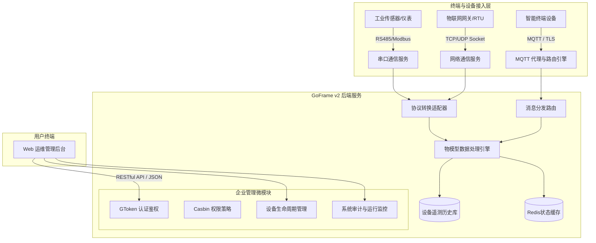

# IOTFast 物联网安全管理平台 - 系统架构与业务需求规格说明书 (SRS)

## 文档基本信息
- **文档编号**：`IOTFAST-SRS-2026-V1.0`
- **系统名称**：IOTFast 物联网安全管理平台 (IoTFast Security & Management Platform)
- **基线版本**：`V1.0.0 Release`
- **编写团队**：系统架构组 & 质量保障测试团队
- **适用对象**：软件开发工程师、自动化测试工程师、安全测试工程师、运维交付人员

---

## 1. 系统概述与业务背景

### 1.1 系统定位
IOTFast 是一款面向工业物联网、智慧园区及边缘计算场景的高性能、轻量级物联网安全管理系统。平台提供对海量异构硬件终端设备的生命周期管理、协议适配链路、遥测时序数据采集、MQTT 消息路由分发及企业级多角色权限管控能力。

### 1.2 核心业务价值
1. **异构硬件统一纳管**：统一抽象物理设备为“品类-物模型-实例”，支持数万级设备并发接入；
2. **多协议接入支撑**：原生集成网络通信链路（TCP/UDP/HTTP）、工业硬件串口链路（RS232/RS485）与 MQTT 消息代理；
3. **高吞吐数据流转**：结合 Go 语言并发协程优势与本地轻量级数据库，实现低时延遥测数据吞吐与本地缓存；
4. **企业级权限与安全隔离**：基于 RBAC 角色访问控制与 GToken 无状态会话，保障设备资产与操作指令的端到端安全。

---

## 2. 总体技术架构设计

### 2.1 技术栈选型
| 分层维度 | 采用技术 | 选型考量 |
| :--- | :--- | :--- |
| **后端核心框架** | Go 1.18+ / GoFrame v2.0 | 高性能高并发微内核，具备工程化路由、ORM、配置与热加载能力 |
| **前端交互体系** | Vue 3 + Vite + TypeScript + Element Plus | 现代化 SPA 单页架构，响应式组件库，良好适配大屏及移动端 |
| **数据持久化** | SQLite 3（本地嵌入） / MySQL 8.0（生产扩展） | 支持单机免运维开箱即用与企业级关系型数据库平滑切换 |
| **高速缓存与会话**| Redis 6.0+ / In-Memory Cache | GToken 会话票据缓存、高频物模型最新状态快照 |
| **消息中间件** | 内置 MQTT Broker / 外部 Mosquitto/EMQX 集成 | 支持标准 MQTT 3.1.1 协议，支持 QoS 0/1/2 消息流转 |

### 2.2 总体系统架构拓扑

---

## 3. 核心领域业务模型

### 3.1 权限与组织架构领域 (RBAC)
- **用户 (User)**：系统唯一标识实体，关联部门、所属角色与岗位；
- **角色 (Role)**：权限集聚体，绑定菜单路由与按钮级权限规则（Casbin Policy）；
- **权限规则 (Menu/Rule)**：三级树形结构（目录、菜单、按钮 API）；
- **数据范围 (DataScope)**：支持全部数据权限、本部门及以下、仅本人数据权限。

### 3.2 物模型与设备领域 (IoT Device Model)
- **设备品类 (Category)**：同一类硬件型号的抽象模版（如“温湿度传感器_TH01”）；
- **物模型属性 (CategoryData / TSV)**：品类具备的属性与遥测项定义（标识符 Identifier、数据类型 float/int/string、单位、只读/读写）；
- **设备实例 (DeviceInfo)**：实际物理联网设备的唯一实例（拥有唯一 DeviceCode / MAC / 序列号）；
- **设备状态 (DeviceStatus)**：记录当前设备在线状态（Online/Offline）、最后活跃时间戳与客户端 IP。

### 3.3 消息与通信领域 (MQTT / Link)
- **主题规则 (Topic)**：如 `/iot/device/{deviceCode}/telemetry`（上报）、`/iot/device/{deviceCode}/command`（下发控制）；
- **消息记录 (MsgRecord)**：全量记录通过 Broker 流转的上下行报文（Payload）、QoS 级别与时间戳；
- **链路信息 (LinkInfo)**：抽象底层 Socket 连接句柄、串口波特率/校验位配置与连接健康度。

---

## 4. 功能性需求规格 (Functional Specifications)

### 4.1 系统管理与安全中心
1. **身份认证**：支持验证码校验防暴力破解，支持密码加盐哈希（MD5(MD5(pwd)+MD5(salt))）；
2. **会话控制**：基于 GToken 生成无状态 Token，支持多端登录与主动下线踢出；
3. **用户管理**：支持分页检索、用户增删改查、状态切换（启用/停用）、重置密码；
4. **角色与菜单授权**：动态权限树勾选授权，前端路由根据用户权限动态注册路由守卫；
5. **审计日志**：自动拦截写入操作日志（IP、耗时、请求参数、操作人）与登录日志。

### 4.2 物联网设备中心
1. **设备分类管理**：支持多层级品类维护、设备类型分类与自定义标签标注；
2. **物模型元数据定义**：可视化编辑设备遥测字段、参数单位、极值范围与上报频率；
3. **设备注册与维护**：支持单台录入与批量导入，维护设备网络参数与地理位置；
4. **设备运行看板**：展示全网设备总数、在线率统计、实时离线报警事件列表。

### 4.3 通信与协议流转
1. **通信链路配置**：支持配置 TCP/UDP 监听端口及 RS232/RS485 串口连接参数（波特率、数据位、停止位）；
2. **MQTT 规则引擎**：配置主题匹配过滤规则，对指定主题数据流转实施持久化落库；
3. **数据流追踪**：提供消息轨迹追踪看板，支持按客户端 ID、消息主题查询往来报文。

---

## 5. 非功能性需求 (Non-Functional Requirements)

1. **接口性能与响应时间**：
   - 常规管理接口响应时间 P95 < 150ms，P99 < 300ms；
   - 遥测数据高频上报接口吞吐支持不低于 2,000 TPS（单机部署基准）；
2. **高可用性与容错**：
   - 客户端异常断开或网络抖动时，支持自动清理无效 Session，不引起协程或内存泄漏；
   - 数据库发生锁超时或错误时，应有优雅的事务回滚与统一错误码封装；
3. **系统安全性**：
   - 严格防止 SQL 注入、XSS 跨站脚本攻击；
   - 接口调用需严格校验 Token 归属与 Casbin 权限范围，杜绝越权访问（横向/纵向）。
