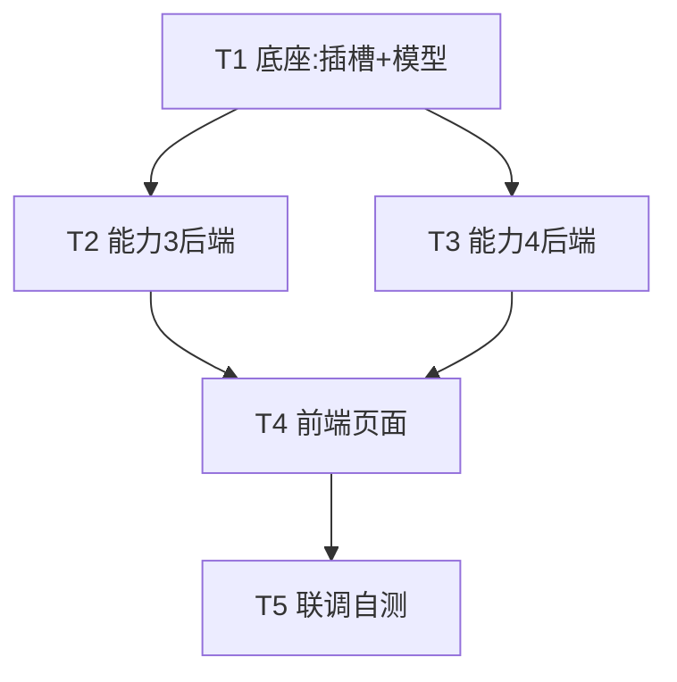

# 增量架构设计：能力3（AI 生成单接口用例·接纳闭环）+ 能力4（AI 编排测试场景）

> 架构师：高见远（Bob）｜设计范围：仅架构 + 任务分解，不含实现代码
> 代码事实均基于 `ai-test-platform` 现有代码（已 Read 复核 `model_router.py` / `model_config.py` / `database.py` / `doc.py` / `case_generator.py` / `ModelConfig.vue` / `main.py` / `Layout.vue` / `router/index.ts` / `api/index.ts`），与团队主理人提供上下文一致。

---

## 1. 数据模型

新增两张**资产表**（轻量、与既有执行链路解耦），以及 3 个枚举。所有枚举用 `SAEnum(..., name="xxx")`，新表由 `Base.metadata.create_all` 自动建表（开发环境）；老库无需 ALTER（新表天然幂等）。

### 1.1 能力3：用例资产表 `test_case_assets`

> 设计原则：**新增独立「用例资产表」**，绝不改造强绑 `test_run` 的 `TestCase`（`test_cases` 表 `test_run_id nullable=False`，是"执行实例"）。资产表沉淀可被反复采纳/编辑/执行的用例，执行时再实例化为 `TestCase`。

| 字段 | 类型 | 约束 | 说明 |
|------|------|------|------|
| `id` | `UUID` | PK, default uuid4 | 资产主键 |
| `project_id` | `UUID` | FK `projects.id`, NOT NULL | 项目归属（多租户隔离） |
| `endpoint_id` | `UUID` | FK `api_endpoints.id`, **nullable=True** | 来源接口资产；手动用例可为空 |
| `case_type` | `String(50)` | NOT NULL | `positive` / `negative` / `boundary` / `exception` |
| `title` | `String(500)` | NOT NULL | 用例标题（AI 生成的 `case_name`） |
| `description` | `Text` | nullable | 用例描述 |
| `request_data` | `JSONB` | NOT NULL | `{method, url, headers, body, params}` |
| `expected_result` | `JSONB` | nullable | `{status_code, assertions:[{type,expected,...}]}` |
| `priority` | `String(10)` | default `"P2"` | P0–P3 |
| `status` | `SAEnum(CaseAssetStatus)` | default `DRAFT`, NOT NULL | `DRAFT` / `ADOPTED` / `DEPRECATED` |
| `source` | `SAEnum(CaseSource)` | default `AI_GENERATED`, NOT NULL | `AI_GENERATED` / `MANUAL` |
| `created_by` | `UUID` | FK `users.id`, **nullable=True** | 创建人（系统/种子可空） |
| `created_at` | `DateTime` | default utcnow | |
| `updated_at` | `DateTime` | default utcnow, onupdate | |

**约束 / 索引**：
- `Index("idx_test_case_assets_project", "project_id")`
- `Index("idx_test_case_assets_project_status", "project_id", "status")`
- `Index("idx_test_case_assets_endpoint", "endpoint_id")`

**与现有 `TestCase`（执行实例）的关系**：
- `TestCase`（强绑 `test_run_id`）是"某次测试运行的执行实例"，无 project 归属、无 endpoint 关联、无接纳生命周期。
- `test_case_assets` 是"可沉淀、可编辑、可采纳的用例资产"。
- 关系：**`test_case_assets` 被测试运行实例化时，由后续能力（执行编排模块）读取资产 → 生成 `TestCase` 行**。本轮**不改造 `TestCase`**，实例化留作后续能力（详见 §11 待明确事项 3）。

### 1.2 能力4：场景表 `scenarios`（单表 + `steps` JSONB）

> MVP 取舍：采用**场景表 + `steps` JSONB 列**（非独立 `scenario_steps` 子表）。JSON 步骤列实现最简单，编辑步骤 = 保存整个 `steps` 数组；`endpoint_id` 以 UUID 字符串存于 JSON 内（MVP 不做物理外键，落库前校验存在性即可）。未来若需频繁单步统计/编辑，可再拆子表。

| 字段 | 类型 | 约束 | 说明 |
|------|------|------|------|
| `id` | `UUID` | PK | 场景主键 |
| `project_id` | `UUID` | FK `projects.id`, NOT NULL | 项目归属 |
| `name` | `String(200)` | NOT NULL | 场景名称 |
| `description` | `Text` | nullable | 场景说明 |
| `nl_input` | `Text` | NOT NULL | 用户自然语言场景描述（编排输入） |
| `status` | `SAEnum(ScenarioStatus)` | default `DRAFT`, NOT NULL | `DRAFT` / `ORCHESTRATED` / `ADOPTED` |
| `steps` | `JSONB` | default `[]` | 步骤数组（结构见下） |
| `created_by` | `UUID` | FK `users.id`, nullable | 创建人 |
| `created_at` / `updated_at` | `DateTime` | default/onupdate | |

**`steps` 数组元素结构**（每步）：
```json
{
  "step_order": 1,
  "endpoint_id": "uuid-or-null",
  "action_desc": "登录并获取 token",
  "method": "POST",
  "url": "/api/v1/login",
  "extract": { "token": "$.data.token", "user_id": "$.data.id" },
  "inject":  { "token": "headers.Authorization", "user_id": "body.user_id" },
  "depend_on_step": null,
  "request": { "headers": {}, "body": {}, "params": {} }
}
```

**数据依赖表达**（核心）：
- **提取**：`extract` 为 `{变量名: jsonpath}`，表示该步响应中提取的变量（如 `token`）。
- **注入**：后续步骤的 `request` 模板中使用 **`{{变量名}}` 占位符**（复用 `case_generator` 既有约定），运行时按前步 `extract` 结果做字符串替换。
- `inject` 为可选元数据（`{变量名: 目标位置}`），用于 UI 展示"变量去向"；真正注入机制是 `{{var}}` 替换。
- `depend_on_step`：显式声明前驱步骤序号，用于预览依赖图与（未来的）执行顺序，本身不参与落库强校验。

**约束 / 索引**：
- `Index("idx_scenarios_project", "project_id")`
- `Index("idx_scenarios_project_status", "project_id", "status")`

### 1.3 枚举定义（`database.py`）
```python
class CaseAssetStatus(PyEnum):
    DRAFT = "draft"
    ADOPTED = "adopted"
    DEPRECATED = "deprecated"

class CaseSource(PyEnum):
    AI_GENERATED = "ai_generated"
    MANUAL = "manual"

class ScenarioStatus(PyEnum):
    DRAFT = "draft"
    ORCHESTRATED = "orchestrated"
    ADOPTED = "adopted"
```
> 注意：`ModelRouting`（能力4 插槽列）枚举沿用既有 `modelprovider`，无需新增枚举。

### 1.4 类图（Mermaid）
见 `class-diagram.mermaid`。

---

## 2. 目录 / 文件结构

### 后端（新增）
| 文件 | 说明 |
|------|------|
| `app/modules/scenario/__init__.py` | 包初始化 |
| `app/modules/scenario/retriever.py` | `EndpointRetriever`：自然语言/关键词检索 `api_endpoints` 候选接口（模糊匹配 + match_score） |
| `app/modules/scenario/orchestrator.py` | `ScenarioOrchestrator`：调 `scenario_orchestration` 插槽产出结构化 steps；AI 失败走规则兜底 |
| `app/api/case_library.py` | 能力3 用例资产 CRUD + 生成 + 接纳（`router = APIRouter()`，main.py 以 `/api/cases` 注册） |
| `app/api/scenario.py` | 能力4 场景 CRUD + 编排 + 采纳（`router = APIRouter()`，main.py 以 `/api/scenarios` 注册） |
| `app/schemas/case_library.py` | 能力3 Pydantic 请求/响应模型（生成/列表/接纳） |
| `app/schemas/scenario.py` | 能力4 Pydantic 请求/响应模型 |

### 后端（修改）
| 文件 | 改动 |
|------|------|
| `app/modules/ai/model_router.py` | ① 加 `scenario_orchestration` 插槽（含 `or` 降级）② `use_cases` 列表加插槽名 |
| `app/modules/ai/model_config.py` | ③ `ModelRoutingConfig` 加 `scenario_orchestration_model_id` 字段 |
| `app/api/model_config.py` | ④ `ROUTING_FIELDS` 加该项；`UpdateRoutingRequest` 加该项 |
| `app/models/database.py` | ⑤ `ModelRouting` 表加 `scenario_orchestration_model_id` 列（nullable=True）；⑥ 新增 `test_case_assets` / `scenarios` 表与 3 枚举；⑦ `init_db()` 加 `ADD COLUMN IF NOT EXISTS` 幂等 ALTER |
| `app/main.py` | 注册 `case_library_router`（`/api/cases`）、`scenario_router`（`/api/scenarios`） |

### 前端（新增）
| 文件 | 说明 |
|------|------|
| `src/views/CaseLibrary.vue` | 用例资产管理页（选接口/项目 → 生成 → 预览四类 → 逐条采纳/废弃/编辑） |
| `src/views/Scenario.vue` | 场景编排页（自然语言 → AI 编排 → 步骤依赖预览 → 保存/编辑/采纳） |

### 前端（修改）
| 文件 | 改动 |
|------|------|
| `src/views/ModelConfig.vue` | `useCaseLabels` 加 `scenario_orchestration`；`routingFields` 加场景编排模型；`routingForm` 加该项 |
| `src/components/Layout.vue` | 硬编码菜单加 2 项：`/case-library`、`/scenario`（含 icon） |
| `src/router/index.ts` | 路由表加 2 条（path/component/meta.title） |
| `src/api/index.ts` | 加 `caseApi`、`scenarioApi` 两组 axios 函数（沿用 `/api` baseURL） |

---

## 3. model_router 插槽扩展

**能力3 复用现有 `case_generation`，无需新插槽。** 仅能力4 需新增 1 个插槽：`scenario_orchestration`（自然语言场景 → 结构化多步串联）。完整 7 处改动如下：

| # | 文件 | 改动点 | 关键代码 |
|---|------|--------|----------|
| 1 | `model_router.py` `get_client().config_id_map` | 加插槽 + **`or` 降级**（防 DB 列 NULL 抛 500） | `"scenario_orchestration": self.routing.scenario_orchestration_model_id or self.routing.code_analysis_model_id,` |
| 2 | `model_router.py` `init_default_models()` | `default_config` / `fallback_config` 的 `use_cases` 列表加 `"scenario_orchestration"` | `use_cases=[..., "doc_parse", "doc_review", "scenario_orchestration"]` |
| 3 | `modules/ai/model_config.py` `ModelRoutingConfig` | 加字段（默认 `"default"`） | `scenario_orchestration_model_id: str = "default"` |
| 4 | `api/model_config.py` `ROUTING_FIELDS` | 元组加该项（否则 UI 配不了） | `"scenario_orchestration_model_id",` |
| 5 | `model_router.py` `init_default_models().set_routing(...)` | 加该字段（默认 `"default"`） | `scenario_orchestration_model_id="default",` |
| 6 | `models/database.py` `ModelRouting` 表 + `init_db()` | 加列（`String(64)`, FK `ai_model_configs.id`, **nullable=True**）+ 幂等 ALTER | `scenario_orchestration_model_id = Column(String(64), ForeignKey("ai_model_configs.id"), nullable=True)`；`init_db()` 加 `ALTER TABLE model_routing ADD COLUMN IF NOT EXISTS scenario_orchestration_model_id VARCHAR(64)` |
| 7 | `frontend/ModelConfig.vue` | `useCaseLabels` / `routingFields` / `routingForm` 加该项 | 见 §8 前端 |

> 统一调用入口仍为 `await get_model_router().call(use_case="scenario_orchestration", messages=[...], response_format_json=True, temperature=0.3)`。

---

## 4. 能力3 接纳闭环设计

### 4.1 生成端点 `POST /api/cases/generate`
- **输入**：`{ project_id: str, endpoint_ids: list[str]|None, endpoint_id: str|None }`（三粒度：整项目 / 多接口 / 单接口）。
- **流程**：
  1. 按 `project_id`（+`endpoint_ids`/`endpoint_id`）从 `api_endpoints` 取接口资产。
  2. 对每个接口构造 `api_info`（来自 `ApiEndpoint`：`method, path, params, request_body, responses, auth_required`），并构造**轻量 `business_analysis`**（见 §7.1，不额外调 AI）。
  3. 调 `TestCaseGenerator().generate_api_cases(api_info, business_analysis)`（内部已用 `case_generation` 插槽；AI 失败自动 `_generate_fallback_cases`，**不会 500**）。
  4. 将返回的每个 case dict 映射为 `TestCaseAsset` 行：`endpoint_id`、`case_type`、`title=case_name`、`description`、`request_data=request`、`expected_result=expected`、`priority`、`status=DRAFT`、`source=AI_GENERATED`、`created_by=当前用户`。
  5. 并发控制：用 `asyncio.Semaphore(5)` 包裹多接口生成（对齐 `case_generator` 内部并发上限）。
  6. 批量 `db.add` + `flush`，返回 `{generated, inserted, project_id}`。
- **注意**：`api_info` 的 `path` 直接使用 `ApiEndpoint.path`（已归一化）；`url` 在 case 内保持相对路径，执行时再由环境拼 base。

### 4.2 列表 / 详情 / 编辑 / 删除
- `GET /api/cases`：`project_id` 必填，`endpoint_id?`、`case_type?`、`status?`、`keyword?`（匹配 title/description）、分页。
- `GET /api/cases/{case_id}`：全字段。
- `PUT /api/cases/{case_id}`：可编辑 `title, description, request_data, expected_result, priority, case_type`；`status` 不被此接口改变（专用端点管理生命周期）。
- `DELETE /api/cases/{case_id}`：物理删除（资产未绑定执行，可删）。

### 4.3 接纳 / 废弃（生命周期闭环）
- `POST /api/cases/{case_id}/adopt`：`status = ADOPTED`（沉淀为可信资产）。
- `POST /api/cases/{case_id}/deprecate`：`status = DEPRECATED`（废弃，不再参与执行）。
- （便捷）`POST /api/cases/adopt-batch`：`{ ids: list[str] }` 批量置 `ADOPTED`。
- **路由顺序**：`/generate`、`/adopt-batch` 必须声明在 `/{case_id}` 之前。

### 4.4 序列图
见 `sequence-diagram.mermaid`（能力3 流程）。

---

## 5. 能力4 场景编排设计

### 5.1 `retriever.py` — `EndpointRetriever`
- `async search(project_id, nl_input, keyword=None, limit=20) -> list[dict]`：
  - 从 `nl_input` 做轻量分词（中英文按标点/空格切分，去停用词）得到关键词集合。
  - 对 `api_endpoints` 按 `path.ilike` / `summary.ilike` 模糊匹配，计算 `match_score`（命中关键词数 / 字段覆盖）。
  - 返回候选接口列表（含 `id, method, path, summary, match_score`），按 score 降序。
  - **可选增强**：AI 语义重排（另起一次 LLM 调用，复用 `case_generation` 插槽或新增）。MVP **不做重排**，纯规则匹配即可。

### 5.2 `orchestrator.py` — `ScenarioOrchestrator`
- `async orchestrate(project_id, nl_input, endpoint_ids=None) -> dict`：
  1. `candidates = retriever.search(...)`；若 `endpoint_ids` 给定，则仅保留/优先这些接口。
  2. 调 `router.call(use_case="scenario_orchestration", messages=[prompt], response_format_json=True)`（prompt + schema 见 §7.2）。
  3. 解析 AI 返回的 `steps`；校验每步 `endpoint_id` 在候选中存在（若 AI 只给 `method+path`，则按 `method+path` 反查 `api_endpoints.id` 回填）。
  4. **AI 失败 / 无 Key → 规则兜底**：按 `match_score`/出现顺序把候选串成线性链路，第 1 步 `extract` 常见变量（`token=$.data.token`、`id=$.data.id`），后续步 `request` 用 `{{token}}` 占位，`depend_on_step = 前一步`。返回 `engine="rule"`。
  5. 返回 `{steps, engine}`。

### 5.3 创建 / 列表 / 详情 / 编辑 / 采纳
- `POST /api/scenarios`：`{ project_id, name, nl_input, endpoint_ids? }` → `retriever + orchestrator` → 建 `Scenario`（`status=ORCHESTRATED`，`steps` 落库）。返回场景。
- `GET /api/scenarios`：`project_id` 必填，`status?`、`keyword?`、分页。
- `GET /api/scenarios/{id}`：含 `steps`。
- `PUT /api/scenarios/{id}`：保存用户调整后的 `name/description/nl_input/steps`（步骤编辑即覆盖 `steps` JSONB）；`status` 由采纳端点管理。
- `POST /api/scenarios/{id}/adopt`：`status = ADOPTED`（用户确认场景可用）。
- （降级）`POST /api/scenarios/{id}/dry-run`：**MVP 不接真实 HTTP 执行**，仅返回"解析后的请求序列"（用前步 `extract` 替换后步 `{{var}}` 占位符），并标注 `engine="preview"`、`note="MVP 未接真实 HTTP"`；真实执行留作后续能力。

### 5.4 序列图
见 `sequence-diagram.mermaid`（能力4 流程）。

---

## 6. API 端点列表

统一返回 `{code:0, data:..., message:"..."}`；写操作 `Depends(get_current_user)`。router 不带 prefix，由 main.py 统一注册。

### 能力3（router 文件 `api/case_library.py`，main.py `prefix="/api/cases"`）
| Method | Path | 请求体 / 参数 | 说明 | 路由顺序注意 |
|--------|------|---------------|------|--------------|
| POST | `/cases/generate` | `{project_id, endpoint_ids?, endpoint_id?}` | 生成并落库（DRAFT） | 声明在 `/{id}` 前 |
| POST | `/cases/adopt-batch` | `{ids: list[str]}` | 批量采纳 | 声明在 `/{id}` 前 |
| GET | `/cases` | `project_id, endpoint_id?, case_type?, status?, keyword?, page, page_size` | 列表 | |
| GET | `/cases/{case_id}` | path | 详情 | |
| PUT | `/cases/{case_id}` | 可编辑字段 | 编辑 | |
| DELETE | `/cases/{case_id}` | path | 删除 | |
| POST | `/cases/{case_id}/adopt` | path | 接纳→ADOPTED | |
| POST | `/cases/{case_id}/deprecate` | path | 废弃→DEPRECATED | |

### 能力4（router 文件 `api/scenario.py`，main.py `prefix="/api/scenarios"`）
| Method | Path | 请求体 / 参数 | 说明 | 路由顺序注意 |
|--------|------|---------------|------|--------------|
| POST | `/scenarios` | `{project_id, name, nl_input, endpoint_ids?}` | 创建+AI 编排→ORCHESTRATED | |
| GET | `/scenarios` | `project_id, status?, keyword?, page, page_size` | 列表 | 声明在 `/{id}` 前 |
| GET | `/scenarios/{id}` | path | 详情（含 steps） | |
| PUT | `/scenarios/{id}` | `name?, description?, nl_input?, steps?` | 保存编辑（含步骤） | |
| POST | `/scenarios/{id}/adopt` | path | 采纳→ADOPTED | |
| POST | `/scenarios/{id}/dry-run` | path | MVP 预览（不执行 HTTP） | |

---

## 7. AI prompt 设计要点

### 7.1 能力3（复用 `case_generator`，无需新设计）
- 直接复用 `TestCaseGenerator._build_prompt` / `generate_api_cases`，prompt 与输出 schema 不变（四类用例 + `{cases:[...]}`）。
- **轻量 `business_analysis` 构造（MVP，不额外调 AI）** —— 在 `api/case_library.py` 内加工具函数：
  ```python
  def _light_business_analysis(ep: ApiEndpoint) -> dict:
      required = [p.get("name") for p in (ep.params or []) if p.get("required")]
      return {
          "business_purpose": ep.summary or ep.path,
          "business_rules": (
              [f"必填参数: {', '.join(required)}"] if required
              else ["无显式必填参数"]
          ),
          "risk_points": (
              ["需要鉴权"] if ep.auth_required else []
          ) + (["包含请求体"] if ep.request_body else []),
      }
  ```
  - 决策理由：避免每个接口多一次 LLM 调用，生成更快、更确定；`case_generation` 本身已能基于 `api_info` 产出合理用例。是否需独立 AI 业务分析见 §11。

### 7.2 能力4 `scenario_orchestration` prompt（产出结构化步骤）
- **输入给 AI**：`nl_input` + 候选接口清单（`[{id, method, path, summary}]`）。
- **要求**：把自然语言场景拆成有序步骤，每步绑定一个候选 `endpoint_id`（或 `method+path`），说明数据依赖（前步提取变量 → 后步注入）。
- **输出 JSON schema**（要求 `response_format_json=True`）：
  ```json
  {
    "steps": [
      {
        "step_order": 1,
        "endpoint_id": "候选接口 uuid（必须来自候选清单）",
        "action_desc": "步骤意图，如：登录获取 token",
        "method": "POST",
        "url": "/api/v1/login",
        "extract": { "token": "$.data.token", "user_id": "$.data.id" },
        "inject":  { "token": "headers.Authorization", "user_id": "body.user_id" },
        "depend_on_step": null,
        "request": { "headers": {}, "body": { "username": "{{user}}", "password": "{{pwd}}" }, "params": {} }
      }
    ]
  }
  ```
  - 变量注入统一用 `{{变量名}}` 占位符（与 `case_generator` 约定一致）。
  - 解析失败 / AI 无 Key → 走 §5.2 规则兜底。

---

## 8. 前端页面

### 8.1 `CaseLibrary.vue`（用例资产管理）
- **布局**：左侧项目选择器 + 接口多选（调 `docApi.listEndpoints` 拉取 `api_endpoints`）+ 「AI 生成」按钮；右侧 el-tabs 分「正向/反向/边界/异常」四类，表格展示 `title/description/priority/status` 徽标。
- **操作**：每行「采纳 / 废弃 / 编辑（对话框改 request_data/expected_result/priority）」；顶部「批量采纳」。

### 8.2 `Scenario.vue`（测试场景编排）
- **布局**：上方自然语言 `el-input` + 项目选择 + 可选接口 + 「AI 编排」按钮；下方 `el-steps` / `el-timeline` 展示步骤顺序，`extract`/`inject`/`depend_on_step` 用标签说明变量依赖（echarts 已装，MVP 先用 `el-steps` + 变量说明，DAG 图可后续增强）；提供「保存步骤」「采纳」。

### 8.3 挂接 router 与 Layout 硬编码菜单（加 2 项）
- `Layout.vue` 在 `/doc-review` 之后加：
  ```html
  <el-menu-item index="/case-library">
    <el-icon><Files /></el-icon><span>用例资产管理</span>
  </el-menu-item>
  <el-menu-item index="/scenario">
    <el-icon><Share /></el-icon><span>测试场景编排</span>
  </el-menu-item>
  ```
  （icon 用 Element Plus 内置 `Files` / `Share`；若项目未全局注册需确认，否则用 `Document`/`Connection` 等同族 icon 亦可。）
- `router/index.ts` 加：
  ```ts
  { path: '/case-library', name: 'CaseLibrary', component: () => import('@/views/CaseLibrary.vue'), meta: { title: '用例资产管理' } },
  { path: '/scenario', name: 'Scenario', component: () => import('@/views/Scenario.vue'), meta: { title: '测试场景编排' } },
  ```
- `api/index.ts` 加：
  ```ts
  export const caseApi = {
    generate: (data: any) => api.post('/cases/generate', data, { timeout: 300000 }),
    list: (params: any) => api.get('/cases', { params }),
    get: (id: string) => api.get(`/cases/${id}`),
    update: (id: string, data: any) => api.put(`/cases/${id}`, data),
    remove: (id: string) => api.delete(`/cases/${id}`),
    adopt: (id: string) => api.post(`/cases/${id}/adopt`),
    deprecate: (id: string) => api.post(`/cases/${id}/deprecate`),
    adoptBatch: (ids: string[]) => api.post('/cases/adopt-batch', { ids }),
  }
  export const scenarioApi = {
    create: (data: any) => api.post('/scenarios', data, { timeout: 300000 }),
    list: (params: any) => api.get('/scenarios', { params }),
    get: (id: string) => api.get(`/scenarios/${id}`),
    update: (id: string, data: any) => api.put(`/scenarios/${id}`, data),
    adopt: (id: string) => api.post(`/scenarios/${id}/adopt`),
    dryRun: (id: string) => api.post(`/scenarios/${id}/dry-run`),
  }
  ```
- `ModelConfig.vue`（插槽 7）：
  - `useCaseLabels` 加 `scenario_orchestration: '场景编排'`
  - `routingFields` 加 `{ key: 'scenario_orchestration_model_id', label: '场景编排模型' }`
  - `routingForm` 加 `scenario_orchestration_model_id: ''`

---

## 9. 任务分解（有序、含依赖）

> 受"单轮任务数 ≤ 5"硬上限约束，将原 7 步计划合并为 5 个模块任务（T1–T5），每组 ≥3 个文件、按模块分组；依赖关系与实现顺序保持。原 7 步 → 5 任务映射：①②→T1；③→T2；④→T3；⑤⑥→T4；⑦→T5。

| Task | 名称 | 源文件（含改/新） | 依赖 | 优先级 |
|------|------|-------------------|------|--------|
| **T1** | 后端底座扩展：model_router 插槽 + 数据模型 + 迁移 | 新/改：`modules/ai/model_router.py`、`modules/ai/model_config.py`、`api/model_config.py`、`models/database.py`（ModelRouting 新列 + 2 新表 + 3 枚举 + init_db ALTER）、`frontend/src/views/ModelConfig.vue`（routingFields） | 无 | P0 |
| **T2** | 能力3 后端：用例资产生成 + 接纳 API | 新：`api/case_library.py`、`schemas/case_library.py`、`main.py`（注册 `/api/cases`）；复用 `modules/case_generator`（不改动） | T1 | P0 |
| **T3** | 能力4 后端：检索 + 编排 + 场景 API | 新：`modules/scenario/__init__.py`、`modules/scenario/retriever.py`、`modules/scenario/orchestrator.py`、`api/scenario.py`、`schemas/scenario.py`、`main.py`（注册 `/api/scenarios`） | T1 | P0 |
| **T4** | 前端：CaseLibrary + Scenario 页面 + 菜单/路由/API | 新：`views/CaseLibrary.vue`、`views/Scenario.vue`；改：`components/Layout.vue`、`router/index.ts`、`api/index.ts` | T2, T3 | P1 |
| **T5** | 联调与自测 | 跨端冒烟：生成→预览→接纳；编排→预览→采纳；dry-run 降级校验；路由顺序回归 | T2, T3, T4 | P1 |

**实现顺序**：T1 →（T2 ∥ T3）→ T4 → T5。T2/T3 可并行（均只依赖 T1）。

### 任务依赖图（Mermaid）


---

## 10. 依赖包

- **后端 Python 包**：本轮**无需新增**。`case_generator` 已就绪；场景编排复用现有 `ModelRouter.call`（OpenAI 兼容）。
  - 仅当实现真实 HTTP 试行（§5.3 dry-run 升级）时才需 `jsonpath-ng` 提取变量。若启用，在 `requirements.txt` 加：
    ```
    jsonpath-ng>=0.6.0
    ```
    MVP 不接真实执行，**本轮回绝不引入该依赖**。
- **前端**：无需新包（`echarts` 已装；MVP 用 `el-steps` 展示步骤，DAG 图后续再升级）。

---

## 11. 待明确事项（需与主理人/用户确认）

1. **能力3 是否先跑 AI 业务分析？** MVP 建议直接用接口 `params` 构造轻量 `business_analysis`（不额外调 AI，更快更确定，见 §7.1）。是否接受"无独立业务分析"，或要求加一步 AI `business_analysis`（多一次 LLM 调用 + 延时）？
2. **能力4 试运行本轮是否做？** MVP 降级为"仅编排保存 + 步骤预览（dry-run 不接真实 HTTP）"。是否接受降级，还是本轮就要真实 HTTP 执行（届时需要 `httpx` + `jsonpath-ng`）？
3. **用例资产 ↔ `TestCase` 实例化关系**：本轮不改造强绑 `test_run` 的 `TestCase`。实例化（资产→执行实例）作为后续能力。是否本轮就给 `TestCase` 加 `asset_id` 可空 FK 以支持溯源？建议**本轮不加**，后续单独做。
4. **权限粒度**：用例资产/场景写操作是否仅 `get_current_user`（与 doc 一致，普通登录用户即可）？还是要求 admin？建议普通用户即可，请确认。
5. **场景步骤存储形态**：本轮选 `steps` JSONB 单表（MVP 简单）。是否接受，还是要求独立 `scenario_steps` 子表？
6. **能力3 生成粒度**：MVP 支持"整项目 / 多接口 / 单接口"三粒度（`endpoint_ids` 可选）。确认该粒度是否满足。

---

## 附：Mermaid 图文件
- 类图：`class-diagram.mermaid`
- 时序图（能力3 + 能力4）：`sequence-diagram.mermaid`
