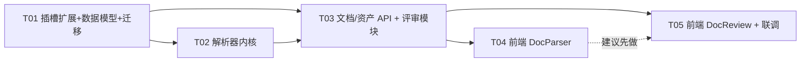
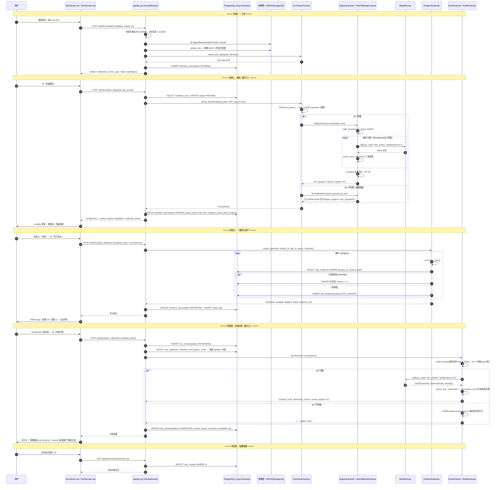

# 增量架构设计：AI 解析接口文档 + AI 评审接口文档

> 架构师：高见远 ｜ 版本：v1.0 ｜ 范围：MVP 增量设计（本轮不写实现代码）
> 基线代码：`ai-test-platform/`（FastAPI + SQLAlchemy async + PostgreSQL + MinIO / Vue3 + TS + Element Plus）

---

## 0. 实现方针（Implementation Approach）

### 0.1 三个核心难点与对策

| 难点 | 对策 |
|---|---|
| 四种异构格式（openapi / har / docx / pdf）产出差异极大 | 引入**统一中间表示 `ApiSpec`**，所有解析器只负责"格式 → ApiSpec"，下游（预览 / 导入 / 评审）只认 ApiSpec，彻底解耦 |
| docx/pdf 无结构，必须靠 AI，但 AI 不可靠 / 可能无 key | **两段式**：文件 → `raw_text`（确定性，纯库解析）→ ApiSpec（AI 增强）。AI 不可用时走**正则兜底**，只丢语义不丢可用性 |
| 现有 `ModelRouter` 只有 4 个插槽，硬编码在 6 处 | 新增 `doc_parse` / `doc_review` 两个 use_case，逐一列出**6 个改动点**（用户给的 3 处不完整，见 §3），并在 `config_id_map` 用 `or` 降级避免未配置即 500 |

### 0.2 关键架构决策（ADR 摘要）

| # | 决策 | 结论 | 理由 |
|---|---|---|---|
| ADR-1 | 中间表示 | 新建 `modules/doc_parser/spec.py` 的 Pydantic `ApiSpec`，**不复用** `code_analyzer` 的 dict 结构 | code_analyzer 产出是 loose dict、字段不含 request_body/responses schema，强行复用会污染两边 |
| ADR-2 | 文件存储 | **本地卷为主 + MinIO 镜像（best-effort）** | 解析必须拿到本地 path；`./data:/app/data` 已挂载可持久化；MinIO 仅作备份/多副本，失败不阻塞主流程（待确认，见 §10-1） |
| ADR-3 | 解析同步/异步 | **MVP 同步**（前端 timeout 300s），不引入 Celery | 已有 Celery 但接入成本高；openapi/har 毫秒级，docx/pdf 走 AI 约 10~60s，同步可接受。超 200 页 PDF 走"截断 + 提示"（待确认，见 §10-3） |
| ADR-4 | 资产唯一键 | `UNIQUE(project_id, method, path)` + upsert，`version` 自增 | 同一文档反复解析导入必须幂等；不做全量历史版本表（过度设计） |
| ADR-5 | 评审总分 | AI 只给各维度 1-5 分，**总分由后端按权重复算** | 不信任 LLM 的算术；保证同一份 issues 与 score 自洽 |
| ADR-6 | 前端菜单 | **必须手工改 `Layout.vue`** | ⚠️ 已核实：`Layout.vue` 的 `el-menu-item` 是硬编码列表，**不是**从 router meta 自动渲染。只加 router 不会出现菜单 |
| ADR-7 | 路由前缀 | `/api/docs` | 与 FastAPI 自带 `/docs`（app 根级）不冲突；nginx `/api` 已转发后端 |

---

## 1. 数据模型

### 1.1 新增枚举（全部带 `name=`，SQLAlchemy 持久化**成员名大写**）

```python
class DocType(PyEnum):
    OPENAPI = "openapi"   # swagger 2.0 / openapi 3.x（yaml|json）
    HAR = "har"
    DOCX = "docx"
    PDF = "pdf"
    UNKNOWN = "unknown"

class DocParseStatus(PyEnum):
    PENDING  = "pending"    # 已上传未解析
    PARSING  = "parsing"
    PARSED   = "parsed"     # 已解析，未导入
    IMPORTED = "imported"   # 已至少导入过一次
    FAILED   = "failed"

class EndpointSource(PyEnum):
    DOC_IMPORT    = "doc_import"     # 本轮：文档导入
    CODE_ANALYSIS = "code_analysis"  # 预留：代码解析产出
    MANUAL        = "manual"

class DocReviewStatus(PyEnum):
    PENDING = "pending"
    REVIEWING = "reviewing"
    COMPLETED = "completed"
    FAILED = "failed"
```

> ⚠️ **旧库注意**：`Base.metadata.create_all` 只建**新表**（含其新枚举类型），**不会** ALTER 已有表。因此 `model_routing` 新增两列必须靠 Alembic 迁移 + `init_db` 幂等 `ADD COLUMN IF NOT EXISTS` 兜底（沿用现有 `userrole` 补值那段的写法）。

### 1.2 `interface_docs` — 接口文档记录

| 字段 | 类型 | 说明 |
|---|---|---|
| id | UUID PK default uuid4 | |
| project_id | UUID FK projects.id NOT NULL | 多租户隔离 |
| uploaded_by | UUID FK users.id NULL | 上传人 |
| filename | String(500) NOT NULL | 原始文件名 |
| doc_type | SAEnum(DocType, name="doctype") NOT NULL | 自动探测，可前端覆盖 |
| file_size | Integer | 字节 |
| sha256 | String(64) index | 内容指纹，用于重复上传提示 |
| local_path | String(500) | `/app/data/uploads/docs/{doc_id}{ext}` |
| storage_object | String(500) NULL | MinIO object name，镜像失败为 NULL |
| status | SAEnum(DocParseStatus, name="docparsestatus") default PENDING NOT NULL | |
| parse_engine | String(20) | `rule` / `ai` / `hybrid` / `rule_degraded` |
| raw_text | Text NULL | docx/pdf 提取的纯文本（评审与二次解析复用，避免重复抽取） |
| parse_result | JSONB default {} | `{"endpoints":[ApiSpec...], "unparsed_notes":[], "meta":{...}}` |
| endpoint_count | Integer default 0 | |
| error_message | Text NULL | |
| created_at / updated_at / parsed_at | DateTime | `default=datetime.utcnow`，updated_at 带 onupdate |

索引：
```python
__table_args__ = (
    Index("idx_interface_docs_project_status", "project_id", "status"),
    Index("idx_interface_docs_created", "created_at"),
)
```

### 1.3 `api_endpoints` — 接口资产（核心可复用资产）

| 字段 | 类型 | 说明 |
|---|---|---|
| id | UUID PK | |
| project_id | UUID FK projects.id NOT NULL | |
| doc_id | UUID FK interface_docs.id NULL | 来源文档；文档删除后置空保留资产 |
| path | String(500) NOT NULL | 归一化：保证以 `/` 开头、去尾斜杠、`:id` 统一转 `{id}` |
| method | String(10) NOT NULL | 大写 GET/POST/... |
| summary | String(500) | |
| description | Text | |
| tags | JSONB default [] | |
| operation_id | String(200) NULL | |
| params | JSONB default [] | `[{name,in,type,required,description,example,enum}]`；`in` ∈ path/query/header/cookie |
| request_body | JSONB default {} | `{content_type, required, schema, example}` |
| responses | JSONB default [] | `[{status_code,description,content_type,schema,example}]` |
| auth_required | Boolean default False | |
| auth_type | String(50) NULL | bearer / basic / apikey / oauth2 / none |
| source | SAEnum(EndpointSource, name="endpointsource") default DOC_IMPORT NOT NULL | |
| ai_confidence | Float NULL | AI 提取置信度 0~1；规则解析写 1.0 |
| version | Integer default 1 | 每次 upsert 覆盖 +1 |
| is_active | Boolean default True | 软下线 |
| created_at / updated_at | DateTime | |

约束与索引：
```python
__table_args__ = (
    UniqueConstraint("project_id", "method", "path", name="uq_api_endpoints_project_method_path"),
    Index("idx_api_endpoints_project_method", "project_id", "method"),
    Index("idx_api_endpoints_doc", "doc_id"),
)
```

### 1.4 `doc_reviews` — 评审结果

| 字段 | 类型 | 说明 |
|---|---|---|
| id | UUID PK | |
| project_id | UUID FK projects.id NOT NULL | |
| doc_id | UUID FK interface_docs.id NOT NULL | |
| reviewed_by | UUID FK users.id NULL | |
| scope_endpoint_ids | JSONB default [] | 空数组 = 全量评审 |
| status | SAEnum(DocReviewStatus, name="docreviewstatus") default PENDING NOT NULL | |
| review_engine | String(20) | `ai` / `rule` |
| model_used | String(200) NULL | 实际命中的 config_id/model_name，便于复盘 |
| overall_score | Float NULL | 1.0~5.0，**后端按权重复算** |
| dimension_scores | JSONB default {} | `{"basic_info":4.0,"request_params":3.0,"response_definition":3.0,"security_auth":2.0}` |
| issues | JSONB default [] | `[{dimension,target,severity,issue,root_cause,suggestion,example}]` |
| summary | Text | 一段总体结论 |
| error_message | Text NULL | |
| created_at / completed_at | DateTime | |

索引：
```python
__table_args__ = (
    Index("idx_doc_reviews_doc_created", "doc_id", "created_at"),
    Index("idx_doc_reviews_project_created", "project_id", "created_at"),
)
```

### 1.5 `ModelRouting` 表增列（已有表，需迁移）

```python
doc_parse_model_id  = Column(String(64), ForeignKey("ai_model_configs.id"), nullable=True)
doc_review_model_id = Column(String(64), ForeignKey("ai_model_configs.id"), nullable=True)
```
> 刻意用 `nullable=True`（现有 5 列是 NOT NULL）：旧库已存在行无法补默认值；为 NULL 时运行时降级到 `code_analysis_model_id` / `fallback_model_id`。

### 1.6 类图

见 `docs/class-diagram.mermaid`（同内容内嵌于 §11）。

---

## 2. 目录 / 文件结构

### 2.1 后端 — 新建（11 个文件）

```
backend/app/modules/doc_parser/
├── __init__.py              # 导出 parse_document / DocParserFactory / ApiSpec
├── spec.py                  # ★统一中间表示：ApiSpec / ApiParam / ApiRequestBody / ApiResponseSpec / ParseResult
├── base.py                  # BaseDocParser 抽象基类 + detect_doc_type() 格式探测 + 解析器注册表
├── openapi_parser.py        # swagger2 / openapi3（yaml|json）规则解析，含 $ref 解引用
├── har_parser.py            # HAR 规则解析：entries → 按 (method,path) 聚合、参数/示例反推
├── docx_parser.py           # python-docx：段落 + 表格 → raw_text
├── pdf_parser.py            # pdfplumber：页文本 + extract_tables → raw_text
├── ai_extractor.py          # ★raw_text → ApiSpec[]（use_case="doc_parse"，分块 + JSON 容错 + 合并去重）
├── text_fallback.py         # 无 AI 时的正则兜底提取（仅 method + path）
└── importer.py              # ParseResult → api_endpoints upsert 落库
backend/app/modules/doc_review/
├── __init__.py
├── reviewer.py              # ★DocReviewer：多维 AI 评审（use_case="doc_review"）+ 总分复算
└── rules.py                 # 规则兜底评审：确定性指标 → 1~5 分
backend/app/api/doc.py       # ★本轮全部 HTTP 端点
backend/alembic/versions/002_doc_asset.py   # 建 3 张新表 + model_routing 增 2 列
```

### 2.2 后端 — 修改（6 个文件）

| 文件 | 改动 |
|---|---|
| `app/models/database.py` | +4 枚举、+3 表类、`ModelRouting` +2 列、`init_db()` 末尾加 `model_routing` 幂等 ADD COLUMN 兜底 |
| `app/modules/ai/model_config.py` | `ModelRoutingConfig` +`doc_parse_model_id` / `doc_review_model_id` |
| `app/modules/ai/model_router.py` | `config_id_map` +2 项（带 `or` 降级）、`init_default_models()` 的 `use_cases` 列表 +2、`set_routing(...)` +2 |
| `app/api/model_config.py` | `ROUTING_FIELDS` 元组 +2（**用户遗漏的改动点**，不加则 UI 无法配置且 GET /routing 不返回） |
| `app/main.py` | `include_router(doc_router, prefix="/api/docs", tags=["接口文档资产"])` |
| `backend/requirements.txt` | +`python-docx` +`pdfplumber`（`pyyaml==6.0.1` 已存在） |

### 2.3 前端 — 新建（4 个）/ 修改（4 个）

新建：
```
frontend/src/views/DocParser.vue              # 能力1：上传→解析→预览→勾选导入
frontend/src/views/DocReview.vue              # 能力2：选文档→评审→评分雷达+问题清单
frontend/src/components/ApiSpecTable.vue       # 接口列表（可选择 / 过滤 / 详情抽屉），两页共用
frontend/src/components/ReviewRadar.vue        # 四维评分雷达（vue-echarts，已有依赖）
```

修改：
| 文件 | 改动 |
|---|---|
| `src/api/index.ts` | 新增 `docApi`（见 §5.3） |
| `src/router/index.ts` | +`/doc-parser`、+`/doc-review` 两条路由（`meta.title`） |
| `src/components/Layout.vue` | **手工**加 2 个 `el-menu-item`（`/doc-parser`、`/doc-review`）+ 补 icon import |
| `src/views/ModelConfig.vue` | `routingFields` / `routingForm` 各 +2 项（文档解析模型 / 文档评审模型） |

---

## 3. `model_router` 插槽扩展（实为 6 处，非 3 处）

### 3.1 新增 use_case

| use_case | 含义 | 建议 temperature | 期望输出 |
|---|---|---|---|
| `doc_parse` | 非结构化文档文本 → 结构化接口定义（信息抽取，要求高保真、不许编造） | **0.1** | 严格 JSON |
| `doc_review` | 接口定义 → 多维质检评分 + 归因 + 建议（要求专业判断，允许一定发散） | **0.3** | 严格 JSON |

### 3.2 改动点清单

| # | 文件 | 改动 |
|---|---|---|
| ① | `modules/ai/model_config.py` | `ModelRoutingConfig` 加 `doc_parse_model_id: str = "default"`、`doc_review_model_id: str = "default"` |
| ② | `modules/ai/model_router.py` `get_client()` | `config_id_map` 加两项，并**带降级**：<br>`"doc_parse": self.routing.doc_parse_model_id or self.routing.code_analysis_model_id,`<br>`"doc_review": self.routing.doc_review_model_id or self.routing.fallback_model_id,`<br>⚠️ 不加 `or` 时，DB 里该列为 NULL → `config_id_map.get()` 返回 None → 抛 `ValueError: Unknown use case`，接口直接 500 |
| ③ | `modules/ai/model_router.py` `init_default_models()` | a) `default_config` / `fallback_config` 的 `use_cases` 列表追加 `"doc_parse","doc_review"`；b) `set_routing(ModelRoutingConfig(...))` 追加两个字段 = `"default"` |
| ④ | `api/model_config.py` | `ROUTING_FIELDS` 追加两个字段名 —— 该元组同时驱动 GET/PUT /routing 的序列化与写入、以及删除模型时的引用检查 |
| ⑤ | `models/database.py` | `ModelRouting` 表 +2 nullable 列（§1.5）+ `init_db()` 幂等 ALTER 兜底 |
| ⑥ | `frontend/views/ModelConfig.vue` | `routingFields` + `routingForm` 各加 2 项，否则管理员无法在 UI 指定模型 |

> 调用方式沿用现有范式，无需改 `ModelRouter.call()`：
> `await get_model_router().call(use_case="doc_parse", messages=[{"role":"user","content":prompt}], temperature=0.1)`

---

## 4. 解析器设计

### 4.1 统一中间表示 `ApiSpec`（`doc_parser/spec.py`，Pydantic）

```python
class ApiParam(BaseModel):
    name: str
    in_: str = Field("query", alias="in")   # path|query|header|cookie
    type: str = "string"                     # string|integer|number|boolean|array|object
    required: bool = False
    description: str = ""
    example: Any | None = None
    enum: list[Any] = []

class ApiRequestBody(BaseModel):
    content_type: str = "application/json"
    required: bool = False
    schema_: dict = Field(default_factory=dict, alias="schema")
    example: Any | None = None

class ApiResponseSpec(BaseModel):
    status_code: int
    description: str = ""
    content_type: str = "application/json"
    schema_: dict = Field(default_factory=dict, alias="schema")
    example: Any | None = None

class ApiSpec(BaseModel):
    path: str
    method: str                              # 归一化大写
    summary: str = ""
    description: str = ""
    tags: list[str] = []
    operation_id: str | None = None
    params: list[ApiParam] = []
    request_body: ApiRequestBody | None = None
    responses: list[ApiResponseSpec] = []
    auth_required: bool = False
    auth_type: str | None = None
    confidence: float = 1.0                  # 规则=1.0，AI 由模型给
    evidence: str = ""                       # AI 提取时标注来源位置，便于人工复核

class ParseResult(BaseModel):
    doc_type: str
    parse_engine: str                        # rule|ai|hybrid|rule_degraded
    endpoints: list[ApiSpec] = []
    raw_text: str = ""
    unparsed_notes: list[str] = []
    meta: dict = {}                          # {title, version, base_path, page_count, chunk_count...}
```
> `key = f"{method} {path}"` 作为端点在预览/勾选/导入时的唯一标识。

### 4.2 四种格式解析策略

| 格式 | 解析路径 | 关键点 |
|---|---|---|
| **openapi / swagger** | `pyyaml.safe_load` 或 `json.loads` → 遍历 `paths.{path}.{method}` | ① `$ref` 递归解引用（`components/schemas`、`definitions`），设深度上限 10 防循环；② swagger2 的 `body` parameter 转 `request_body`，`consumes/produces` 转 content_type；③ `security` + `securitySchemes` → `auth_required/auth_type`；④ `basePath`/`servers[0].url` 拼进 meta 而非 path；⑤ `parse_engine="rule"`，`confidence=1.0` |
| **har** | `json.loads` → `log.entries[]` | ① `request.url` 去 host、query 剥离为 `in=query` 参数；② 同 `(method, path)` 多条 entry **聚合**：参数取并集、`required` = 出现率 100% 才为 True；③ `postData.text` 尝试 json 解析 → `request_body.example`，用 `_infer_schema()` 反推 schema（type 推断，不做 format）；④ `response.status` → responses（多状态码合并）；⑤ URL 中 `/users/12345` 等纯数字/UUID 段**路径参数化**为 `/users/{id}`，避免资产爆炸；⑥ 过滤静态资源（`.js/.css/.png/...`）与非 API 域名 |
| **docx** | `python-docx`：`doc.paragraphs` + `doc.tables`（表格转 markdown 管道格式，保留"参数名 \| 类型 \| 必填 \| 说明"的列语义）→ 拼成 `raw_text` → **AI 结构化** | 表格必须转 markdown 而非纯文本拼接，否则 AI 丢失列对应关系（实测最影响准确率的一点） |
| **pdf** | `pdfplumber`：逐页 `extract_text()` + `extract_tables()`（同样转 markdown）→ `raw_text` → **AI 结构化** | ① 页数上限（默认 200 页，超出截断并写 `unparsed_notes`）；② 页眉页脚重复行去重；③ 扫描版 PDF（`extract_text()` 为空）直接返回 FAILED 并提示"疑似扫描件，本版本不支持 OCR" |

### 4.3 docx/pdf 的两段式 AI 增强

```
文件 → [确定性抽取] raw_text（含 markdown 表格）
     → [分块] split_chunks(raw_text, max_chars=12000, 优先在标题行/空行切)
     → [并发 AI] 每块 call(use_case="doc_parse", temperature=0.1)
     → [JSON 容错] _parse_json_response()（裸 JSON / ```json 块 / 抽取首个 {...}，沿用 case_generator 实现）
     → [合并] 按 key=(METHOD PATH) 去重；冲突时保留"字段完整度更高"者，完整度相同取 confidence 高者
     → [归一化] method 大写、path 补前导 /、status_code 转 int、非法项丢弃并记 unparsed_notes
     → ApiSpec[]
```
- 并发用 `asyncio.gather` + `Semaphore(3)`，防打爆模型配额。
- 单块失败**不中断**整体：记 `unparsed_notes`，其余块结果照常返回（与 `analysis.py` 里 AI 失败非阻塞的既有风格一致）。

### 4.4 降级矩阵（无 AI key / AI 全部失败）

| 格式 | 有 AI | 无 AI | 是否可用 |
|---|---|---|---|
| openapi | `rule`（AI 不参与） | `rule` | ✅ **100% 等价** |
| har | `rule`（AI 不参与） | `rule` | ✅ **100% 等价** |
| docx | `ai` | `rule_degraded`：正则 `(GET\|POST\|PUT\|DELETE\|PATCH)\s+(/[^\s,，、]+)` 扫 raw_text，只出 method+path，`confidence=0.3` | ⚠️ 可用但只有骨架 |
| pdf | `ai` | 同上 | ⚠️ 同上 |

判定方式：`ai_extractor` 捕获异常/`get_model_router().configs` 为空 → 切 `text_fallback`，`parse_engine="rule_degraded"`，响应中带 `degraded: true` + 提示语，前端 `el-alert` 黄条展示。
**结论：MVP 的"必须跑通"底线（openapi + har）完全不依赖 AI。**

---

## 5. API 端点列表

全部位于 **`backend/app/api/doc.py`**，`prefix="/api/docs"`，统一返回 `{"code":0,"data":...,"message":"..."}`，全部加 `current_user: User = Depends(get_current_user)`（来自 `app.modules.auth.dependencies`）。

> ⚠️ **路由声明顺序陷阱**：FastAPI 按声明顺序匹配，`/endpoints`、`/reviews/{review_id}` 必须声明在 `/{doc_id}` **之前**，否则会被当成 `doc_id` 吞掉并抛 UUID 解析错误。

| # | Method | Path | 请求 | 响应 data | 能力 |
|---|---|---|---|---|---|
| 1 | POST | `/api/docs/upload` | `multipart/form-data`：`file: UploadFile`、`project_id: str = Form(...)`、`doc_type: str \| None = Form(None)` | `{doc_id, filename, doc_type, file_size, sha256, status:"pending", duplicated: bool}` | ① |
| 2 | POST | `/api/docs/{doc_id}/parse` | `{use_ai: bool = true, max_endpoints: int = 200}` | `{doc_id, status, doc_type, parse_engine, degraded, endpoint_count, endpoints:[ApiSpec], unparsed_notes:[], meta:{}}` | ① |
| 3 | GET | `/api/docs` | query：`project_id`(必填)、`status`、`doc_type`、`keyword`、`page=1`、`page_size=20` | `{total, page, page_size, items:[{doc_id,filename,doc_type,status,endpoint_count,parse_engine,created_at}]}` | ① |
| 4 | GET | `/api/docs/endpoints` | query：`project_id`(必填)、`doc_id`、`method`、`keyword`、`page`、`page_size` | `{total, items:[ApiEndpoint]}` | ① |
| 5 | GET | `/api/docs/endpoints/{endpoint_id}` | — | 单个接口资产全字段 | ① |
| 6 | GET | `/api/docs/reviews/{review_id}` | — | 评审详情全文（含 issues） | ② |
| 7 | GET | `/api/docs/{doc_id}` | — | 文档详情 + `parse_result`（`include_raw_text=false` 默认不带正文） | ① |
| 8 | DELETE | `/api/docs/{doc_id}` | — | `{doc_id, endpoints_kept: n}`（删记录+文件，已导入资产 `doc_id` 置空保留） | ① |
| 9 | POST | `/api/docs/{doc_id}/import` | `{endpoint_keys: ["GET /api/v1/users"] , import_all: false, overwrite: true}` | `{imported, updated, skipped, failed, endpoint_ids:[]}` | ① |
| 10 | POST | `/api/docs/{doc_id}/review` | `{endpoint_ids: [] , use_ai: true}`（空 = 全量） | `{review_id, status, review_engine, overall_score, dimension_scores:{}, issues:[], summary}` | ② |
| 11 | GET | `/api/docs/{doc_id}/reviews` | query：`page`、`page_size` | `{total, items:[{review_id, overall_score, dimension_scores, issue_count, review_engine, created_at}]}` | ② |

### 5.1 上传流程细节（端点 1）

沿用 `api/upload.py` 的分块写入范式：
1. 白名单校验扩展名：`.json/.yaml/.yml/.har/.docx/.pdf`；上限 **20MB**。
2. 分块（1MB）写 `/app/data/uploads/docs/{doc_id}{ext}`，边写边算 sha256，超限即删文件 + 413。
3. `detect_doc_type()`：先看扩展名，`.json` 需二次探测内容（`log.entries` → HAR；`swagger`/`openapi` 键 → OPENAPI）。
4. best-effort `storage.upload_file(local_path, f"docs/{project_id}/{doc_id}{ext}")`，异常仅 `logger.warning`，不影响返回。
5. 落 `interface_docs` 记录，status=PENDING；`sha256` 命中同项目已有记录时返回 `duplicated: true`（仅提示，不阻断）。

### 5.2 导入落库细节（端点 9，`importer.py`）

```
for spec in 选中的 endpoints:
    key = (project_id, spec.method, normalize_path(spec.path))
    存在 且 overwrite → 更新全字段, version += 1, updated += 1
    存在 且 not overwrite → skipped += 1
    不存在 → insert, imported += 1
最后：interface_docs.status = IMPORTED
```
- 单条失败（如 path 超长）计入 `failed` 并继续，不整批回滚。
- 依赖 `UNIQUE(project_id, method, path)` 保证幂等；建议用 `select ... for update` 或捕获 `IntegrityError` 重试一次。
- 记 `AuditLog(action="doc_import", resource_type="interface_doc", resource_id=doc_id)`。

### 5.3 前端 API 封装（`src/api/index.ts` 追加）

```ts
// ============ 接口文档资产 ============
export const docApi = {
  upload: (file: File, projectId: string, docType?: string) => {
    const fd = new FormData()
    fd.append('file', file); fd.append('project_id', projectId)
    if (docType) fd.append('doc_type', docType)
    return api.post('/docs/upload', fd, {
      headers: { 'Content-Type': 'multipart/form-data' }, timeout: 120000,
    })
  },
  parse: (docId: string, data?: any) => api.post(`/docs/${docId}/parse`, data ?? {}, { timeout: 300000 }),
  list: (params: any) => api.get('/docs', { params }),
  get: (docId: string) => api.get(`/docs/${docId}`),
  remove: (docId: string) => api.delete(`/docs/${docId}`),
  import: (docId: string, data: any) => api.post(`/docs/${docId}/import`, data, { timeout: 120000 }),
  listEndpoints: (params: any) => api.get('/docs/endpoints', { params }),
  getEndpoint: (id: string) => api.get(`/docs/endpoints/${id}`),
  review: (docId: string, data?: any) => api.post(`/docs/${docId}/review`, data ?? {}, { timeout: 300000 }),
  listReviews: (docId: string, params?: any) => api.get(`/docs/${docId}/reviews`, { params }),
  getReview: (reviewId: string) => api.get(`/docs/reviews/${reviewId}`),
}
```

---

## 6. AI Prompt 设计要点

### 6.1 能力① `doc_parse`：文本 → 接口结构化

**System/前置约束（写进 user prompt 开头即可，与 case_generator 一致的单 message 风格）**
1. 角色：资深 API 文档解析引擎。
2. **铁律：只允许从给定文本中抽取，禁止推测、禁止补全不存在的接口/参数**。文本没写的 `type` 一律填 `"string"` 并在 `description` 留空，不许臆造。
3. 无法判定的整段 → 写入 `unparsed_notes`，不要硬凑成接口。
4. `confidence` 自评：明确的参数表 ≥0.8；散落描述 0.4~0.7；仅出现 URL 0.3。
5. 输出**纯 JSON**，不要任何解释文字、不要 markdown 代码块（但后端仍做三重容错）。

**输出 JSON Schema**
```json
{
  "endpoints": [
    {
      "path": "/api/v1/users/{id}",
      "method": "GET",
      "summary": "查询用户详情",
      "description": "",
      "tags": ["用户中心"],
      "auth_required": true,
      "auth_type": "bearer",
      "params": [
        {"name":"id","in":"path","type":"string","required":true,
         "description":"用户ID","example":"u_1001","enum":[]}
      ],
      "request_body": {
        "content_type":"application/json","required":false,
        "schema":{"type":"object","properties":{}},"example":null
      },
      "responses": [
        {"status_code":200,"description":"成功","content_type":"application/json",
         "schema":{"type":"object","properties":{}},"example":{"code":0,"data":{}}}
      ],
      "confidence": 0.86,
      "evidence": "第3章 表2"
    }
  ],
  "unparsed_notes": ["第5节仅有文字描述、无参数表，未提取"]
}
```
**Few-shot**：prompt 内嵌 1 个"markdown 参数表 → JSON"极简示例（约 30 行），实测对表格类文档提升最大。

### 6.2 能力② `doc_review`：多维评审

**四维度与权重（后端常量，AI 只打分不算总分）**

| dimension | 中文 | weight | 评审要点 |
|---|---|---|---|
| `basic_info` | 基本信息 | 0.20 | 接口名/描述是否可懂、path 与 method 语义是否相符（如查询用 POST）、是否分组归类、命名风格是否统一 |
| `request_params` | 请求参数 | 0.30 | 类型是否明确、必填是否标注、取值范围/枚举/长度约束、示例是否可直接调用、分页参数是否规范 |
| `response_definition` | 响应定义 | 0.30 | 是否定义 2xx 结构、是否定义错误码与 4xx/5xx、错误码是否有含义表、字段是否有类型与示例、是否有统一包装结构 |
| `security_auth` | 安全认证 | 0.20 | 认证方式是否明确、是否定义 401/403、敏感字段是否明文示例（password/token/身份证/手机号）、是否有权限说明与限流说明 |

**输出 JSON Schema**
```json
{
  "summary": "文档整体可读性尚可，但响应错误码与安全认证缺失严重……",
  "dimensions": [
    {"dimension":"basic_info","score":4,"comment":"命名统一，但 12 个接口缺少描述"},
    {"dimension":"request_params","score":3,"comment":"多数参数未标注必填与取值范围"},
    {"dimension":"response_definition","score":2,"comment":"仅定义 200，无错误响应"},
    {"dimension":"security_auth","score":2,"comment":"未说明认证方式，示例中出现明文密码"}
  ],
  "issues": [
    {
      "dimension": "security_auth",
      "target": "POST /api/v1/login",
      "severity": "high",
      "issue": "请求示例中 password 字段为明文，且未声明传输加密要求",
      "root_cause": "文档模板未包含安全要求章节，编写者按业务字段直接罗列",
      "suggestion": "在请求体说明中标注 password 需前端 SHA256 加盐后传输，并补充 401/403 响应定义",
      "example": "{\"username\":\"u1\",\"password\":\"<sha256(pwd+salt)>\"}"
    }
  ]
}
```
- `score` ∈ 整数 1~5；`severity` ∈ `high|medium|low`（对应前端 `danger|warning|info` tag）。
- `target` 为 `"METHOD /path"` 或 `"__document__"`（全局问题）。
- **后端复算**：`overall_score = round(Σ score_i × weight_i, 2)`，写入 `overall_score`；AI 若返回 overall 直接忽略。
- **输入裁剪**：评审输入不是原文，而是**已解析的 ApiSpec 列表精简 JSON**（去掉 example 大对象、schema 只留一层 properties keys），超过 40 个接口时按 tag 分批评审再合并 issues、维度分取加权平均。理由：原文太长且噪声大，ApiSpec 已是干净输入。

### 6.3 规则兜底评审（`doc_review/rules.py`，无 AI 时）

对 ApiSpec 列表算确定性比率 → `score = round(1 + 4 × ratio, 1)`（clamp 1~5）：

| dimension | ratio 定义 |
|---|---|
| basic_info | `summary` 非空率 × 0.6 + `tags` 非空率 × 0.4 |
| request_params | 参数中"有 description"率 × 0.4 + "required 被显式标注"率 × 0.3 + "有 example"率 × 0.3 |
| response_definition | 有 2xx 定义率 × 0.4 + 有 4xx/5xx 定义率 × 0.4 + 响应有 schema 率 × 0.2 |
| security_auth | `auth_required` 明确率 × 0.5 + 有 401/403 率 × 0.3 + (1 − 敏感字段明文示例率) × 0.2 |

issues 由固定模板生成（如"12 个接口缺少 summary" → severity=medium + 固定 suggestion），`review_engine="rule"`，前端标注"规则评审（未配置 AI 模型）"。

---

## 7. 前端页面设计

### 7.1 `DocParser.vue`（能力①）

```
┌ el-card「1. 选择项目并上传」
│  el-select 项目（projectApi.getList）｜ el-select 文档类型（自动探测/手动指定）
│  el-upload drag :auto-upload="false" accept=".json,.yaml,.yml,.har,.docx,.pdf"
│  提示：≤20MB；openapi/har 为规则解析（精准）；docx/pdf 依赖 AI（结果需人工复核）
├ el-steps（上传文件 → AI 解析 → 预览确认 → 导入资产）current 由状态机驱动
├ el-card「2. 解析结果」v-loading="parsing"
│  el-alert（degraded=true 时黄条：未配置 AI 模型，仅提取到接口骨架）
│  统计条：共 N 个接口 ｜ 引擎 rule/ai ｜ unparsed_notes 折叠展示
│  <ApiSpecTable selectable v-model:selection="selected" />
│    列：☑ ｜ method(el-tag 颜色按方法) ｜ path ｜ summary ｜ 参数数 ｜ 响应数 ｜ 置信度(el-progress mini) ｜ 详情
│    顶部：关键字搜索 + method 多选过滤
│    点「详情」→ el-drawer：el-descriptions + el-table(params) + <pre>{{ JSON }}</pre>(body/responses)
└ 底栏（sticky）：已选 X/N ｜ [导入选中] [导入全部] ｜ el-checkbox 覆盖已有同名接口
   导入成功 → ElMessage「新增 a / 更新 b / 跳过 c」+ [去评审该文档] 跳 /doc-review?doc_id=
```

交互与容错要点：
- 上传与解析**分两步**（不 auto-upload），用户可先确认文档类型再解析；解析按钮独立，失败可重试（`use_ai` 可切换为 false 重试）。
- 解析请求 `timeout: 300000`；同时启一个 5s 轮询 `docApi.get(doc_id)` 显示 status（PARSING/FAILED），主请求先返回则停轮询 —— 这样即使前端超时，用户也能看到最终状态。
- 页面顶部另有 el-tabs 第二页「已有资产」：`docApi.listEndpoints` 列表 + 文档列表 `docApi.list`（可删除/重新解析）。

### 7.2 `DocReview.vue`（能力②）

```
┌ el-card「评审对象」
│  el-select 项目 → el-select 文档（status ∈ parsed|imported）｜ 支持 query 参数 ?doc_id= 预选
│  el-radio-group 范围：全量 / 指定接口（选"指定"展开 <ApiSpecTable selectable>）
│  [开始评审]（el-button type=primary，loading 时禁用）
├ el-card「评审结论」v-loading（el-skeleton）
│  左 1/3：总分卡（大号 overall_score/5 + el-rate allow-half disabled + 等级文案：优秀≥4.5/良好≥3.5/一般≥2.5/较差<2.5）
│  右 2/3：<ReviewRadar :scores="dimension_scores" />（vue-echarts radar，四轴 max=5）
│  下方：el-alert(summary) + 四维度 el-descriptions（分数 + comment）
├ el-card「问题清单」
│  过滤：维度 el-select ｜ 严重度 el-select
│  el-table issues：维度 ｜ 目标接口 ｜ 严重度(el-tag danger/warning/info) ｜ 问题 ｜ 归因(show-overflow-tooltip) ｜ 建议
│  行展开(el-table type=expand)展示 suggestion 全文 + example 代码块
│  [复制 JSON]（MVP 不做 PDF 导出）
└ el-card「历史评审」el-table（时间 ｜ 总分 ｜ 引擎 ｜ 问题数 ｜ 查看）→ 点击加载 docApi.getReview
```

### 7.3 挂接 router 与菜单

`src/router/index.ts`（放在 `/analysis` 之后，保持导航顺序）：
```ts
{ path: '/doc-parser', name: 'DocParser',
  component: () => import('@/views/DocParser.vue'), meta: { title: '接口文档解析' } },
{ path: '/doc-review', name: 'DocReview',
  component: () => import('@/views/DocReview.vue'), meta: { title: '接口文档评审' } },
```
`src/components/Layout.vue` —— ⚠️ **菜单是硬编码的，必须手工追加**（紧跟 `/analysis` 那一项）：
```vue
<el-menu-item index="/doc-parser">
  <el-icon><Document /></el-icon><span>接口文档解析</span>
</el-menu-item>
<el-menu-item index="/doc-review">
  <el-icon><DocumentChecked /></el-icon><span>接口文档评审</span>
</el-menu-item>
```
并在 `<script setup>` 的 `@element-plus/icons-vue` import 中补 `Document, DocumentChecked`。
两页均需登录（不加 `meta.public`），沿用现有 `beforeEach`；不加 `requireAdmin`（普通测试人员要能用）。

---

## 8. 任务分解

> 遵循「≤5 个任务、每任务 ≥3 文件、按功能分层」的团队规范。每个任务内的 ①~⑩ 子步骤即用户列出的十步实现顺序，**按序执行**。

### T01 — AI 插槽扩展 + 数据模型 + 迁移（P0，无依赖）
对应子步骤 ①②
- 涉及文件：
  - 改 `backend/app/modules/ai/model_config.py`（ModelRoutingConfig +2 字段）
  - 改 `backend/app/modules/ai/model_router.py`（config_id_map 带 `or` 降级 / use_cases / set_routing）
  - 改 `backend/app/api/model_config.py`（ROUTING_FIELDS +2）
  - 改 `backend/app/models/database.py`（+4 枚举、+3 表、ModelRouting +2 列、init_db 幂等 ALTER）
  - 新 `backend/alembic/versions/002_doc_asset.py`
  - 改 `backend/requirements.txt`（python-docx、pdfplumber）
  - 改 `frontend/src/views/ModelConfig.vue`（routingFields/routingForm +2）
- 验收：`docker compose up` 后 `/api/health` 200；`GET /api/models/routing` 返回含 `doc_parse_model_id`/`doc_review_model_id`；新 3 表存在；旧库启动不报枚举/列错误。

### T02 — 解析器内核（统一 IR + 4 解析器 + AI 提取 + 降级）（P0，依赖 T01）
对应子步骤 ④（含 ⑤ 的 AI 提取部分）
- 涉及文件：`backend/app/modules/doc_parser/` 全部 10 个文件（`spec.py` / `base.py` / `openapi_parser.py` / `har_parser.py` / `docx_parser.py` / `pdf_parser.py` / `ai_extractor.py` / `text_fallback.py` / `importer.py` / `__init__.py`）
- 实现顺序：`spec.py` → `base.py`（含 detect_doc_type）→ `openapi_parser` → `har_parser` → `docx/pdf`（只出 raw_text）→ `ai_extractor` → `text_fallback` → `importer`
- 验收：单测/脚本级验证 —— 一份 openapi3.yaml + 一份 swagger2.json + 一份 .har 解析出的 ApiSpec 数量与手工核对一致；断掉 AI key 时 openapi/har 仍 100% 正常。

### T03 — 文档与资产 API + 评审模块（P0，依赖 T01、T02）
对应子步骤 ③⑤⑥⑦
- 涉及文件：
  - 新 `backend/app/api/doc.py`（11 个端点，注意 `/endpoints`、`/reviews/{id}` 声明在 `/{doc_id}` 之前）
  - 新 `backend/app/modules/doc_review/__init__.py`、`reviewer.py`、`rules.py`
  - 改 `backend/app/main.py`（注册 `/api/docs`）
- 实现顺序：③上传 → ⑤解析（调 T02）→ ⑥一键导入 → ⑦评审
- 验收：curl 全链路 upload → parse → import → review 通；未登录返回 401；`overall_score` 为后端按权重复算值。

### T04 — 前端能力①：文档解析与导入（P1，依赖 T03）
对应子步骤 ⑧
- 涉及文件：新 `frontend/src/views/DocParser.vue`、新 `frontend/src/components/ApiSpecTable.vue`、改 `frontend/src/api/index.ts`（docApi）、改 `frontend/src/router/index.ts`、改 `frontend/src/components/Layout.vue`
- 验收：上传 swagger.json → 预览接口列表 → 勾选导入 → 「已有资产」Tab 可见；降级黄条正确出现。

### T05 — 前端能力②：评审页 + 全链路联调（P1，依赖 T03；建议 T04 后做以复用 ApiSpecTable）
对应子步骤 ⑨⑩
- 涉及文件：新 `frontend/src/views/DocReview.vue`、新 `frontend/src/components/ReviewRadar.vue`、改 `frontend/src/api/index.ts`（补 review 相关，若 T04 已加则仅微调）、改 `frontend/src/router/index.ts` + `Layout.vue`（第二条路由/菜单）
- 联调清单：四格式各跑一遍；无 AI key 场景；20MB 边界；重复导入幂等；`ModelConfig.vue` 切换 doc_parse 模型后生效
- 验收：雷达图四维正确渲染；issues 可按维度/严重度过滤；历史评审可回看。

### 任务依赖图



---

## 9. 依赖包

### 9.1 Python — `backend/requirements.txt` 追加

```diff
 # 工具库
 loguru==0.7.2
 pyyaml==6.0.1
 toml==0.10.2
 python-dotenv==1.0.0
 aiofiles==23.2.1
+
+# 接口文档解析（AI 文档解析/评审能力）
+python-docx==1.1.0      # .docx 段落与表格抽取
+pdfplumber==0.10.3      # .pdf 文本与表格抽取（依赖 pdfminer.six，pip 自动装）
```

| 包 | 状态 | 用途 |
|---|---|---|
| `pyyaml==6.0.1` | ✅ **已在 requirements**，无需加 | openapi YAML 解析 |
| `minio==7.2.3` | ✅ 已有（`utils/storage.py` 已封装） | 文档镜像存储 |
| `jsonschema==4.20.0` | ✅ 已有 | 可选：校验 AI 输出 JSON |
| `python-docx==1.1.0` | ❗**需新增** | docx |
| `pdfplumber==0.10.3` | ❗**需新增** | pdf |
| HAR / JSON | 标准库 `json` | 无需新增 |

> `pdfplumber` 会带入 `pdfminer.six`、`pillow`；`pillow` 通常已被 `matplotlib` 引入，镜像体积增量约 15MB，可接受。**改完 requirements 必须 `docker compose build backend`**，仅 restart 无效。

### 9.2 前端

**无需新增任何 npm 包**。已核实 `package.json` 已含：`element-plus@^2.5.3`、`@element-plus/icons-vue@^2.3.1`、`echarts@^5.4.3`、`vue-echarts@^6.6.8`、`axios@^1.6.5` —— 上传（el-upload）、表格（el-table）、雷达图（vue-echarts radar）全部覆盖。

---

## 10. 待明确事项（需主理人/用户确认）

| # | 事项 | 我的默认取值（不回复即按此执行） | 影响 |
|---|---|---|---|
| 1 | 文档存储：MinIO 还是本地卷？ | **本地卷 `/app/data/uploads/docs` 为主 + MinIO best-effort 镜像** | 决定 `interface_docs.local_path/storage_object` 语义与容器无状态化程度 |
| 2 | 接口资产是否强制绑定 project？ | **强制 `project_id NOT NULL`**，上传时必选项目 | 若允许"匿名试解析"，需加 nullable + 临时文档 TTL 清理逻辑 |
| 3 | 解析是否要异步化（Celery + 进度轮询）？ | **MVP 同步**，前端 300s 超时 + 状态轮询兜底 | 超大 PDF（>100 页 + AI 分块）可能超时；异步化会新增 task 表与 worker 改动 |
| 4 | `api_endpoints` 是否要与代码解析产出（`TestRun.analysis_result.apis`）合流？是否让用例生成直接消费 `api_endpoints`？ | **本轮只落库，不改用例生成链路**；已预留 `source=CODE_ANALYSIS` 枚举值 | 决定是否要在本轮改 `case_generator` 的输入源 |
| 5 | 重复导入策略：覆盖 vs 版本化留档？ | **upsert 覆盖 + `version` 自增**，不留历史快照 | 若要 diff「文档改了哪些接口」，需另建 `api_endpoint_versions` 表 |
| 6 | 评审四维度及权重是否要做成可配置？ | **MVP 硬编码 0.2/0.3/0.3/0.2** | 可配置需加 Settings 项 + 前端配置页 |
| 7 | 文件大小 / 单次接口数上限？ | **20MB / 200 接口 / PDF 200 页** | 影响 413 阈值与 AI 成本上限 |
| 8 | 是否记审计日志？ | **记** `doc_upload` / `doc_parse` / `doc_import` / `doc_review` 到现有 `AuditLog` | 企业级合规通常需要 |
| 9 | 是否需要独立「接口资产管理」页面？ | **本轮内嵌为 DocParser.vue 的第二个 Tab**，不新建页面 | 若要独立页需 +1 路由 +1 菜单 +1 view |
| 10 | 权限粒度：谁能导入/评审？ | **登录即可（`get_current_user`）**，不加角色限制 | 若要限制（如 VIEWER 只读），需引入 `require_role([...])` 依赖 |
| 11 | 扫描版 PDF（图片型）是否要 OCR？ | **不支持**，直接 FAILED + 明确提示 | 支持需引入 tesseract/PaddleOCR，镜像与耗时代价大，建议独立迭代 |

---

## 11. 类图与调用时序

> 同内容另存为 `docs/class-diagram.mermaid` 与 `docs/sequence-diagram.mermaid`。

### 11.1 类图

```mermaid
classDiagram
    class InterfaceDoc {
        +UUID id
        +UUID project_id
        +UUID uploaded_by
        +str filename
        +DocType doc_type
        +int file_size
        +str sha256
        +str local_path
        +str storage_object
        +DocParseStatus status
        +str parse_engine
        +str raw_text
        +dict parse_result
        +int endpoint_count
        +str error_message
        +datetime created_at
        +datetime parsed_at
    }
    class ApiEndpoint {
        +UUID id
        +UUID project_id
        +UUID doc_id
        +str path
        +str method
        +str summary
        +list tags
        +list params
        +dict request_body
        +list responses
        +bool auth_required
        +str auth_type
        +EndpointSource source
        +float ai_confidence
        +int version
        +bool is_active
    }
    class DocReview {
        +UUID id
        +UUID project_id
        +UUID doc_id
        +UUID reviewed_by
        +list scope_endpoint_ids
        +DocReviewStatus status
        +str review_engine
        +str model_used
        +float overall_score
        +dict dimension_scores
        +list issues
        +str summary
        +datetime created_at
    }
    class Project {
        +UUID id
        +str name
    }

    class ApiSpec {
        +str path
        +str method
        +str summary
        +list~ApiParam~ params
        +ApiRequestBody request_body
        +list~ApiResponseSpec~ responses
        +bool auth_required
        +float confidence
        +str key()
    }
    class ApiParam {
        +str name
        +str in_
        +str type
        +bool required
        +Any example
    }
    class ApiRequestBody {
        +str content_type
        +dict schema_
        +Any example
    }
    class ApiResponseSpec {
        +int status_code
        +dict schema_
        +Any example
    }
    class ParseResult {
        +str doc_type
        +str parse_engine
        +list~ApiSpec~ endpoints
        +str raw_text
        +list unparsed_notes
        +dict meta
    }

    class BaseDocParser {
        <<abstract>>
        +bool supports(doc_type)
        +ParseResult parse(file_path)
    }
    class OpenApiParser {
        +ParseResult parse(file_path)
        -dict _deref(node, root, depth)
    }
    class HarParser {
        +ParseResult parse(file_path)
        -str _parameterize(path)
        -dict _infer_schema(sample)
    }
    class DocxParser {
        +ParseResult parse(file_path)
        -str _tables_to_markdown(doc)
    }
    class PdfParser {
        +ParseResult parse(file_path)
        -str _dedup_header_footer(pages)
    }
    class DocParserFactory {
        +DocType detect_doc_type(path, filename)
        +BaseDocParser get_parser(doc_type)
        +ParseResult parse_document(path, doc_type, use_ai)
    }
    class AiSpecExtractor {
        +ModelRouter router
        +list~ApiSpec~ extract(raw_text)
        -list _split_chunks(text, max_chars)
        -dict _parse_json_response(resp)
        -list _merge(specs)
    }
    class TextFallbackExtractor {
        +list~ApiSpec~ extract(raw_text)
    }
    class EndpointImporter {
        +dict import_specs(db, project_id, doc_id, specs, overwrite)
        -str _normalize_path(path)
    }
    class DocReviewer {
        +ModelRouter router
        +dict DIMENSION_WEIGHTS
        +dict review(specs)
        -str _build_prompt(specs)
        -float _recompute_overall(dimensions)
        -dict _parse_json_response(resp)
    }
    class RuleReviewer {
        +dict review(specs)
        -float _score(ratio)
    }
    class ModelRouter {
        +dict configs
        +ModelRoutingConfig routing
        +UnifiedModelClient get_client(use_case)
        +str call(use_case, messages, **kwargs)
    }
    class ModelRoutingConfig {
        +str code_analysis_model_id
        +str case_generation_model_id
        +str defect_analysis_model_id
        +str fix_suggestion_model_id
        +str doc_parse_model_id
        +str doc_review_model_id
        +str fallback_model_id
    }
    class DocApiRouter {
        +upload_doc(file, project_id, doc_type, user, db)
        +parse_doc(doc_id, req, user, db)
        +list_docs(query, user, db)
        +get_doc(doc_id, user, db)
        +delete_doc(doc_id, user, db)
        +import_endpoints(doc_id, req, user, db)
        +list_endpoints(query, user, db)
        +review_doc(doc_id, req, user, db)
        +list_reviews(doc_id, user, db)
        +get_review(review_id, user, db)
    }
    class StorageUtil {
        +str upload_file(local_path, object_name)
        +str download_file(object_name, local_path)
    }

    Project "1" --> "0..*" InterfaceDoc : owns
    Project "1" --> "0..*" ApiEndpoint : owns
    InterfaceDoc "1" --> "0..*" ApiEndpoint : imported_as
    InterfaceDoc "1" --> "0..*" DocReview : reviewed_by
    ParseResult "1" --> "0..*" ApiSpec : contains
    ApiSpec "1" --> "0..*" ApiParam : has
    ApiSpec "1" --> "0..1" ApiRequestBody : has
    ApiSpec "1" --> "0..*" ApiResponseSpec : has
    BaseDocParser <|-- OpenApiParser
    BaseDocParser <|-- HarParser
    BaseDocParser <|-- DocxParser
    BaseDocParser <|-- PdfParser
    DocParserFactory --> BaseDocParser : dispatches
    DocParserFactory --> AiSpecExtractor : enhances docx/pdf
    DocParserFactory --> TextFallbackExtractor : degrades when no AI
    AiSpecExtractor --> ModelRouter : call(doc_parse)
    DocReviewer --> ModelRouter : call(doc_review)
    DocReviewer ..> RuleReviewer : fallback
    ModelRouter --> ModelRoutingConfig : uses
    DocApiRouter --> DocParserFactory : uses
    DocApiRouter --> EndpointImporter : uses
    DocApiRouter --> DocReviewer : uses
    DocApiRouter --> StorageUtil : mirrors file
    DocApiRouter ..> InterfaceDoc : persists
    DocApiRouter ..> ApiEndpoint : persists
    DocApiRouter ..> DocReview : persists
    EndpointImporter ..> ApiEndpoint : upsert
```



### 11.2 调用时序



---

## 12. 跨模块共享约定（Shared Knowledge，给 Engineer）

1. **响应格式**：所有新端点返回 `{"code": 0, "data": ..., "message": "..."}`；错误一律 `raise HTTPException(status, detail)`（前端 axios 拦截器读 `error.response.data.detail`）。
2. **鉴权**：新端点全部加 `current_user: User = Depends(get_current_user)`，import 自 `app.modules.auth.dependencies`。
3. **DB 会话**：`db: AsyncSession = Depends(get_db_session)`（`app.utils.database`）；写操作用 `await db.flush()`，事务由依赖统一提交（沿用 `analysis.py` 风格）。
4. **枚举持久化**：`SAEnum(X, name="...")` 存的是**成员名大写**；查询/过滤时用成员，不要用小写字符串。
5. **AI 调用**：只走 `await get_model_router().call(use_case=..., messages=[...], temperature=...)`，禁止在业务模块直接 new client。
6. **JSON 容错**：所有 LLM 返回都必须过 `_parse_json_response()`（裸 JSON / ```json 块 / 抽取首个 `{...}` 三重）；解析失败必须有兜底返回，**不许把异常抛给用户**。
7. **AI 失败非阻塞**：AI 异常一律 `logger.error(..., exc_info=True)` + 降级路径，参照 `api/analysis.py:79-88`。
8. **path 归一化**：以 `/` 开头、去尾部 `/`、`:id`/`<id>` 统一为 `{id}`、纯数字/UUID 路径段参数化 —— 由 `EndpointImporter._normalize_path()` 单点实现，解析器不各自造轮子。
9. **时间**：`datetime.utcnow()`，响应中 `.isoformat()` 输出。
10. **日志**：`from app.utils.logger import get_logger; logger = get_logger(__name__)`。
11. **路由声明顺序**：静态段路由（`/endpoints`、`/reviews/{id}`）必须写在 `/{doc_id}` 之前。
12. **评分口径**：维度分 AI 给整数 1~5；`overall_score` 恒由后端按权重 0.2/0.3/0.3/0.2 复算，保留 2 位小数。
13. **前端菜单**：新增页面 = 改 `router/index.ts` **且** 改 `Layout.vue`（菜单硬编码，不会自动出现）。
14. **前端超时**：解析/评审类请求显式设 `timeout: 300000`，其余沿用默认 30s。
