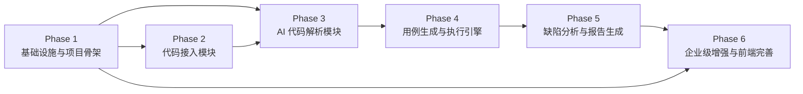
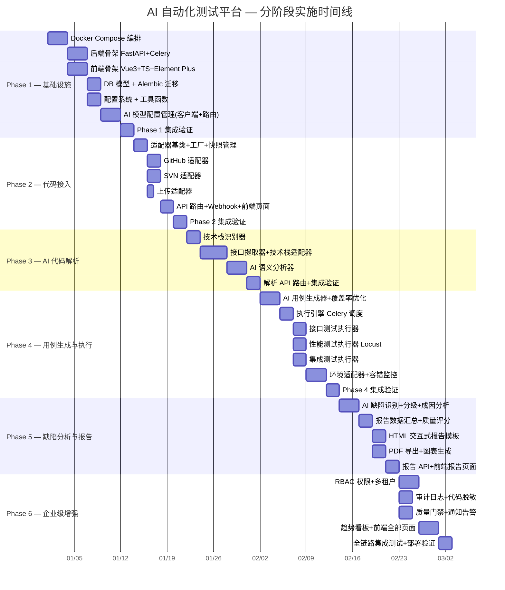

# AI 自动化测试平台 — 分阶段实施计划

> **文档定位**：基于《AI 自动化测试平台_完整设计方案》（4328行）输出的工程落地路线图，将设计方案拆解为 6 个可独立交付的阶段，供工程师按序实现。
>
> **技术栈**：后端 Python 3.12 + FastAPI + Celery + PostgreSQL + Redis + MinIO + RabbitMQ；前端 Vue 3 + TypeScript + Element Plus + ECharts + Pinia

---

## 一、总体阶段概览

| 阶段 | 名称 | 目标 | 依赖 | 预估工期 |
|------|------|------|------|---------|
| **Phase 1** | 基础设施与项目骨架 | 搭建可运行的项目骨架，包含全部基础设施服务、DB 模型、配置系统与 AI 模型配置管理 | 无 | 2 周 |
| **Phase 2** | 代码接入模块 | 实现 GitHub/SVN/上传三种数据源适配器，统一工厂模式接入 | Phase 1 | 1.5 周 |
| **Phase 3** | AI 代码解析模块 | 实现技术栈识别、接口提取、AI 语义分析，输出标准化解析结果 | Phase 1, Phase 2 | 2 周 |
| **Phase 4** | 测试用例生成与执行引擎 | 实现 AI 用例生成、覆盖率优化、三类测试并行执行与环境适配 | Phase 3 | 2.5 周 |
| **Phase 5** | 缺陷分析与报告生成 | 实现 AI 缺陷识别分级、HTML+PDF 双模式报告、可视化图表 | Phase 4 | 1.5 周 |
| **Phase 6** | 企业级增强与前端完善 | 实现 RBAC、审计日志、质量门禁、通知告警、趋势看板，完成全部前端页面 | Phase 1–5 | 2 周 |

### 阶段依赖关系图



### 阶段甘特图



---

## 二、阶段间接口契约

> 以下接口契约定义了各阶段之间的数据交换格式，前序阶段的输出必须严格遵循，后续阶段直接消费。

### 契约 1：Phase 1 → Phase 2~6（基础设施契约）

```
# AI 模型客户端统一接口（所有 AI 模块复用）
ModelRouter.call(use_case: str, messages: list[dict], **kwargs) -> str
ModelRouter.call_json(use_case: str, messages: list[dict], **kwargs) -> dict

# 数据库会话（所有模块复用）
get_db_session() -> AsyncSession  # SQLAlchemy 异步会话

# 配置访问（所有模块复用）
Settings  # Pydantic Settings 实例，含所有环境变量

# 对象存储客户端（代码快照、报告存储复用）
MinioClient  # MinIO 客户端封装

# Redis 客户端（任务状态、缓存复用）
RedisClient  # Redis 客户端封装
```

### 契约 2：Phase 2 → Phase 3（代码接入契约）

```json
// SourceAdapterFactory.fetch_code() 返回的统一结果格式
{
  "local_path": "/data/repos/owner_repo",     // 代码本地路径（Phase 3 的输入）
  "version_id": "a1b2c3d4e5f6...",            // 版本标识（Git SHA / SVN Revision / upload_timestamp）
  "version_label": "branch=main, commit=a1b2c3d4",
  "fetch_time": "2025-01-01T00:00:00Z",
  "files_changed": ["src/main.py", "..."],     // 增量更新时的变更文件列表
  "total_files": 156,
  "snapshot_id": "snap_20250101_001",          // MinIO 快照 ID
  "source_type": "github"                       // github / svn / upload
}
```

### 契约 3：Phase 3 → Phase 4（代码解析契约）

```json
// AI 代码解析模块输出的 analysis_result.json
{
  "tech_stack": "python_fastapi",              // 技术栈标识（Phase 4 环境适配器的 key）
  "language": "python",
  "framework": "fastapi",
  "local_path": "/data/repos/owner_repo",
  "project_structure": { "entry_points": [...], "modules": [...] },
  "api_list": [                                 // 接口清单（Phase 4 用例生成的输入）
    {
      "path": "/api/v1/users",
      "http_method": "POST",
      "params": { "body": {...}, "query": {...}, "path": {...} },
      "response_schema": {...},
      "auth_required": true,
      "module": "user_service",
      "description": "创建用户"
    }
  ],
  "dependency_graph": { "nodes": [...], "edges": [...] },
  "business_modules": [ { "name": "user_service", "apis": [...] } ],
  "ai_analysis": {                              // AI 语义分析结果
    "business_logic": "...",
    "data_flow": [...],
    "risk_areas": [...]
  }
}
```

### 契约 4：Phase 4 → Phase 5（测试结果契约）

```json
// 测试执行引擎输出的 test_results
{
  "test_run_id": "tr_20250101_001",
  "basic_info": { "project": "...", "source_type": "github", "version": "..." },
  "analysis_result": { /* Phase 3 的 analysis_result 引用 */ },
  "api_results": {
    "total": 50, "passed": 45, "failed": 5,
    "details": [ { "case_id": "TC_001", "case_name": "...", "case_type": "positive",
                   "passed": false, "request": {...}, "expected": {...},
                   "actual_status_code": 500, "actual_response": "...",
                   "error_message": "..." } ]
  },
  "performance_results": {
    "total_apis": 10, "avg_rt": 120, "avg_tps": 850.5,
    "bottlenecks": [ { "api": "/api/v1/orders", "p95_ms": 800, "tps": 50 } ],
    "details": [...]
  },
  "integration_results": {
    "total": 8, "passed": 6, "failed": 2,
    "details": [ { "chain_name": "...", "passed": false, "steps": [...], "failure_step": 2 } ]
  }
}
```

### 契约 5：Phase 5 → Phase 6（报告与缺陷契约）

```json
// 缺陷分析输出
{
  "total_defects": 7,
  "by_severity": { "P0": 0, "P1": 2, "P2": 3, "P3": 2 },
  "by_category": { "program_bug": 3, "performance_issue": 2, "integration_failure": 2 },
  "defects": [ { "category": "program_bug", "severity": "P1",
                 "root_cause": "...", "fix_suggestion": "...",
                 "reproduction_steps": [...] } ]
}

// 报告输出
{
  "online_url": "/reports/tr_20250101_001",
  "html_path": "reports/tr_20250101_001/report.html",
  "pdf_path": "reports/tr_20250101_001/report.pdf",
  "summary": { "quality_score": 78, "overall_pass": false, /* ... */ }
}
```

---

## 三、各阶段详细方案

### Phase 1：基础设施与项目骨架

> **阶段目标**：搭建可运行的全栈项目骨架，包含 Docker Compose 全部服务编排、后端 FastAPI+Celery 骨架、前端 Vue3 骨架、完整 DB 数据模型、配置系统、工具函数库，以及 AI 模型配置管理（统一客户端 + 路由器 + 管理 API）。

#### 文件清单

| # | 文件路径 | 说明 | 对应设计方案章节 |
|---|---------|------|----------------|
| 1 | `docker-compose.yml` | 全部服务编排（frontend/backend/celery-worker/celery-beat/postgres/redis/rabbitmq/minio） | §7.3 |
| 2 | `.env.example` | 环境变量模板（AI API/GitHub/SVN/DB/Redis/MinIO/RabbitMQ） | §7.2 |
| 3 | `README.md` | 项目说明与快速启动指南 | §7.2 |
| 4 | `backend/requirements.txt` | Python 依赖清单 | §2.3 |
| 5 | `backend/Dockerfile` | 后端容器镜像构建 | §7.3 |
| 6 | `backend/app/main.py` | FastAPI 应用入口，路由注册、中间件挂载、健康检查 | §3.x |
| 7 | `backend/app/celery.py` | Celery 应用配置（broker=RabbitMQ, backend=Redis, 任务注册） | §3.4 |
| 8 | `backend/app/config.py` | Pydantic Settings 配置类，读取所有环境变量 | §7.2 |
| 9 | `backend/app/models/__init__.py` | 模型包初始化 | §附录 |
| 10 | `backend/app/models/base.py` | SQLAlchemy Base、公共 Mixin（TimestampMixin、IDMixin） | — |
| 11 | `backend/app/models/source.py` | 数据源配置模型（SourceConfig 表） | §3.1 |
| 12 | `backend/app/models/test_run.py` | 测试运行记录模型（TestRun, TestCase 表） | §3.4 |
| 13 | `backend/app/models/analysis.py` | 代码解析结果模型（AnalysisResult 表，JSONB 存储） | §3.2 |
| 14 | `backend/app/models/defect.py` | 缺陷记录模型（Defect 表） | §3.5 |
| 15 | `backend/app/models/report.py` | 报告元数据模型（Report 表） | §3.6 |
| 16 | `backend/app/models/model_config.py` | AI 模型配置模型（ModelConfig, ModelRouting 表） | §2.4 |
| 17 | `backend/app/models/user.py` | 用户/组织/项目模型（User, Org, Project, Member 表） | §9.1 |
| 18 | `backend/app/models/audit.py` | 审计日志模型（AuditLog 表） | §9.2 |
| 19 | `backend/app/utils/__init__.py` | 工具包初始化 | §附录 |
| 20 | `backend/app/utils/database.py` | 数据库会话管理（异步引擎、get_db_session 依赖注入） | — |
| 21 | `backend/app/utils/redis_client.py` | Redis 客户端封装（任务状态、缓存） | §1.3 |
| 22 | `backend/app/utils/minio_client.py` | MinIO 客户端封装（代码快照、报告存储） | §3.1 |
| 23 | `backend/app/utils/crypto.py` | AES-256 加密/解密工具（API Key 加密存储） | §2.4 |
| 24 | `backend/app/utils/logger.py` | Loguru 日志配置 | §2.3 |
| 25 | `backend/app/modules/ai/__init__.py` | AI 模块包初始化 | §2.4 |
| 26 | `backend/app/modules/ai/model_config.py` | ModelConfig / ModelRoutingConfig Pydantic 模型 + ModelProvider 枚举 | §2.4 |
| 27 | `backend/app/modules/ai/model_client.py` | UnifiedModelClient 统一模型客户端（OpenAI/Anthropic/Custom 三种 provider） | §2.4 |
| 28 | `backend/app/modules/ai/model_router.py` | ModelRouter 模型路由器（按 use_case 路由 + 备用模型切换） | §2.4 |
| 29 | `backend/app/api/routes.py` | API 路由聚合（include 所有子路由） | §附录 |
| 30 | `backend/app/api/model_config.py` | AI 模型配置管理 API（CRUD + 连通性测试 + 路由配置） | §2.4 |
| 31 | `backend/alembic/env.py` | Alembic 迁移环境配置 | — |
| 32 | `backend/alembic/versions/001_initial.py` | 初始迁移（全部表结构） | — |
| 33 | `frontend/package.json` | 前端依赖声明 | §2.2 |
| 34 | `frontend/vite.config.ts` | Vite 构建配置 | §2.2 |
| 35 | `frontend/tsconfig.json` | TypeScript 配置 | §2.2 |
| 36 | `frontend/Dockerfile` | 前端容器镜像构建（Nginx） | §7.3 |
| 37 | `frontend/index.html` | HTML 入口 | §2.2 |
| 38 | `frontend/src/main.ts` | Vue 应用入口（挂载 ElementPlus、Pinia、Router） | §2.2 |
| 39 | `frontend/src/App.vue` | 根组件（布局框架） | §2.2 |
| 40 | `frontend/src/router/index.ts` | 路由配置（基础路由 + 路由守卫占位） | §2.2 |
| 41 | `frontend/src/api/index.ts` | Axios 实例封装（请求/响应拦截器） | §2.2 |
| 42 | `frontend/src/stores/index.ts` | Pinia Store 基础配置 | §2.2 |
| 43 | `frontend/src/views/ModelConfig.vue` | AI 模型配置页面（配置列表、新增/编辑、连通性测试、路由配置） | §2.4 |
| 44 | `frontend/src/api/model.ts` | 模型配置 API 调用封装 | §2.4 |
| 45 | `frontend/src/layouts/MainLayout.vue` | 主布局（侧边栏导航 + 顶栏 + 内容区） | — |

#### 文件间依赖关系

```
docker-compose.yml ──────────────────────────────────────────┐
.env.example ────────────────────────────────────────────────┤
                                                              ▼
backend/app/config.py ◄── backend/app/utils/*.py ◄── backend/app/main.py
         │                         │                              │
         ▼                         ▼                              ▼
backend/app/models/*.py ◄── backend/app/modules/ai/*.py ◄── backend/app/api/*.py
         │                                                         │
         ▼                                                         ▼
backend/alembic/                                  backend/app/celery.py (依赖 config + models)

frontend/package.json ◄── frontend/vite.config.ts ◄── frontend/src/main.ts
                                                              │
                                                   frontend/src/App.vue
                                                              │
                              frontend/src/layouts/MainLayout.vue
                                                              │
                              frontend/src/router/index.ts ◄── frontend/src/views/ModelConfig.vue
                                                              │
                              frontend/src/api/index.ts ◄── frontend/src/api/model.ts
```

#### 关键实现要点

1. **Docker Compose 编排**（§7.3）：8 个服务（frontend:8080, backend:8000, celery-worker×3, celery-beat, postgres:5432, redis:6379, rabbitmq:5672/15672, minio:9000/9001），backend 挂载 `/var/run/docker.sock` 供后续 Docker SDK 调用。

2. **AI 模型配置管理**（§2.4）：这是 Phase 1 的核心交付物，后续所有 AI 模块（解析、用例生成、缺陷分析）均依赖此模块：
   - `UnifiedModelClient` 支持 OpenAI 兼容 API（覆盖 90% 场景含 vLLM/Ollama/DeepSeek）、Anthropic Claude、自定义 HTTP API 三种 provider
   - `ModelRouter` 按 `use_case`（`code_analysis`/`case_generation`/`defect_analysis`/`fix_suggestion`）路由到对应模型，主模型失败自动切换 fallback 模型
   - API Key 使用 AES-256 加密存储，API 返回时脱敏为 `***`
   - 模型配置管理 API：`GET/POST /api/models/configs`、`PUT /api/models/configs/{id}`、`POST /api/models/configs/{id}/test`、`PUT /api/models/routing`

3. **DB 数据模型设计**（§附录 + §3.1–3.7 + §9.1–9.2）：所有表一次建好，避免后续迁移频繁：
   - `source_configs` 表存储三种数据源配置
   - `test_runs` / `test_cases` 表存储测试运行记录
   - `analysis_results` 表用 JSONB 存储解析结果（灵活结构）
   - `defects` 表存储缺陷清单
   - `reports` 表存储报告元数据
   - `model_configs` / `model_routing` 表存储 AI 模型配置
   - `users` / `orgs` / `projects` / `members` 表支持多租户 RBAC
   - `audit_logs` 表存储审计日志

4. **Celery 配置**（§3.4）：broker=RabbitMQ, backend=Redis，注册任务队列占位，后续 Phase 4 填充具体任务。

5. **前端骨架**（§2.2）：Vue 3 `<script setup>` + Element Plus + Pinia + Vue Router，Axios 封装统一请求/响应拦截器（JWT Token 注入、错误统一处理），主布局含侧边栏导航占位。

---

### Phase 2：代码接入模块

> **阶段目标**：实现 GitHub/SVN/人工上传三种代码数据源适配器，通过统一工厂模式接入，提供统一的拉取/接收 API 和 Webhook 自动触发能力，输出标准化的代码快照。

#### 文件清单

| # | 文件路径 | 说明 | 对应设计方案章节 |
|---|---------|------|----------------|
| 1 | `backend/app/modules/source/__init__.py` | 数据源模块包初始化，注册所有适配器 | §3.1 |
| 2 | `backend/app/modules/source/base.py` | `SourceType` 枚举、`SourceConfig` 数据类、`CodeSourceAdapter` 抽象基类、`SourceAdapterFactory` 工厂 | §3.1 |
| 3 | `backend/app/modules/source/github_adapter.py` | `GitHubAdapter`：全量 clone + 增量 pull，支持分支/Commit 指定 | §3.1 |
| 4 | `backend/app/modules/source/svn_adapter.py` | `SVNAdapter`：全量 checkout + 增量 update，支持修订版本指定 | §3.1 |
| 5 | `backend/app/modules/source/upload_adapter.py` | `UploadAdapter`：ZIP/TAR.GZ 解压校验 | §3.1 |
| 6 | `backend/app/modules/source/snapshot.py` | `SnapshotManager`：代码快照创建、MinIO 上传、版本管理 | §3.1 |
| 7 | `backend/app/modules/source/retry.py` | 拉取重试机制（指数退避，对应 FaultType.PULL_FAILURE） | §3.1 / §3.7 |
| 8 | `backend/app/api/source.py` | 统一数据源接入 API（`POST /api/source/fetch`、`GET /api/source/configs`） | §4.7 |
| 9 | `backend/app/api/upload.py` | 文件上传 API（`POST /api/upload`，接收压缩包） | §3.1 / §4.6 |
| 10 | `backend/app/api/webhook.py` | Webhook 接收 API（GitHub Push Event / SVN Post-commit Hook） | §4.4 / §4.5 |
| 11 | `frontend/src/views/SourceManage.vue` | 数据源管理页面（GitHub/SVN/上传三种配置表单 + 历史记录） | §4.7 |
| 12 | `frontend/src/api/source.ts` | 数据源 API 调用封装 | §4.7 |
| 13 | `frontend/src/components/SourceForm.vue` | 数据源配置表单组件（GitHub/SVN/上传三态切换） | §4.7 |

#### 文件间依赖关系

```
backend/app/modules/source/base.py ◄── github_adapter.py
         │                          ◄── svn_adapter.py
         │                          ◄── upload_adapter.py
         │                                  │
         ▼                                  ▼
    snapshot.py ◄── retry.py          (base 的 SourceConfig 被所有适配器消费)
         │
         ▼
backend/app/api/source.py ◄── backend/app/api/upload.py ◄── backend/app/api/webhook.py
         │
         ▼
(消费 Phase 1 的 config.py, models/source.py, utils/minio_client.py, utils/redis_client.py)

frontend/src/api/source.ts ◄── frontend/src/components/SourceForm.vue ◄── frontend/src/views/SourceManage.vue
```

#### 关键实现要点

1. **适配器基类与工厂**（§3.1）：
   - `CodeSourceAdapter` 抽象基类定义 `fetch(config: SourceConfig) -> dict` 和 `supports_incremental() -> bool` 两个抽象方法
   - `SourceAdapterFactory` 提供统一入口 `fetch_code(config)`，内部选择适配器并自动创建快照
   - 适配器通过 `register()` 类方法运行时注册，新增数据源只需扩展适配器

2. **GitHub 适配器**（§3.1 / §4.2）：
   - 全量 clone：Token 注入 URL 认证 `https://{token}@github.com/...`，支持 `depth=1` 浅克隆
   - 增量 pull：先 `fetch` 再 `pull`，通过 `git diff --name-only old_sha new_sha` 获取变更文件
   - 支持指定分支（`config.branch`）和指定 Commit（`config.commit_sha`）

3. **SVN 适配器**（§3.1 / §4.5）：
   - 全量 checkout：`svn checkout --username --password --non-interactive --no-auth-cache`
   - 增量 update：`svn update --revision {N}`
   - 认证参数通过 `--non-interactive --no-auth-cache` 避免交互式提示

4. **上传适配器**（§3.1 / §4.6）：
   - 接收 ZIP/TAR.GZ 压缩包，解压到 `/data/repos/upload_{timestamp}/`
   - 校验压缩包完整性（文件数 > 0、非嵌套单目录陷阱）
   - 不支持增量更新（`supports_incremental()` 返回 `False`）

5. **快照管理**（§3.1）：
   - 每次拉取/上传后创建版本快照，上传到 MinIO 对象存储
   - 快照 ID 格式：`snap_{YYYYMMDD}_{seq}`
   - 支持回退到历史快照（容错兜底策略 `use_cached_snapshot`）

6. **重试机制**（§3.1 / §3.7）：
   - 拉取失败（`PULL_FAILURE`）：最多重试 3 次，指数退避 5s→10s→20s，兜底使用缓存快照
   - SVN 认证失败（`SVN_AUTH_FAILURE`）：不重试，直接返回认证错误

7. **Webhook 自动触发**（§4.4 / §4.5）：
   - GitHub Push Event：验证 Webhook Secret → 解析仓库名和分支 → 自动触发 fetch_code
   - SVN Post-commit Hook：接收 HTTP 回调 → 解析仓库 URL 和修订版本 → 自动触发 fetch_code

8. **统一 API**（§4.7）：
   - `POST /api/source/fetch`：接收 `SourceConfig`，调用 `SourceAdapterFactory.fetch_code()`，返回标准化结果
   - `GET /api/source/configs`：列出已配置的数据源
   - `POST /api/upload`：接收压缩包文件，存储后返回路径供 `SourceConfig.upload_file_path` 使用

---

### Phase 3：AI 代码解析模块

> **阶段目标**：实现技术栈智能识别、API 接口自动提取、AI 语义分析增强，输出标准化的 `analysis_result`，作为后续用例生成和环境适配的输入。

#### 文件清单

| # | 文件路径 | 说明 | 对应设计方案章节 |
|---|---------|------|----------------|
| 1 | `backend/app/modules/code_analyzer/__init__.py` | 代码解析模块包初始化 | §3.2 |
| 2 | `backend/app/modules/code_analyzer/stack_detector.py` | `StackDetector`：基于文件签名+框架特征的技术栈识别器 | §3.2 |
| 3 | `backend/app/modules/code_analyzer/api_extractor.py` | `APIExtractor`：接口提取器（路由扫描+参数解析+响应 Schema） | §3.2 |
| 4 | `backend/app/modules/code_analyzer/ai_analyzer.py` | `AIAnalyzer`：AI 语义分析增强（业务逻辑理解+模块划分+风险评估） | §3.2 |
| 5 | `backend/app/modules/code_analyzer/adapters/__init__.py` | 技术栈适配器注册 | §3.2 |
| 6 | `backend/app/modules/code_analyzer/adapters/java_spring.py` | Spring Boot 适配器（注解扫描 `@RestController`/`@RequestMapping`） | §3.2 |
| 7 | `backend/app/modules/code_analyzer/adapters/python_flask.py` | Flask 适配器（装饰器扫描 `@app.route`） | §3.2 |
| 8 | `backend/app/modules/code_analyzer/adapters/python_fastapi.py` | FastAPI 适配器（装饰器扫描 `@app.get`/`@router.post`） | §3.2 |
| 9 | `backend/app/modules/code_analyzer/adapters/python_django.py` | Django 适配器（URLconf 解析） | §3.2 |
| 10 | `backend/app/modules/code_analyzer/adapters/go_gin.py` | Go Gin 适配器（路由模式扫描 `r.GET(`） | §3.2 |
| 11 | `backend/app/modules/code_analyzer/adapters/node_express.py` | Node Express 适配器（路由模式扫描 `app.get(`） | §3.2 |
| 12 | `backend/app/modules/code_analyzer/adapters/node_nestjs.py` | Node NestJS 适配器（注解扫描 `@Controller`/`@Get`） | §3.2 |
| 13 | `backend/app/modules/code_analyzer/adapters/php_laravel.py` | PHP Laravel 适配器（路由文件解析 `routes/api.php`） | §3.2 |
| 14 | `backend/app/api/analysis.py` | 代码解析 API（`POST /api/analysis/run`、`GET /api/analysis/{id}`） | §3.2 |
| 15 | `frontend/src/views/Analysis.vue` | 解析结果查看页面（技术栈信息+接口清单+依赖图可视化） | §3.2 |

#### 文件间依赖关系

```
backend/app/modules/code_analyzer/stack_detector.py
         │ (输出 tech_stack 标识)
         ▼
backend/app/modules/code_analyzer/adapters/*.py (8 个技术栈适配器，由 stack_detector 的输出选择)
         │ (每个适配器实现 extract_apis(project_path) -> list[dict])
         ▼
backend/app/modules/code_analyzer/api_extractor.py (调度适配器，统一提取接口)
         │
         ▼
backend/app/modules/code_analyzer/ai_analyzer.py (AI 语义增强，调用 Phase 1 的 ModelRouter)

(消费 Phase 1 的 modules/ai/model_router.py — use_case="code_analysis")
(消费 Phase 2 的 fetch_code() 输出 — local_path)

backend/app/api/analysis.py → frontend/src/views/Analysis.vue
```

#### 关键实现要点

1. **技术栈识别**（§3.2）：
   - `STACK_SIGNATURES` 字典定义 8 种技术栈的识别特征：文件签名（如 `pom.xml`/`requirements.txt`/`go.mod`）、框架导入特征、路由装饰器/注解特征
   - `StackDetector.detect(project_path)` 遍历签名计算置信度评分，取最高分作为识别结果
   - 输出 `{ stack: "python_fastapi", language: "python", framework: "fastapi", confidence: 0.95 }`

2. **接口提取**（§3.2）：
   - 每个技术栈适配器实现统一的 `extract_apis(project_path) -> list[dict]` 接口
   - **Spring Boot**：扫描 `@RestController`/`@RequestMapping`/`@GetMapping` 等注解，解析 `pom.xml` 依赖、`application.yml` 端口配置
   - **FastAPI**：扫描 `@app.get`/`@router.post` 装饰器，解析 Pydantic 模型参数
   - **Flask**：扫描 `@app.route`/`@blueprint.route` 装饰器
   - **Django**：解析 `urls.py` URLconf 路由映射
   - **Go Gin**：正则匹配 `r.GET(`/`router.POST(` 路由注册模式
   - **Node Express/NestJS**：扫描 `app.get(`/`@Controller(`/`@Get(` 模式
   - **PHP Laravel**：解析 `routes/api.php`/`routes/web.php` 路由文件
   - 每个接口提取：`path`、`http_method`、`params`（body/query/path）、`response_schema`、`auth_required`、`description`

3. **AI 语义分析增强**（§3.2）：
   - 调用 `ModelRouter.call_json(use_case="code_analysis", ...)` 发送接口清单和代码片段给 AI
   - AI 增强：补充接口的业务语义描述、数据流向分析、模块依赖关系、风险区域标注
   - 输出 `business_modules` 划分（按业务域聚合接口）
   - 输出 `ai_analysis` 对象包含 `business_logic`、`data_flow`、`risk_areas`

4. **解析 API**（§3.2）：
   - `POST /api/analysis/run`：接收 `local_path`（来自 Phase 2 的 fetch_code 输出），执行完整解析流程，返回 `analysis_result`
   - `GET /api/analysis/{id}`：查询历史解析结果
   - 解析结果存入 `analysis_results` 表（JSONB 字段）

5. **依赖图可视化**：前端使用 ECharts Graph 图展示模块依赖关系，节点为业务模块，边为调用关系。

---

### Phase 4：测试用例生成与执行引擎

> **阶段目标**：实现 AI 驱动的测试用例生成（含覆盖率优化）和三类核心测试（接口/性能/集成）的并行执行引擎，含环境自动适配和容错监控。

#### 文件清单

| # | 文件路径 | 说明 | 对应设计方案章节 |
|---|---------|------|----------------|
| 1 | `backend/app/modules/case_generator/__init__.py` | 用例生成模块包初始化 | §3.3 |
| 2 | `backend/app/modules/case_generator/case_generator.py` | `TestCaseGenerator`：AI 用例生成器（正向/反向/边界/异常四类用例） | §3.3 |
| 3 | `backend/app/modules/case_generator/coverage_optimizer.py` | `CoverageOptimizer`：基于代码路径的覆盖率分析与补充用例 | §3.3 |
| 4 | `backend/app/modules/execution/__init__.py` | 执行引擎模块包初始化 | §3.4 |
| 5 | `backend/app/modules/execution/engine.py` | `TestExecutionEngine` + Celery 任务定义（prepare_environment/run_api_tests/run_performance_tests/run_integration_tests/aggregate_results） | §3.4 / §5.1–5.3 |
| 6 | `backend/app/modules/execution/api_tester.py` | `APITester`：接口测试执行器（HTTPx 异步请求+响应校验+断言引擎） | §5.1 |
| 7 | `backend/app/modules/execution/performance_tester.py` | `PerformanceTester`：性能测试执行器（Locust 集成+TPS/QPS 统计+瓶颈识别） | §5.2 |
| 8 | `backend/app/modules/execution/integration_tester.py` | `IntegrationTester`：集成测试执行器（全链路串联+上下文传递+流程校验） | §5.3 |
| 9 | `backend/app/modules/execution/env_adapters.py` | `EnvironmentAdapterFactory` + 8 种技术栈环境适配器（Docker 容器启动+健康检查） | §3.4 |
| 10 | `backend/app/modules/execution/assertion_engine.py` | 断言引擎（status_code/json_path/contains/jsonschema/response_time 多种断言类型） | §5.1 |
| 11 | `backend/app/modules/monitor/__init__.py` | 容错监控模块包初始化 | §3.7 |
| 12 | `backend/app/modules/monitor/fault_tolerance.py` | `FaultHandler`：8 种故障类型的重试+兜底策略（指数退避） | §3.7 |
| 13 | `backend/app/modules/monitor/checkpoint.py` | `CheckpointManager`：任务检查点保存与恢复 | §8.2 |
| 14 | `backend/app/api/test_run.py` | 测试运行 API（`POST /api/test/run`、`GET /api/test/{id}/status`、`POST /api/test/{id}/cancel`） | §3.4 |
| 15 | `frontend/src/views/TestRun.vue` | 测试运行页面（发起测试+实时进度+任务状态） | §3.4 |
| 16 | `frontend/src/api/test.ts` | 测试运行 API 调用封装 | §3.4 |

#### 文件间依赖关系

```
(Phase 3 输出: analysis_result 含 api_list + tech_stack)
         │
         ▼
case_generator/case_generator.py ──► coverage_optimizer.py
         │ (输出: test_cases {api: [...], performance: [...], integration: [...]})
         ▼
execution/engine.py (Celery chain: prepare_environment → group(api/perf/integration) → aggregate)
         │                    │                    │
         ▼                    ▼                    ▼
  env_adapters.py      api_tester.py       performance_tester.py    integration_tester.py
  (Docker 启动被测服务)   (HTTPx 请求)        (Locust 压测)            (链路串联)
         │                    │                    │                    │
         │                    └──► assertion_engine.py ◄───┘            │
         │                                                                      │
         ▼                                                                      ▼
  monitor/fault_tolerance.py ◄────────── monitor/checkpoint.py ◄──────────────┘
  (重试+兜底)                          (检查点保存/恢复)

(消费 Phase 1 的 celery.py, ModelRouter — use_case="case_generation")
(消费 Phase 3 的 analysis_result — tech_stack, api_list)

backend/app/api/test_run.py → frontend/src/views/TestRun.vue
```

#### 关键实现要点

1. **AI 用例生成**（§3.3）：
   - `TestCaseGenerator.generate_api_cases(api_info, business_analysis)` 调用 `ModelRouter.call_json(use_case="case_generation", ...)`
   - 生成四类用例：正向（≥3 个）、反向（≥5 个）、边界值（≥4 个）、异常（≥3 个）
   - 低温度参数（`temperature=0.3`）保证用例稳定性
   - 每个用例含：`case_id`、`case_type`、`case_name`、`request`（method/url/headers/body/params）、`expected`（status_code/assertions）、`priority`
   - 变量占位符 `{{token}}` 格式，供集成测试上下文传递

2. **覆盖率优化**（§3.3）：
   - `CoverageOptimizer.optimize(cases, code_paths)` 分析 AST 执行路径覆盖率
   - 识别未覆盖路径，调用 AI 生成补充用例

3. **执行引擎调度**（§3.4）：
   - Celery `chain(prepare_environment → group(api_tests, performance_tests, integration_tests) → aggregate_results)`
   - `prepare_environment`：根据 `tech_stack` 选择环境适配器，Docker 构建被测服务镜像并启动容器
   - 三类测试通过 `group()` 并行执行
   - `aggregate_results`：汇总三类测试结果为统一的 `test_results`

4. **接口测试执行器**（§5.1）：
   - HTTPx 异步发送 HTTP 请求，支持变量替换 `{{token}}` → 实际值
   - 断言引擎支持：`status_code`（状态码比对）、`json_path`（JSONPath 提取+比对）、`contains`（响应体包含）、`jsonschema`（Schema 校验）、`response_time`（响应时间阈值）
   - 记录每个用例的：`passed`、`actual_status_code`、`actual_response`、`response_time_ms`、`error_message`

5. **性能测试执行器**（§5.2）：
   - Locust 集成：编程式定义压测任务（`HttpUser` + `@task`），不依赖 Locust Web UI
   - 阶梯压测：逐步增加并发用户数，记录 TPS/QPS/P95/P99 响应时间
   - 瓶颈识别：响应时间超阈值（默认 500ms）或错误率超 5% 的接口标记为瓶颈
   - 输出 `performance_results` 含 `bottlenecks` 列表

6. **集成测试执行器**（§5.3）：
   - 全链路串联：按业务场景编排多接口调用序列（如：注册 → 登录 → 下单 → 支付）
   - 上下文传递：前一步响应中的字段（如 `userId`、`token`）自动注入后续步骤的请求参数
   - 流程校验：每步执行后断言，失败时记录 `failure_step` 和失败原因
   - 输出 `integration_results` 含每个链路的执行详情

7. **环境适配器**（§3.4）：
   - `EnvironmentAdapterFactory.ADAPTERS` 映射 8 种技术栈到适配器类
   - 每个适配器 `start_service(repo_path)`：Docker SDK 构建镜像 → 启动容器 → 返回随机映射端口 URL
   - `wait_for_ready(url, timeout=120)`：轮询 `/health` 端点等待服务就绪

8. **容错监控**（§3.7 / §8.1–8.2）：
   - `FaultHandler` 定义 8 种故障类型（PULL_FAILURE/SVN_AUTH_FAILURE/UPLOAD_CORRUPTED/API_TIMEOUT/ENV_EXCEPTION/TASK_INTERRUPT/AI_RATE_LIMIT/DISK_FULL）
   - 每种故障配置：`max_retries`、`backoff_base`、`backoff_max`、`fallback` 策略
   - 兜底策略：`use_cached_snapshot`（缓存快照）、`mark_as_timeout`（标记超时）、`use_default_env`（默认环境）、`resume_from_checkpoint`（检查点恢复）、`switch_to_backup_model`（切换备用模型）
   - `CheckpointManager`：每个 Celery 任务步骤完成后保存检查点到 Redis，中断后可从检查点恢复

---

### Phase 5：缺陷分析与报告生成

> **阶段目标**：实现 AI 缺陷智能识别（分类+分级+成因+修复建议）、HTML 交互式报告 + PDF 导出报告双模式生成、可视化图表，输出完整的测试报告。

#### 文件清单

| # | 文件路径 | 说明 | 对应设计方案章节 |
|---|---------|------|----------------|
| 1 | `backend/app/modules/defect_analyzer/__init__.py` | 缺陷分析模块包初始化 | §3.5 |
| 2 | `backend/app/modules/defect_analyzer/analyzer.py` | `DefectAnalyzer`：AI 缺陷识别（5 类分类+P0–P3 分级+根因分析+修复建议+去重合并） | §3.5 |
| 3 | `backend/app/modules/report/__init__.py` | 报告模块包初始化 | §3.6 |
| 4 | `backend/app/modules/report/generator.py` | `ReportGenerator`：报告生成器（数据汇总+质量评分+HTML/PDF 双模式） | §3.6 |
| 5 | `backend/app/modules/report/charts.py` | `ChartBuilder`：可视化图表数据构建（质量评分仪表盘+缺陷分布饼图+通过率柱状图+性能折线图） | §6.4 |
| 6 | `backend/app/modules/report/templates/report_interactive.html` | 在线交互式报告模板（Jinja2 + ECharts，支持筛选/缩放/展开折叠） | §6.2 |
| 7 | `backend/app/modules/report/templates/report_pdf.html` | PDF 报告模板（Jinja2 + matplotlib 静态图表） | §6.2 |
| 8 | `backend/app/modules/report/templates/styles.css` | 报告样式（HTML+PDF 共用基础样式 + PDF 专用打印样式） | §6.2 |
| 9 | `backend/app/api/report.py` | 报告 API（`GET /api/report/{test_run_id}`（在线）、`GET /api/report/{test_run_id}/pdf`（导出）、`GET /api/report/history`（历史对比）） | §3.6 |
| 10 | `frontend/src/views/Report.vue` | 报告查看页面（在线交互报告嵌入+PDF 导出按钮+历史版本对比） | §6.2 |
| 11 | `frontend/src/api/report.ts` | 报告 API 调用封装 | §3.6 |
| 12 | `frontend/src/components/ReportSummary.vue` | 报告摘要组件（质量评分+通过率+缺陷概览卡片） | §6.3 |

#### 文件间依赖关系

```
(Phase 4 输出: test_results 含 api_results/performance_results/integration_results)
         │
         ▼
defect_analyzer/analyzer.py (AI 分析失败用例 → 缺陷清单)
         │ (输出: defects {total, by_severity, by_category, defects[]})
         ▼
report/generator.py
         ├──► report/charts.py (构建图表数据: 仪表盘/饼图/柱状图/折线图)
         │
         ├──► templates/report_interactive.html (Jinja2 渲染 → 在线 HTML, ECharts 交互图表)
         │
         └──► templates/report_pdf.html (Jinja2 渲染 → HTML → WeasyPrint → PDF, matplotlib 静态图表)
                  └──► templates/styles.css

(消费 Phase 1 的 ModelRouter — use_case="defect_analysis", "fix_suggestion")
(消费 Phase 1 的 utils/minio_client.py — 报告上传存储)

backend/app/api/report.py → frontend/src/views/Report.vue → frontend/src/components/ReportSummary.vue
```

#### 关键实现要点

1. **AI 缺陷识别**（§3.5）：
   - `DefectAnalyzer.analyze(test_results)` 遍历三类测试的失败结果
   - 5 类缺陷分类：`business_exception`（业务异常，P3 基准）、`program_bug`（程序 BUG，P1 基准）、`performance_issue`（性能问题，P2 基准）、`integration_failure`（集成故障，P1 基准）、`security_vulnerability`（安全漏洞，P0 基准）
   - 调用 `ModelRouter.call_json(use_case="defect_analysis", ...)` 让 AI 判定每个失败的 category、severity、root_cause、fix_suggestion、reproduction_steps
   - AI 去重合并：相似缺陷自动合并（同一根因的多个失败用例）

2. **质量评分算法**（§3.6）：
   - 基准分 100 分
   - API 测试通过率扣分：`(1 - pass_rate) × 40`
   - 性能瓶颈扣分：`bottleneck_count × 5`
   - 集成测试失败扣分：`(1 - pass_rate) × 30`
   - 缺陷扣分：P0×15 + P1×8 + P2×3 + P3×1
   - 整体通过判定：P0=0 且 P1=0

3. **HTML 交互式报告**（§6.2）：
   - Jinja2 模板 `report_interactive.html`，内嵌 ECharts CDN
   - 交互特性：图表缩放、数据筛选（按用例类型/状态）、用例详情展开/折叠
   - 报告结构：摘要概览 → 质量评分仪表盘 → 接口测试详情 → 性能测试详情 → 集成测试详情 → 缺陷清单 → 修复建议
   - 生成后上传 MinIO，返回在线访问 URL

4. **PDF 导出报告**（§6.2）：
   - 使用 `report_pdf.html` 模板，matplotlib 生成静态图表图片替换 ECharts 交互图表
   - WeasyPrint 将 HTML 渲染为 PDF
   - PDF 适合存档和分享，不含交互 JS

5. **可视化方案**（§6.4）：
   - 质量评分：ECharts Gauge 仪表盘
   - 缺陷分布：ECharts Pie 饼图（按 severity 和 category 双维度）
   - 测试通过率：ECharts Bar 柱状图（接口/性能/集成三类对比）
   - 性能趋势：ECharts Line 折线图（TPS/响应时间随并发数变化）
   - 模块依赖：ECharts Graph 桑基图（Phase 3 依赖图复用）

6. **报告 API**（§3.6）：
   - `GET /api/report/{test_run_id}`：返回在线 HTML 报告内容或重定向到 MinIO URL
   - `GET /api/report/{test_run_id}/pdf`：返回 PDF 文件下载
   - `GET /api/report/history`：返回历史报告列表，支持版本对比

7. **报告完整字段**（§6.3）：报告包含 basic_info（项目/版本/时间）、quality_score、overall_pass、api_summary、performance_summary、integration_summary、defect_summary（按 severity 和 category 分组）、详细用例列表、缺陷详情（含 root_cause 和 fix_suggestion）。

---

### Phase 6：企业级增强与前端完善

> **阶段目标**：实现企业级增强功能（RBAC 权限、审计日志、代码脱敏、质量门禁、通知告警、趋势看板），完成全部前端页面，实现全链路集成与部署验证。

#### 文件清单

| # | 文件路径 | 说明 | 对应设计方案章节 |
|---|---------|------|----------------|
| 1 | `backend/app/modules/auth/__init__.py` | 认证授权模块包初始化 | §9.1 |
| 2 | `backend/app/modules/auth/rbac.py` | RBAC 权限模型（Permission 枚举+ROLE_PERMISSIONS 映射+权限检查函数+JWT 认证） | §9.1 |
| 3 | `backend/app/modules/auth/middleware.py` | FastAPI 权限中间件（请求级权限校验装饰器 `@require_permission`） | §9.1 |
| 4 | `backend/app/modules/audit/__init__.py` | 审计模块包初始化 | §9.2 |
| 5 | `backend/app/modules/audit/logger.py` | `AuditLogger`：审计日志记录器 + HTTP 中间件自动记录 | §9.2 |
| 6 | `backend/app/modules/security/__init__.py` | 安全模块包初始化 | §9.3 |
| 7 | `backend/app/modules/security/desensitizer.py` | `CodeDesensitizer`：代码脱敏（API Key/密码/JWT/AWS Key/连接串 5 类正则替换） | §9.3 |
| 8 | `backend/app/modules/notification/__init__.py` | 通知模块包初始化 | §9.4 |
| 9 | `backend/app/modules/notification/notifier.py` | `NotificationManager`：多渠道通知（邮件/企业微信/钉钉/Slack Webhook）+ 通知级别（success/warning/critical） | §9.4 |
| 10 | `backend/app/modules/quality_gate/__init__.py` | 质量门禁模块包初始化 | §9.5 |
| 11 | `backend/app/modules/quality_gate/gate.py` | `QualityGate`：门禁规则评估（P0/P1 缺陷数+通过率+响应时间+错误率+质量评分 7 条规则） | §9.5 |
| 12 | `backend/app/api/auth.py` | 认证 API（登录/登出/用户管理/角色分配）— 更新 Phase 1 占位 | §9.1 |
| 13 | `backend/app/api/audit.py` | 审计日志 API（`GET /api/audit/logs` 分页查询+过滤） | §9.2 |
| 14 | `backend/app/api/quality_gate.py` | 质量门禁 API（`GET/PUT /api/quality-gate/rules`、`GET /api/quality-gate/{test_run_id}/evaluate`） | §9.5 |
| 15 | `backend/app/api/trend.py` | 趋势看板 API（`GET /api/trend/quality`、`GET /api/trend/defects`、`GET /api/trend/pass-rate`） | §9.6 |
| 16 | `backend/app/modules/integration/orchestrator.py` | 全链路编排器：串联 Phase 2→3→4→5 的完整流程（代码接入→解析→用例生成→执行→缺陷分析→报告生成） | §1.2 |
| 17 | `frontend/src/views/Dashboard.vue` | 仪表盘首页（项目概览+最近测试+质量趋势+快捷操作） | §6.2 |
| 18 | `frontend/src/views/QualityTrend.vue` | 质量趋势看板（质量评分折线图+缺陷趋势柱状图+通过率趋势+关键指标） | §9.6 |
| 19 | `frontend/src/views/Settings.vue` | 系统设置页面（数据源配置+环境配置+通知配置） | — |
| 20 | `frontend/src/views/QualityGate.vue` | 质量门禁配置页面（门禁规则编辑+历史评估结果） | §9.5 |
| 21 | `frontend/src/views/AuditLog.vue` | 审计日志页面（日志列表+筛选+详情查看） | §9.2 |
| 22 | `frontend/src/views/Login.vue` | 登录页面 | §9.1 |
| 23 | `frontend/src/stores/auth.ts` | 认证状态管理（用户信息+权限列表+登录态） | §9.1 |
| 24 | `frontend/src/api/auth.ts` | 认证 API 调用封装 | §9.1 |
| 25 | `frontend/src/api/audit.ts` | 审计日志 API 调用封装 | §9.2 |
| 26 | `frontend/src/api/trend.ts` | 趋势看板 API 调用封装 | §9.6 |
| 27 | `frontend/src/api/qualityGate.ts` | 质量门禁 API 调用封装 | §9.5 |
| 28 | `frontend/src/components/QualityScoreCard.vue` | 质量评分卡片组件（仪表盘+通过/不通过标识） | §6.4 |
| 29 | `frontend/src/components/DefectList.vue` | 缺陷列表组件（分组展示+严重性标签+详情展开） | §6.3 |
| 30 | `frontend/src/components/TrendChart.vue` | 趋势图表组件（可复用的 ECharts 折线/柱状图封装） | §9.6 |
| 31 | `frontend/src/router/index.ts` | 路由配置更新（全部页面路由+权限守卫+角色路由过滤） | §9.1 |
| 32 | `frontend/src/layouts/MainLayout.vue` | 主布局更新（侧边栏菜单按权限动态渲染） | §9.1 |

#### 文件间依赖关系

```
(Phase 1–5 的所有后端模块)
         │
         ▼
modules/auth/rbac.py + middleware.py ──► api/auth.py (JWT 认证 + 权限校验)
         │                                        │
         ▼                                        ▼
modules/audit/logger.py ──► api/audit.py    (审计中间件挂载到 main.py)
         │
         ▼
modules/security/desensitizer.py ──► (注入到 Phase 3 ai_analyzer + Phase 4 case_generator 的 AI 调用前)
         │
         ▼
modules/quality_gate/gate.py ──► api/quality_gate.py (消费 Phase 5 的 report summary)
         │
         ▼
modules/notification/notifier.py ──► (订阅 Phase 5 报告生成完成事件)
         │
         ▼
modules/integration/orchestrator.py (编排完整流程: source → analysis → case_gen → execution → defect → report)

frontend/src/stores/auth.ts ◄── frontend/src/api/auth.ts ◄── frontend/src/views/Login.vue
         │
         ▼
frontend/src/router/index.ts (权限守卫) ──► frontend/src/layouts/MainLayout.vue (动态菜单)
         │
         ├──► Dashboard.vue ──► components/QualityScoreCard.vue
         ├──► QualityTrend.vue ──► components/TrendChart.vue
         ├──► QualityGate.vue
         ├──► AuditLog.vue
         ├──► Settings.vue
         └──► (Phase 2–5 的前端页面已有)
```

#### 关键实现要点

1. **RBAC 权限管理**（§9.1）：
   - 4 种角色：Admin（全部权限）、Tester（发起测试+查看报告）、Developer（查看报告+缺陷）、Viewer（只读报告）
   - 8 种权限：`PROJECT_MANAGE`/`TEST_RUN`/`TEST_CANCEL`/`REPORT_VIEW`/`REPORT_EXPORT`/`MODEL_CONFIG`/`SOURCE_CONFIG`/`USER_MANAGE`
   - `@require_permission(Permission.TEST_RUN)` 装饰器保护 API 端点
   - 前端路由守卫：未登录跳转登录页，已登录按角色过滤可访问路由
   - 数据隔离：项目间数据完全隔离，跨项目需显式授权

2. **审计日志**（§9.2）：
   - HTTP 中间件自动记录所有 POST/PUT/DELETE 请求
   - 记录字段：`timestamp`/`user_id`/`action`/`resource_type`/`resource_id`/`detail`/`ip`
   - 支持按用户、操作类型、时间范围分页查询

3. **代码脱敏**（§9.3 / P0 优先级）：
   - `CodeDesensitizer.desensitize(code)` 在 AI 调用前自动执行
   - 5 类敏感信息正则替换：API Keys（`sk-`/`sk-ant-` 前缀）、数据库密码、JWT Token、AWS Keys（`AKIA` 前缀）、连接串中的密码
   - `desensitize_config(config)` 递归脱敏配置文件中的 `password`/`secret`/`token`/`api_key`/`private_key` 字段
   - 注入点：Phase 3 的 `ai_analyzer.py` 和 Phase 4 的 `case_generator.py` 在调用 `ModelRouter` 前先脱敏

4. **质量门禁**（§9.5 / P1 优先级）：
   - 7 条默认规则：`max_p0_defects=0`、`max_p1_defects=2`、`min_api_pass_rate=0.90`、`min_integration_pass_rate=0.80`、`max_response_time_p95_ms=500`、`max_error_rate=0.05`、`min_quality_score=70`
   - `QualityGate.evaluate(report, custom_rules)` 逐条检查，返回 `gate_passed` + `blocking_issues`
   - 企业可自定义规则阈值

5. **通知与告警**（§9.4 / P1 优先级）：
   - 多渠道：邮件（SMTP）、企业微信群机器人、钉钉群机器人、Slack Webhook
   - 通知级别：`success`（测试通过）、`warning`（有缺陷但无 P0）、`critical`（有 P0 缺陷）
   - 订阅报告生成完成事件，自动发送通知

6. **历史趋势看板**（§9.6 / P2 优先级）：
   - 质量评分趋势：近 30 天质量评分折线图
   - 缺陷数量趋势：P0/P1/P2/P3 分层柱状图
   - 接口通过率趋势：折线图
   - 关键指标：平均质量评分、质量趋势方向（改善/恶化）、最常见缺陷类型、最不稳定接口

7. **全链路编排器**（§1.2）：
   - `Orchestrator.run_full_pipeline(source_config)` 串联完整流程：
     1. 代码接入（Phase 2 `SourceAdapterFactory.fetch_code`）
     2. 代码解析（Phase 3 `StackDetector` → `APIExtractor` → `AIAnalyzer`）
     3. 用例生成（Phase 4 `TestCaseGenerator` → `CoverageOptimizer`）
     4. 测试执行（Phase 4 `TestExecutionEngine.execute_all`）
     5. 缺陷分析（Phase 5 `DefectAnalyzer.analyze`）
     6. 报告生成（Phase 5 `ReportGenerator.generate`）
     7. 质量门禁评估（Phase 6 `QualityGate.evaluate`）
     8. 通知发送（Phase 6 `NotificationManager.notify_test_completed`）
   - 每步完成后保存检查点（Phase 4 `CheckpointManager`），支持中断恢复

8. **前端完善**：
   - Dashboard 仪表盘：项目概览卡片 + 最近测试记录 + 质量趋势缩略图 + 快捷操作入口
   - 全部页面接入权限控制，侧边栏菜单按角色动态渲染
   - ECharts 图表组件封装（`TrendChart.vue` 可复用），支持折线/柱状/饼图类型切换

---

## 四、阶段间并行与串行分析

| 阶段关系 | 类型 | 说明 |
|---------|------|------|
| Phase 1 → Phase 2 | **必须串行** | Phase 2 依赖 Phase 1 的 DB 模型、配置系统、MinIO 客户端 |
| Phase 1 → Phase 3 | **必须串行** | Phase 3 依赖 Phase 1 的 AI 模型客户端（ModelRouter） |
| Phase 2 → Phase 3 | **必须串行** | Phase 3 需要 Phase 2 的 `fetch_code()` 输出（`local_path`）作为输入 |
| Phase 2 ∥ Phase 3(部分) | **可部分并行** | Phase 3 的 `stack_detector.py` 和适配器开发可与 Phase 2 并行（仅需本地路径作为输入，接口契约已定义） |
| Phase 3 → Phase 4 | **必须串行** | Phase 4 需要 Phase 3 的 `analysis_result`（`tech_stack` + `api_list`） |
| Phase 4 → Phase 5 | **必须串行** | Phase 5 需要 Phase 4 的 `test_results` |
| Phase 5 → Phase 6 | **必须串行** | Phase 6 的质量门禁和通知依赖 Phase 5 的报告输出 |
| Phase 1 → Phase 6 | **必须串行** | Phase 6 的 RBAC 依赖 Phase 1 的 `user.py` 模型 |

> **并行优化建议**：Phase 2 和 Phase 3 可安排 2 名工程师并行开发——工程师 A 做 Phase 2（代码接入），工程师 B 做 Phase 3 的 `stack_detector` + 适配器（仅需约定 `local_path` 输入接口）。Phase 3 的 `ai_analyzer` 部分等 Phase 2 完成后联调。

---

## 五、有序任务列表

> 以下任务按依赖顺序排列，工程师按序实现。每个任务标注所属阶段和依赖关系。

### T01：项目基础设施搭建 【Phase 1 / P0】
- **范围**：创建项目根目录结构、`docker-compose.yml`、`.env.example`、`README.md`、`backend/requirements.txt`、`backend/Dockerfile`、`frontend/package.json`、`frontend/vite.config.ts`、`frontend/tsconfig.json`、`frontend/Dockerfile`、`frontend/index.html`
- **依赖**：无
- **验收标准**：`docker-compose up -d` 可启动全部 8 个服务，各服务健康检查通过

### T02：后端骨架与配置系统 【Phase 1 / P0】
- **范围**：`backend/app/main.py`、`backend/app/celery.py`、`backend/app/config.py`、`backend/app/utils/`（database.py, redis_client.py, minio_client.py, crypto.py, logger.py）
- **依赖**：T01
- **验收标准**：FastAPI 应用启动，`/health` 返回 `{"status": "healthy"}`，Celery worker 可连接 RabbitMQ，Redis/MinIO 客户端可连接

### T03：数据库模型与迁移 【Phase 1 / P0】
- **范围**：`backend/app/models/`（base.py, source.py, test_run.py, analysis.py, defect.py, report.py, model_config.py, user.py, audit.py）、`backend/alembic/`（env.py, 001_initial.py）
- **依赖**：T02
- **验收标准**：`alembic upgrade head` 成功创建全部表，表结构与设计方案一致

### T04：AI 模型配置管理模块 【Phase 1 / P0】
- **范围**：`backend/app/modules/ai/`（model_config.py, model_client.py, model_router.py）、`backend/app/api/model_config.py`、`backend/app/api/routes.py`
- **依赖**：T02, T03
- **验收标准**：模型配置 CRUD API 可用，`POST /api/models/configs/{id}/test` 可测试模型连通性，`UnifiedModelClient` 可调用 OpenAI 兼容 API

### T05：前端骨架与 AI 模型配置页面 【Phase 1 / P0】
- **范围**：`frontend/src/`（main.ts, App.vue, router/index.ts, api/index.ts, stores/index.ts, layouts/MainLayout.vue, views/ModelConfig.vue, api/model.ts）
- **依赖**：T01, T04
- **验收标准**：前端可访问 `http://localhost:8080`，AI 模型配置页面可 CRUD 模型配置并测试连通性

### T06：代码接入模块（后端） 【Phase 2 / P0】
- **范围**：`backend/app/modules/source/`（base.py, github_adapter.py, svn_adapter.py, upload_adapter.py, snapshot.py, retry.py）、`backend/app/api/`（source.py, upload.py, webhook.py）
- **依赖**：T02, T03, T04
- **验收标准**：三种数据源均可拉取/接收代码，返回标准化结果（含 `local_path`/`version_id`/`snapshot_id`），快照上传 MinIO 成功，Webhook 可自动触发

### T07：数据源管理前端页面 【Phase 2 / P1】
- **范围**：`frontend/src/views/SourceManage.vue`、`frontend/src/api/source.ts`、`frontend/src/components/SourceForm.vue`
- **依赖**：T05, T06
- **验收标准**：前端可配置三种数据源，发起代码拉取，查看拉取历史和快照列表

### T08：AI 代码解析模块（后端） 【Phase 3 / P0】
- **范围**：`backend/app/modules/code_analyzer/`（stack_detector.py, api_extractor.py, ai_analyzer.py, adapters/*.py）、`backend/app/api/analysis.py`
- **依赖**：T04, T06
- **验收标准**：给定 `local_path`，可识别技术栈、提取全部 API 接口、AI 语义分析输出 `analysis_result`（符合契约 3 格式），至少支持 FastAPI 和 Spring Boot 两种技术栈

### T09：解析结果前端页面 【Phase 3 / P1】
- **范围**：`frontend/src/views/Analysis.vue`
- **依赖**：T05, T08
- **验收标准**：前端可查看解析结果，展示技术栈信息、接口清单表格、依赖图可视化

### T10：AI 用例生成模块 【Phase 4 / P0】
- **范围**：`backend/app/modules/case_generator/`（case_generator.py, coverage_optimizer.py）
- **依赖**：T04, T08
- **验收标准**：给定 `analysis_result`，可生成四类测试用例（正向/反向/边界/异常），每类数量达标，用例格式符合契约（含 case_id/request/expected/priority）

### T11：测试执行引擎与三类测试执行器 【Phase 4 / P0】
- **范围**：`backend/app/modules/execution/`（engine.py, api_tester.py, performance_tester.py, integration_tester.py, env_adapters.py, assertion_engine.py）、`backend/app/api/test_run.py`
- **依赖**：T08, T10
- **验收标准**：Celery 编排可串行执行环境准备→三类测试并行→结果汇总，接口测试 HTTPx 请求成功，性能测试 Locust 压测有 TPS/P95 数据，集成测试链路串联上下文传递正确

### T12：容错监控模块 【Phase 4 / P1】
- **范围**：`backend/app/modules/monitor/`（fault_tolerance.py, checkpoint.py）
- **依赖**：T11
- **验收标准**：故障触发时按配置重试+兜底，检查点可保存和恢复，任务中断后可从检查点续跑

### T13：测试运行前端页面 【Phase 4 / P1】
- **范围**：`frontend/src/views/TestRun.vue`、`frontend/src/api/test.ts`
- **依赖**：T05, T11
- **验收标准**：前端可发起测试、查看实时进度、查看任务状态和三类测试结果概览

### T14：AI 缺陷智能识别模块 【Phase 5 / P0】
- **范围**：`backend/app/modules/defect_analyzer/analyzer.py`
- **依赖**：T04, T11
- **验收标准**：给定 `test_results`，AI 可识别失败用例的缺陷类型、严重性、根因、修复建议，输出符合契约 5 格式

### T15：报告生成模块（HTML+PDF） 【Phase 5 / P0】
- **范围**：`backend/app/modules/report/`（generator.py, charts.py, templates/report_interactive.html, templates/report_pdf.html, templates/styles.css）、`backend/app/api/report.py`
- **依赖**：T14
- **验收标准**：生成在线 HTML 报告（含 ECharts 交互图表）和 PDF 报告（含 matplotlib 静态图表），报告含质量评分、通过率、缺陷清单、修复建议，上传 MinIO 成功

### T16：报告查看前端页面 【Phase 5 / P1】
- **范围**：`frontend/src/views/Report.vue`、`frontend/src/api/report.ts`、`frontend/src/components/ReportSummary.vue`
- **依赖**：T05, T15
- **验收标准**：前端可在线查看交互式报告、导出 PDF、查看历史报告列表

### T17：RBAC 权限与认证系统 【Phase 6 / P0】
- **范围**：`backend/app/modules/auth/`（rbac.py, middleware.py）、`backend/app/api/auth.py`、`frontend/src/views/Login.vue`、`frontend/src/stores/auth.ts`、`frontend/src/api/auth.ts`
- **依赖**：T03, T05
- **验收标准**：JWT 登录/登出可用，4 种角色权限校验生效，前端路由守卫和动态菜单正常，数据隔离生效

### T18：审计日志与代码脱敏 【Phase 6 / P1】
- **范围**：`backend/app/modules/audit/logger.py`、`backend/app/modules/security/desensitizer.py`、`backend/app/api/audit.py`
- **依赖**：T17
- **验收标准**：所有 POST/PUT/DELETE 操作自动记录审计日志，AI 调用前代码自动脱敏（5 类敏感信息替换）

### T19：质量门禁与通知告警 【Phase 6 / P1】
- **范围**：`backend/app/modules/quality_gate/gate.py`、`backend/app/modules/notification/notifier.py`、`backend/app/api/quality_gate.py`
- **依赖**：T15
- **验收标准**：质量门禁 7 条规则评估正确，通知可发送到邮件/企业微信/钉钉，通知级别按缺陷严重性自动判定

### T20：全链路编排与前端完善 【Phase 6 / P0】
- **范围**：`backend/app/modules/integration/orchestrator.py`、`frontend/src/views/`（Dashboard.vue, QualityTrend.vue, Settings.vue, QualityGate.vue, AuditLog.vue）、`frontend/src/api/`（audit.ts, trend.ts, qualityGate.ts）、`frontend/src/components/`（QualityScoreCard.vue, DefectList.vue, TrendChart.vue）、`frontend/src/router/index.ts`（更新）
- **依赖**：T06, T08, T11, T15, T17, T18, T19
- **验收标准**：全链路编排器可一键执行完整流程（接入→解析→用例→执行→缺陷→报告→门禁→通知），全部前端页面可用，趋势看板展示历史数据，权限控制覆盖所有页面

---

## 六、共享知识（跨阶段约定）

> 以下约定贯穿所有阶段，工程师在实现时必须遵循：

### 6.1 API 响应格式

```json
// 所有 API 统一返回格式
{
  "code": 0,           // 0=成功，非 0=错误码
  "data": {},          // 业务数据
  "message": "success" // 提示信息
}
```

### 6.2 AI 模型调用约定

- 所有 AI 调用必须通过 `ModelRouter.call()` 或 `ModelRouter.call_json()`，**禁止**直接实例化 `UnifiedModelClient`
- `use_case` 取值固定为 4 种：`code_analysis`、`case_generation`、`defect_analysis`、`fix_suggestion`
- AI 返回 JSON 时使用 `call_json()` 方法，内置 Markdown 代码块 JSON 提取容错
- 代码发送给 AI 前必须经过 `CodeDesensitizer.desensitize()` 脱敏（Phase 6 实现后）

### 6.3 Celery 任务约定

- 所有 Celery 任务必须设置 `max_retries` 和 `default_retry_delay`
- 任务失败时使用 `self.retry(exc=exc)` 自动重试
- 长时间任务必须定期保存检查点（`CheckpointManager.save()`）
- 任务 ID 与 `test_run_id` 关联，存储在 Redis 中用于状态查询

### 6.4 数据存储约定

- 代码快照存储在 MinIO，路径格式：`snapshots/{project_id}/{snapshot_id}/`
- 报告存储在 MinIO，路径格式：`reports/{test_run_id}/report.{html|pdf}`
- 临时代码存储在本地 `/data/repos/{repo_name}/`，可配置保留天数自动清理
- 数据库中的 JSONB 字段（如 `analysis_result`、`test_cases`、`test_results`）存储完整 JSON 结构

### 6.5 前端组件约定

- 所有页面使用 Vue 3 `<script setup>` 语法
- API 调用统一通过 `src/api/` 目录封装，组件不直接使用 Axios
- 全局状态使用 Pinia Store，按功能域拆分（auth、source、test、report 等）
- ECharts 图表封装为独立组件（`TrendChart.vue` 等），支持类型切换
- 表格统一使用 Element Plus `<el-table>`，表单使用 `<el-form>` + 校验规则

### 6.6 错误处理约定

- 后端使用 FastAPI 异常处理器统一捕获异常，返回标准错误格式
- Celery 任务异常记录到日志并保存检查点
- 前端 Axios 响应拦截器统一处理 401（跳转登录）、403（权限不足）、500（服务器错误）
- 容错处理遵循 `FaultHandler` 配置的重试和兜底策略，不裸抛异常

### 6.7 配置管理约定

- 所有配置通过环境变量注入（`.env` 文件），`config.py` 统一读取
- AI 模型配置支持运行时在管理页面修改（存数据库），不依赖环境变量
- 敏感信息（API Key、密码）AES-256 加密存储，API 返回时脱敏
- Docker Compose 环境变量通过 `env_file: .env` 注入

---

## 七、风险与缓解措施

| 风险 | 影响 | 缓解措施 |
|------|------|---------|
| AI 模型调用不稳定/超时 | 代码解析、用例生成、缺陷分析受阻 | `ModelRouter` 内置备用模型切换 + `FaultHandler` 的 `AI_RATE_LIMIT` 重试策略（5 次重试，指数退避 30s→300s） |
| Docker 环境适配器启动被测服务失败 | 测试无法执行 | `env_adapters.py` 的 `wait_for_ready` 超时兜底 + `FaultHandler` 的 `ENV_EXCEPTION` 策略（3 次重试，兜底使用默认环境） |
| 大型仓库代码拉取耗时过长 | 用户体验差 | GitHub 适配器默认浅克隆（`depth=1`），增量更新只拉取变更；SVN 支持指定修订版本 |
| MinIO 存储空间不足 | 快照和报告存储失败 | 配置保留天数自动清理旧快照；`FaultHandler` 的 `DISK_FULL` 检测 |
| Celery 任务堆积 | 测试执行延迟 | celery-worker 部署 3 副本；任务设置优先级队列；长时间任务定期保存检查点 |
| 前端 ECharts 大数据量渲染卡顿 | 报告页面体验差 | 用例详情分页加载；图表数据聚合后传递；虚拟滚动列表 |

---

*本计划基于《AI 自动化测试平台_完整设计方案》编制，覆盖 6 个阶段、20 个任务、145+ 个文件。每个阶段均为可独立交付的里程碑，阶段间通过明确的接口契约衔接，确保前序输出可直接被后续阶段消费。*
