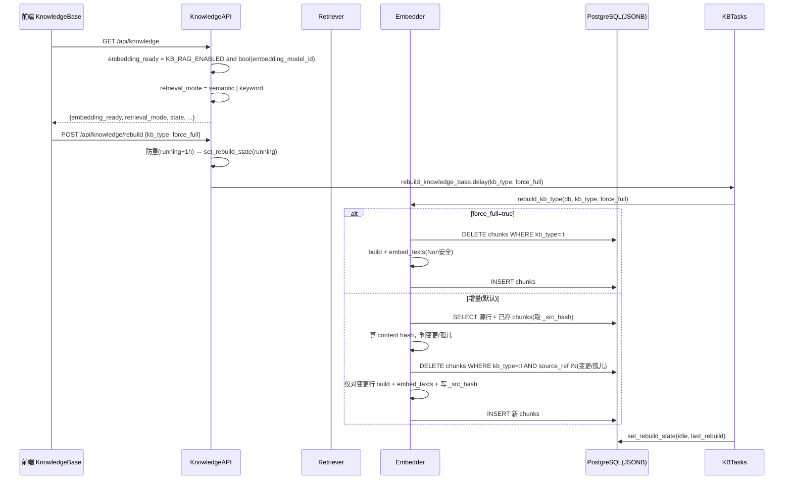
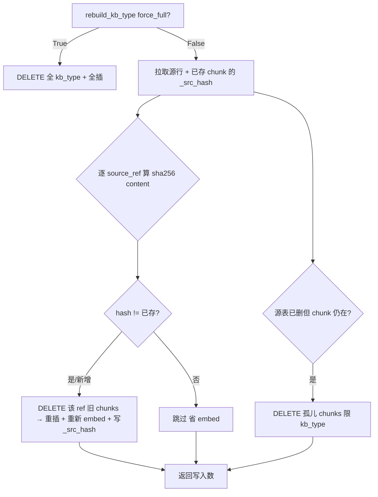

# 知识库 RAG（能力12）P0 增量设计文档

> 本文档为「知识库 RAG」P0 三件事（真实嵌入模型接入 / 增量重建 / Alembic 迁移）的**增量设计 + 有序任务分解**。
> 本轮**只出设计，不写业务代码**。后端工程师照 §7 任务分解实现，QA 照 §8 验收。
> 所有设计均已在 `D:\code\WorkbuddyProject\ai测试自闭环\ai-test-platform` 现状代码上复核确认。

---

## 0. 现状复核结论（已 Read 确认，非盲信）

| 项 | 现状 | 复核来源 |
|---|---|---|
| 知识库模块 | `chunker.py` / `embedder.py` / `retriever.py` / `tasks.py` 齐全 | 已读 |
| `KnowledgeChunk.embedding` | `Column(JSONB, nullable=True)`，无 pgvector | `database.py:851` |
| `KnowledgeChunk.source_ref` | `Column(String(200), nullable=True, index=True)` —— **非唯一索引** | `database.py:848` |
| `build_chunk_records` | 一个 source_ref **可产出多条 chunk**（按字符窗口切片） | `chunker.py:54-68` |
| `KBRebuildState.last_rebuild` | 已存在（`DateTime, nullable=True`），可作游标 | `database.py:881` |
| `retrieve_and_inject` | **首行 `if not settings.KB_RAG_ENABLED: return ""`**（铁律） | `retriever.py:201` |
| `embed_texts`/`embed_query` | 已实现且 None 安全（无模型→None 降级） | `embedder.py:22-46` |
| `rebuild_kb_type` | 现状为 `DELETE WHERE kb_type=:t` 后全量 INSERT | `embedder.py:151-179` |
| `ModelRouting.embedding_model_id` | 已加（nullable，老库兼容） | `database.py:213` |
| `model_config.py` 后端 | `ROUTING_FIELDS` 含 `embedding_model_id`；`UpdateRoutingRequest` 含该字段 | `model_config.py:50,109` ✅ 已就绪 |
| `GET /knowledge` 状态 | 已返回 `embedding_model_id` | `knowledge.py:142-148` |
| 前端 `ModelConfig.vue` | `routingFields` **未含** `embedding_model_id`（第 194-206 行） | 已读 ❌ 需补 |
| 前端 `KnowledgeBase.vue` | 已展示 `embedding_model_id`（第 52-53 行），rebuild 调用 `knowledgeApi.rebuild` | 已读 |
| Alembic | **已存在** `backend/alembic/`，head= `001_initial.py`（建 10 表 + 枚举，**不含**三张知识表） | 已读 → 新增 revision |
| `celery_app.py` include | 已含 `app.modules.knowledge.tasks` | `celery_app.py:16` ✅ |
| `config.py` | `KB_RAG_ENABLED` 默认 `False` | `config.py:61` |

**三条铁律现状（必须保持不被破坏）**：
1. 开关关时 4 处注入点 prompt **逐字一致**（`retrieve_and_inject` 首行早退）。
2. **双降级链**：`embed` 失败 → `embed_texts` 返回 None → `retrieve_chunks` 走 `keyword_score` 兜底。
3. 索引路由 `GET ""` 无尾斜杠；`SAEnum` 显式 `name=`；`celery include` 已含 knowledge tasks。

---

## 1. 硬约束遵循声明（不可破）

- 生产库 `postgres:16-alpine`（musl）**不含 pgvector** → **绝不用 pgvector**，继续 **JSONB + Python 余弦**（`retriever.py` 的 `cosine()` 已就绪）。
- **不动 docker-compose、不删数据卷、不换 Postgres 镜像**（零风险升级铁律）。
- 迁移 / 增量逻辑均保持「开关关→prompt 逐字一致」「双降级链」「索引无尾斜杠」「SAEnum 显式 name=」「celery include」等既有铁律。

---

## 2. P0-① 真实嵌入模型接入

### 2.1 目标
让语义检索真正生效：开启 `KB_RAG_ENABLED` 且配好 `embedding_model_id` 时，`rebuild` 落真实向量、检索走余弦；未配时仍可用关键词模式，**不阻塞**。

### 2.2 改动文件清单

| 文件 | 改动 | 前端/后端 |
|---|---|---|
| `backend/app/api/knowledge.py` | `get_kb_status` 增加返回 `embedding_ready: bool` 与 `retrieval_mode: "semantic"\|"keyword"` | 后端 |
| `frontend/src/views/ModelConfig.vue` | `routingFields` 增加 `embedding_model_id` 项；`routingForm` 增加 `embedding_model_id: ''` | 前端 |
| `frontend/src/views/KnowledgeBase.vue` | 状态卡展示「检索模式 / 语义就绪」徽标；`status` 类型与 `loadStatus` 增加两字段 | 前端 |
| `backend/app/modules/ai/model_router.py` | 无需改（`config_id_map` 已含 `"embedding"`，`database.py` 已含列）——仅复核 | 后端（复核） |
| `backend/app/api/model_config.py` | 无需改（`ROUTING_FIELDS`/`UpdateRoutingRequest` 已含）——仅复核 | 后端（复核） |

> 后端 `model_config.py` 链路**已就绪**，无需改动；前端 `ModelConfig.vue` 是**唯一必须补的前端改动**。

### 2.3 函数 / 字段签名

`GET /api/knowledge`（索引路由，`@router.get("")`，保持无尾斜杠）响应 `data` 新增：

```python
# get_kb_status 返回的 data 字段（增量）
data = {
    "enabled": bool(settings.KB_RAG_ENABLED),
    "chunk_count": int,
    "chunk_counts": {t.value: int for t in KBChunkType},
    "term_count": int,
    "embedding_model_id": str | None,      # 已存在
    "embedding_ready": bool,               # 【新增】语义检索就绪信号
    "retrieval_mode": "semantic" | "keyword",  # 【新增】明确"关键词模式"
    "state": str,                          # idle|running|failed
    "last_rebuild": str | None,
}
```

### 2.4 关键伪代码

**(a) 状态接口语义信号（后端）**

```python
# knowledge.py :: get_kb_status 内，紧接 embedding_model_id 取值之后
embedding_model_id = get_model_router().routing.embedding_model_id  # 已存在

# 【选择】embedding_ready = 开关开 AND 已配嵌入模型；不做实时 probe（避免状态接口延迟/烧配额）
embedding_ready = bool(settings.KB_RAG_ENABLED) and bool(embedding_model_id)
retrieval_mode = "semantic" if embedding_ready else "keyword"

# 若强制要求"探测可达"，用下方 try/except 包裹、绝不抛错（可选，默认不启用）：
# try:
#     ok = await embed_texts(["probe"])
#     embedding_ready = embedding_ready and (ok is not None)
# except Exception:
#     embedding_ready = False   # 探测失败仅降级，不崩状态接口
```

**(b) 前端嵌入模型选择项（ModelConfig.vue，最小改动）**

```diff
  const routingFields = [
    ...
    { key: 'report_analysis_model_id', label: '报告分析模型' },
+   { key: 'embedding_model_id',       label: '嵌入模型（语义检索）' },
    { key: 'fallback_model_id',        label: '备用模型' },
  ]

  const routingForm = reactive<Record<string, string>>({
    ...
    report_analysis_model_id: '',
+   embedding_model_id: '',
    fallback_model_id: '',
  })
```

> `loadRouting` / `saveRouting` 已按 `routingFields` 泛型遍历，`routingForm[f.key]` 自动纳入 `PUT /api/models/routing` 的 payload，**无需改提交逻辑**。后端 `UpdateRoutingRequest`/`ROUTING_FIELDS` 已含该字段，链路闭合。

**(c) 前端状态展示（KnowledgeBase.vue）**

```diff
  # status 类型（~283 行）与默认值（~318 行）增加：
+ embedding_ready: boolean
+ retrieval_mode: string   # 'semantic' | 'keyword'

  # loadStatus（~405 行）增加：
+ embedding_ready: d.embedding_ready ?? false,
+ retrieval_mode: d.retrieval_mode ?? 'keyword',

  # 模板（~49-56 行「嵌入模型」卡片旁）增加：
+ <el-col> 检索模式：<el-tag :type="status.retrieval_mode==='semantic'?'success':'info'">
+   {{ status.retrieval_mode === 'semantic' ? '语义检索' : '关键词模式' }}
+ </el-tag> <span v-if="status.embedding_ready">✓ 语义就绪</span> </el-col>
```

### 2.5 风险点
- **不破坏首行早退**：P0-① 不改 `retriever.py`，`retrieve_and_inject` 首行 `if not settings.KB_RAG_ENABLED: return ""` 保持原样；开关关时 prompt 仍逐字一致。
- **双降级链保持**：`embed_texts` 已 None 安全，`retrieve_chunks` 已 `has_emb` 判定走余弦 / 否则 `keyword_score`。P0-① 不触碰此逻辑。
- **重建不阻塞**：`KB_RAG_ENABLED=true` 但 `embedding_model_id` 为空 → `embed_texts` 返回 None → 落关键词 chunk，`retrieval_mode='keyword'`，状态明确标注，不报错不阻断。
- **状态接口永不崩**：即使 `get_model_router()` 抛错，现有 `try/except` 已兜底 `embedding_model_id=None`，`embedding_ready` 随之 False。

---

## 3. P0-② 增量重建（只刷新增/变更行）

### 3.1 ⚠️ 关键纠正（对原需求说明）
原需求建议「给 `source_ref` 加唯一约束/唯一索引」。**经查证不可行**：`build_chunk_records` 对一个 source_ref 会产出**多条** chunk（字符窗口切片），`source_ref` 本就**非唯一**。若加 UNIQUE，rebuild 重插会直接冲突报唯一违例。

**结论**：
- **不**给 `source_ref` 加任何唯一约束，保持既有 `index=True`（非唯一 B-tree 索引），与 `database.py:848` 完全一致。
- 增量逻辑在**源行（source row）粒度**操作：对「变更/新增」的 source_ref，先 `DELETE chunks WHERE kb_type=:t AND source_ref=:ref` 再重插；对「源表已删」的 source_ref 做孤儿清理。

### 3.2 ⚠️ 变更检测策略（对原需求说明）
原需求建议 `WHERE updated_at > :last OR id NOT IN (...)`。经查证：**`Defect`/`TestCase` 表只有 `created_at`、无 `updated_at`**（见 `database.py:241,289`），时间戳法无法侦测这两类表的「原地修改」。

**结论**：采用**内容哈希 diff**（跨 4 张源表统一、可侦测新增+修改），哈希存于既有 `meta` JSONB（**无需改表结构**）。`KBRebuildState.last_rebuild` 保留为状态游标（可选粗过滤），但**权威变更判定用内容哈希**。

- 哈希：`src_hash = sha256(content.encode("utf-8")).hexdigest()[:16]`，写入每条 chunk 的 `meta["_src_hash"]`。
- 首次增量（老 chunk 无 `_src_hash`）：按「视为变更」整体重算该 kb_type（一次性全量刷新，落好哈希），后续真正增量。

### 3.3 改动文件清单

| 文件 | 改动 | 前端/后端 |
|---|---|---|
| `backend/app/modules/knowledge/embedder.py` | `rebuild_kb_type(db, kb_type, force_full=False)` 增加增量分支；新增 `_incremental_rebuild_kb_type`、`delete_chunks_by_source_ref(s)` | 后端 |
| `backend/app/modules/knowledge/chunker.py` | `build_chunk_records(..., src_hash=None)` 将 `src_hash` 写入 `meta["_src_hash"]` | 后端 |
| `backend/app/modules/knowledge/tasks.py` | `_rebuild(kb_type, force_full=False)`；task 签名加 `force_full` | 后端 |
| `backend/app/api/knowledge.py` | `RebuildRequest` 加 `force_full: bool = False`；`rebuild_knowledge` 透传 `task.delay(kb_type, force_full)` | 后端 |
| `frontend/src/api/index.ts` | `knowledgeApi.rebuild(kbType, forceFull?)` 发送 `{ kb_type, force_full }` | 前端 |
| `frontend/src/views/KnowledgeBase.vue` | 重建区加「强制全量重建」勾选框，传 `force_full` | 前端 |

### 3.4 函数签名

```python
# embedder.py
async def rebuild_kb_type(db, kb_type: str, force_full: bool = False) -> int:
    """force_full=True → 旧逻辑（DELETE+全插）；否则 → 增量。返回写入 chunk 数。"""

async def _incremental_rebuild_kb_type(db, kb_type: str) -> int: ...
async def delete_chunks_by_source_ref(db, kb_type, source_ref: str) -> None: ...
async def delete_chunks_by_source_refs(db, kb_type, refs: list[str]) -> None: ...

# chunker.py
def build_chunk_records(text, kb_type, source_ref, meta=None, *,
                        max_chars=1000, overlap=100,
                        src_hash: str | None = None) -> list[dict]:
    # 每条 record 的 meta = {**(meta or {}), "_src_hash": src_hash}

# tasks.py
@celery_app.task(name="app.modules.knowledge.tasks.rebuild_knowledge_base", bind=True)
def rebuild_knowledge_base(self, kb_type: str | None = None, force_full: bool = False) -> dict:
    return asyncio.run(_rebuild(kb_type, force_full))

# api/knowledge.py
class RebuildRequest(BaseModel):
    kb_type: str | None = None
    force_full: bool = False   # 【新增】
```

### 3.5 关键伪代码（增量核心）

```python
# embedder.py :: _incremental_rebuild_kb_type(db, kb_type)
async def _incremental_rebuild_kb_type(db, kb_type):
    import hashlib
    # 1) 取当前源行 (source_ref, content, meta)
    rows = await _fetch_source_rows(db, kb_type)          # 复用现有函数
    current = {}   # source_ref -> (content, meta)
    for ref, content, meta in rows:
        current[ref] = (content, meta)

    # 2) 读已存在 chunk，按 source_ref 分组，取已存哈希
    existing = (await db.execute(
        select(KnowledgeChunk)
        .where(KnowledgeChunk.kb_type == KBChunkType(kb_type))
    )).scalars().all()
    existing_hash = {}    # source_ref -> _src_hash（取该 ref 任一 chunk 的）
    for c in existing:
        h = (c.meta or {}).get("_src_hash") if c.meta else None
        existing_hash.setdefault(c.source_ref, h)

    # 3) 计算当前哈希，判定变更 / 新增
    changed_refs = []
    for ref, (content, meta) in current.items():
        src_hash = hashlib.sha256(content.encode("utf-8")).hexdigest()[:16]
        if existing_hash.get(ref) != src_hash:
            changed_refs.append((ref, content, meta, src_hash))

    # 4) 孤儿：源表已无、但 chunk 仍在
    orphan_refs = [r for r in existing_hash if r not in current]

    total = 0
    # 5) 变更/新增：先删该 ref 旧 chunk，再重插（带新哈希 + 重新 embed）
    for ref, content, meta, src_hash in changed_refs:
        await delete_chunks_by_source_ref(db, kb_type, ref)
        records = build_chunk_records(content, kb_type, ref, meta, src_hash=src_hash)
        if records:
            texts = [r["content"] for r in records]
            emb = await embed_texts(texts)               # None 安全 → 关键词兜底
            if emb is not None:
                for i, r in enumerate(records):
                    r["embedding"] = emb[i] if i < len(emb) else None
            total += await upsert_chunks(db, records)
    # 6) 孤儿清理（限定 kb_type，避免跨类型误删）
    if orphan_refs:
        await delete_chunks_by_source_refs(db, kb_type, orphan_refs)
    return total
```

```python
# embedder.py :: delete helpers
async def delete_chunks_by_source_ref(db, kb_type, source_ref):
    await db.execute(delete(KnowledgeChunk).where(
        KnowledgeChunk.kb_type == KBChunkType(kb_type),
        KnowledgeChunk.source_ref == source_ref,
    ))

async def delete_chunks_by_source_refs(db, kb_type, refs):
    if not refs: return
    await db.execute(delete(KnowledgeChunk).where(
        KnowledgeChunk.kb_type == KBChunkType(kb_type),
        KnowledgeChunk.source_ref.in_(refs),
    ))
```

```python
# embedder.py :: rebuild_kb_type 入口
async def rebuild_kb_type(db, kb_type, force_full=False):
    if force_full:
        # —— 旧逻辑原样保留（DELETE+全插），清空该 kb_type 全部 chunk ——
        rows = await _fetch_source_rows(db, kb_type)
        records = []
        for ref, content, meta in rows:
            records.extend(build_chunk_records(content, kb_type, ref, meta))
        if records:
            emb = await embed_texts([r["content"] for r in records])
            if emb is not None:
                for i, r in enumerate(records):
                    r["embedding"] = emb[i] if i < len(emb) else None
        await db.execute(delete(KnowledgeChunk).where(KnowledgeChunk.kb_type == KBChunkType(kb_type)))
        return await upsert_chunks(db, records)
    return await _incremental_rebuild_kb_type(db, kb_type)
```

```python
# tasks.py :: _rebuild 透传 force_full（重建状态机 / 失败兜底保持原样）
async def _rebuild(kb_type, force_full=False):
    types = [kb_type] if kb_type else ["defect","case","doc","term"]
    ...
    async with AsyncSessionLocal() as db:
        for t in types:
            n = await rebuild_kb_type(db, t, force_full=force_full)
            total += n
        await db.commit()
    ...
```

```python
# api/knowledge.py :: rebuild_knowledge 透传
task = rebuild_knowledge_base.delay(req.kb_type, req.force_full)   # 防重逻辑保持
```

```diff
# frontend/src/api/index.ts
- rebuild: (kbType) => api.post('/knowledge/rebuild', kbType ? { kb_type: kbType } : {}),
+ rebuild: (kbType, forceFull = false) =>
+   api.post('/knowledge/rebuild', { kb_type: kbType || undefined, force_full: forceFull }),
```

```diff
# frontend/src/views/KnowledgeBase.vue 重建区（~339 行附近）
+ const forceFull = ref<boolean>(false)
# 模板「一键重建」按钮旁加：
+ <el-checkbox v-model="forceFull" title="清空该知识库全部切片后全量重建（默认增量）">强制全量重建</el-checkbox>
# handleRebuild（~449 行）改为：
- const res = await knowledgeApi.rebuild(payload)
+ const res = await knowledgeApi.rebuild(payload, forceFull.value)
```

### 3.6 风险点
- **source_ref 非唯一**：增量按 source_ref 整组删插，**绝不**对 source_ref 加唯一约束（见 §3.1）。
- **孤儿清理限 kb_type**：`delete ... WHERE kb_type=:t AND source_ref IN (...)`，杜绝跨类型误删。
- **重建状态机**：API 防重（`running` + 1h）+ tasks 失败兜底保持原样，仅透传 `force_full` 参数。
- **双降级链**：`embed_texts` 失败→None→关键词兜底，增量分支同样复用，未破坏。
- **首次增量全量**：老 chunk 无 `_src_hash` 会触发一次性整体重算（预期行为），后续才真正增量；可加日志标注。
- **大表扫描**：变更检测需拉取全部源行算哈希（嵌入 API 调用被省下，主要成本在此）；`Defect`/`TestCase` 无 `updated_at` 故需全扫，若日后体量极大可另议「加 updated_at 列」（非 P0 范围，见 §9 拍板点）。

---

## 4. P0-③ Alembic 迁移脚本（生产可复现 schema）

### 4.1 现状
- `backend/alembic/` **已存在**，`alembic.ini` 的 `script_location = alembic`，head = `001_initial.py`（建 10 表 + 枚举，**不含**三张知识表，也未含 `model_routing.embedding_model_id`）。
- 三张知识表当前仅由 `init_db()` 的 `create_all` + best-effort `ALTER`（embedding_model_id）兜底生成，**无迁移**。

### 4.2 方案
**在现有 alembic 下新增一个 revision**（不初始化 alembic）。新 revision：`down_revision="001"`。

### 4.3 改动文件清单

| 文件 | 改动 | 说明 |
|---|---|---|
| `backend/alembic/versions/002_knowledge_rag.py` | **新建** revision | 建三表 + 加 `embedding_model_id` 列 + 幂等种子 `kb_rebuild_state` |
| `backend/alembic/env.py` | 顶部 import 增加 `KnowledgeChunk, KnowledgeTerm, KBRebuildState` | 使 `target_metadata` 含知识表，便于未来 `autogenerate` 正确 |

### 4.4 迁移内容要点

**(a) `kbchunktype` 枚举标签（避免 asyncpg DatatypeMismatchError）**
`SAEnum(KBChunkType, name="kbchunktype")` 持久化**成员名**（`DEFECT`/`CASE`/`DOC`/`TERM`，由 `init_db` 的 `ALTER TYPE ... ADD VALUE '{member.name}'` 约定佐证）。为**零风险**兼容「成员名 / 成员值」两种写法（与既有 `userrole` 实际同时含 name+value 的既定状态一致），枚举建**全部 8 个标签**：

```sql
CREATE TYPE IF NOT EXISTS "kbchunktype" AS ENUM
  ('DEFECT','CASE','DOC','TERM','defect','case','doc','term');
```
并在已存在时幂等补标签：`ALTER TYPE kbchunktype ADD VALUE IF NOT EXISTS 'DEFECT';`（对 8 个各执行一次，PG16 支持）。

**(b) 三张表（与 `database.py` 逐列对齐，不建 source_ref 唯一约束）**

| 表 | 列（与 database.py 一致） |
|---|---|
| `knowledge_chunks` | `id` UUID PK；`kb_type` `kbchunktype` 枚举（index）；`source_ref` VARCHAR(200) nullable + **普通（非唯一）索引** `ix_knowledge_chunks_source_ref`；`content` TEXT；`embedding` JSONB nullable；`meta` JSONB；`created_at` DateTime；复合索引 `ix_knowledge_chunks_type_created(kb_type, created_at)` |
| `knowledge_terms` | `id` UUID PK；`term` VARCHAR(200) index；`aliases` JSONB；`technical_meaning` TEXT；`domain` VARCHAR(100) index；`meta` JSONB；`created_at`/`updated_at` DateTime |
| `kb_rebuild_state` | `id` Integer PK autoincrement；`state` VARCHAR(20) default 'idle'；`updated_at` DateTime；`last_rebuild` DateTime nullable；`last_rebuild_chunks` Integer nullable；`error` TEXT nullable |

**(c) `model_routing` 加列**

```sql
ALTER TABLE model_routing ADD COLUMN embedding_model_id VARCHAR(64);
ALTER TABLE model_routing
  ADD CONSTRAINT fk_model_routing_embedding
  FOREIGN KEY (embedding_model_id) REFERENCES ai_model_configs(id);
```
（`nullable=True` 老库兼容；列存在则跳过。）

**(d) 幂等种子 `kb_rebuild_state`**

```sql
INSERT INTO kb_rebuild_state (id, state)
SELECT 1, 'idle'
WHERE NOT EXISTS (SELECT 1 FROM kb_rebuild_state WHERE id = 1);
```

### 4.5 upgrade() / downgrade() 伪代码

```python
# ===== upgrade() =====
def upgrade():
    bind = op.get_bind()
    insp = sa.inspect(bind)
    tables = set(insp.get_table_names())

    # 1) 枚举 kbchunktype（幂等：不存在则建，已存在则补标签）
    if not insp.dialect.has_type(bind, "kbchunktype"):   # 伪：实际用 inspect.get_enums()
        op.execute('CREATE TYPE "kbchunktype" AS ENUM '
                   "('DEFECT','CASE','DOC','TERM','defect','case','doc','term')")
    else:
        for lbl in ('DEFECT','CASE','DOC','TERM','defect','case','doc','term'):
            op.execute(f"ALTER TYPE kbchunktype ADD VALUE IF NOT EXISTS '{lbl}'")

    # 2) knowledge_chunks（存在则跳过，兼容 init_db 的 create_all）
    if "knowledge_chunks" not in tables:
        op.create_table("knowledge_chunks",
            sa.Column("id", UUID(as_uuid=True), nullable=False),
            sa.Column("kb_type", PG_ENUM("kbchunktype", name="kbchunktype", create_type=False), nullable=False),
            sa.Column("source_ref", sa.String(200), nullable=True),
            sa.Column("content", sa.Text(), nullable=False),
            sa.Column("embedding", JSONB(astext_type=sa.Text()), nullable=True),
            sa.Column("meta", JSONB(astext_type=sa.Text()), nullable=True),
            sa.Column("created_at", sa.DateTime(), nullable=True),
            sa.PrimaryKeyConstraint("id"),
        )
        op.create_index("ix_knowledge_chunks_source_ref", "knowledge_chunks", ["source_ref"])  # 非唯一
        op.create_index("ix_knowledge_chunks_type_created", "knowledge_chunks", ["kb_type","created_at"])

    # 3) knowledge_terms
    if "knowledge_terms" not in tables:
        op.create_table("knowledge_terms",
            sa.Column("id", UUID(as_uuid=True), nullable=False),
            sa.Column("term", sa.String(200), nullable=False),
            sa.Column("aliases", JSONB(astext_type=sa.Text()), nullable=True),
            sa.Column("technical_meaning", sa.Text(), nullable=False),
            sa.Column("domain", sa.String(100), nullable=True),
            sa.Column("meta", JSONB(astext_type=sa.Text()), nullable=True),
            sa.Column("created_at", sa.DateTime(), nullable=True),
            sa.Column("updated_at", sa.DateTime(), nullable=True),
            sa.PrimaryKeyConstraint("id"),
        )
        op.create_index("ix_knowledge_terms_term", "knowledge_terms", ["term"])
        op.create_index("ix_knowledge_terms_domain", "knowledge_terms", ["domain"])

    # 4) kb_rebuild_state
    if "kb_rebuild_state" not in tables:
        op.create_table("kb_rebuild_state",
            sa.Column("id", sa.Integer(), autoincrement=True, nullable=False),
            sa.Column("state", sa.String(20), nullable=True),
            sa.Column("updated_at", sa.DateTime(), nullable=True),
            sa.Column("last_rebuild", sa.DateTime(), nullable=True),
            sa.Column("last_rebuild_chunks", sa.Integer(), nullable=True),
            sa.Column("error", sa.Text(), nullable=True),
            sa.PrimaryKeyConstraint("id"),
        )

    # 5) model_routing.embedding_model_id（列存在则跳过）
    cols = {c["name"] for c in insp.get_columns("model_routing")}
    if "embedding_model_id" not in cols:
        op.add_column("model_routing",
            sa.Column("embedding_model_id", sa.String(64), nullable=True))
        op.create_foreign_key(
            "fk_model_routing_embedding", "model_routing", "ai_model_configs",
            ["embedding_model_id"], ["id"])

    # 6) 幂等种子
    op.execute("INSERT INTO kb_rebuild_state (id, state) "
               "SELECT 1, 'idle' WHERE NOT EXISTS "
               "(SELECT 1 FROM kb_rebuild_state WHERE id = 1)")
```

```python
# ===== downgrade() =====
def downgrade():
    bind = op.get_bind()
    insp = sa.inspect(bind)
    cols = {c["name"] for c in insp.get_columns("model_routing")}
    if "embedding_model_id" in cols:
        op.drop_constraint("fk_model_routing_embedding", "model_routing", type_="foreignkey")
        op.drop_column("model_routing", "embedding_model_id")
    if "kb_rebuild_state" in insp.get_table_names():
        op.drop_table("kb_rebuild_state")
    if "knowledge_terms" in insp.get_table_names():
        op.drop_table("knowledge_terms")
    if "knowledge_chunks" in insp.get_table_names():
        op.drop_index("ix_knowledge_chunks_type_created", table_name="knowledge_chunks")
        op.drop_index("ix_knowledge_chunks_source_ref", table_name="knowledge_chunks")
        op.drop_table("knowledge_chunks")
    op.execute('DROP TYPE IF EXISTS "kbchunktype"')
```

> **与 `init_db()` 幂等共存**：迁移用「表/列/枚举存在则跳过」守卫，与 `init_db()` 的 `create_all`（只建缺失表）+ best-effort `ALTER embedding_model_id` 互不冲突。生产以 `alembic upgrade head` 为准；`init_db()` 仅作开发兜底。部署顺序：先 `alembic upgrade head`，再起应用（避免 init_db 与迁移重复建表导致的 "already exists"）。

### 4.6 env.py 改动
```diff
  from app.models.database import (  # noqa: F401
      User, Project, AIModelConfig, ModelRouting, TestRun, TestCase,
      TestResult, Defect, TestReport, AuditLog,
+     KnowledgeChunk, KnowledgeTerm, KBRebuildState,   # 知识库 RAG（能力12）
  )
```

### 4.7 风险点
- **绝不用 pgvector**：`embedding` 为 JSONB，迁移不建任何 vector 扩展（与铁律一致）。
- **SAEnum 标签**：`kbchunktype` 同时含 name+value 标签，杜绝 asyncpg `DatatypeMismatchError`；显式 `name="kbchunktype"` 与 `database.py` 一致。
- **source_ref 不建唯一索引**：只建普通索引（与 §3.1 纠正一致）。
- **幂等**：`IF NOT EXISTS` / 存在性检查，确保「迁移 + init_db」重复执行不报错。
- **不动 docker-compose / 不换镜像**：迁移纯 schema，不涉及容器配置。

---

## 5. 铁律保持说明（逐条对账）

| 铁律 | 是否被破坏 | 保护措施 |
|---|---|---|
| 开关关→4 处 prompt 逐字一致 | ❌ 未破坏 | P0-①/② 均不改 `retriever.py` 首行早退 `if not settings.KB_RAG_ENABLED: return ""` |
| 双降级链（embed 失败→关键词） | ❌ 未破坏 | 增量/全量分支均复用 `embed_texts`（None 安全）+ `retrieve_chunks` 的 `has_emb` 判定 |
| 索引路由无尾斜杠 | ❌ 未破坏 | `GET ""` 保持 `@router.get("")`；新建/改字段不改路由 |
| SAEnum 显式 name= | ❌ 未破坏 | 迁移 `kbchunktype` 显式 `name="kbchunktype"`，与 `database.py` 一致 |
| celery include | ❌ 未破坏 | `celery_app.py` include 已含 `app.modules.knowledge.tasks`，task 仅增参 `force_full` |
| 不动 docker/数据卷/镜像 | ❌ 未破坏 | P0-③ 纯 schema 迁移，无容器改动 |

---

## 6. 前端改动范围总结

| 页面 / 文件 | 是否要动 | 改动点 |
|---|---|---|
| `frontend/src/views/ModelConfig.vue` | ✅ 必须 | `routingFields` 增 `embedding_model_id` 项；`routingForm` 增 `embedding_model_id: ''`（提交逻辑自动复用） |
| `frontend/src/views/KnowledgeBase.vue` | ✅ 建议 | 状态卡展示 `embedding_ready` / `retrieval_mode`；重建区加「强制全量重建」勾选框 |
| `frontend/src/api/index.ts` | ✅ 建议 | `knowledgeApi.rebuild(kbType, forceFull?)` 发送 `force_full` |
| 端点路径 | — | 嵌入模型：`PUT /api/models/routing`（已存在，仅前端补字段）；状态：`GET /api/knowledge`；重建：`POST /api/knowledge/rebuild` |

> 后端 `model_config.py` / `model_router.py` **无需改动**（链路已就绪，复核通过）。

---

## 7. 有序任务分解（按实现顺序，供后端工程师 + QA）

> 任务粒度：每个任务含多文件、按依赖排序。建议顺序 T01 → T02/T03（可并行）→ T04。

### T01 — P0-③ Alembic 迁移 + env.py（基础，先落地）
- **依赖**：无
- **优先级**：P0
- **改动文件**：
  - `backend/alembic/versions/002_knowledge_rag.py`（新建）
  - `backend/alembic/env.py`（增 import）
- **内容**：建 `knowledge_chunks`/`knowledge_terms`/`kb_rebuild_state` 三表（含 `kbchunktype` 枚举，name+value 双标签，source_ref **非唯一**索引）；`model_routing` 加 `embedding_model_id`（FK，nullable）；幂等种子 `kb_rebuild_state`；`upgrade/downgrade` 全程存在性守卫。
- **验收**：`alembic upgrade head` 成功；`alembic downgrade base` 干净回滚；重复 `upgrade` 幂等不报错。

### T02 — P0-① 后端：状态接口语义信号
- **依赖**：T01（可选，状态接口不依赖表结构）
- **优先级**：P0
- **改动文件**：
  - `backend/app/api/knowledge.py`（`get_kb_status` 增加 `embedding_ready` / `retrieval_mode`）
- **内容**：`embedding_ready = KB_RAG_ENABLED and bool(embedding_model_id)`；`retrieval_mode = "semantic"|"keyword"`；**不**做实时 probe（见 §9 拍板点）；不改首行早退与双降级。
- **验收**：`GET /api/knowledge` 返回新字段；开关关时字段仍为 False 且 prompt 不变；未配嵌入模型时 `retrieval_mode='keyword'` 且不阻塞。

### T03 — P0-② 后端：增量重建
- **依赖**：T01（表已存在，create_all 亦可用，逻辑独立）
- **优先级**：P0
- **改动文件**：
  - `backend/app/modules/knowledge/chunker.py`（`build_chunk_records` 加 `src_hash`，写入 `meta["_src_hash"]`）
  - `backend/app/modules/knowledge/embedder.py`（`rebuild_kb_type(force_full)` + `_incremental_rebuild_kb_type` + `delete_chunks_by_source_ref(s)`）
  - `backend/app/modules/knowledge/tasks.py`（`_rebuild(force_full)` + task 签名）
  - `backend/app/api/knowledge.py`（`RebuildRequest.force_full` + 透传）
- **内容**：源行粒度增量（哈希 diff + 孤儿清理）；`force_full=True` 走旧全量逻辑；保持重建状态机与双降级。
- **验收**：仅改一条源数据后重建，只重算该 source_ref 的 chunk（embedding 命中向量）；删除源数据后重建，孤儿 chunk 被清；`force_full=True` 全量清空重插；源表无 `updated_at` 的 `Defect`/`TestCase` 修改也能被增量侦测。

### T04 — 前端：嵌入模型配置 + 状态展示 + 强制全量
- **依赖**：T02、T03（需其 API 契约：`embedding_ready`/`retrieval_mode`/`force_full`）
- **优先级**：P0
- **改动文件**：
  - `frontend/src/views/ModelConfig.vue`（`routingFields` + `routingForm` 增 `embedding_model_id`）
  - `frontend/src/views/KnowledgeBase.vue`（状态展示 + 「强制全量重建」勾选框）
  - `frontend/src/api/index.ts`（`rebuild` 发送 `force_full`）
- **验收**：ModelConfig 页出现「嵌入模型（语义检索）」下拉并成功保存（`PUT /api/models/routing`）；知识库状态页显示「检索模式/语义就绪」；勾选「强制全量重建」后重建确实走全量。

---

## 8. QA 验收要点（任务 #15 参考）

1. **开关语义**：`KB_RAG_ENABLED=false` 时 4 处注入点 prompt 与未接 RAG 前**逐字一致**（回归 diff 校验）。
2. **嵌入接入**：配置 `embedding_model_id` + 开 `KB_RAG_ENABLED` → 重建后 `GET /knowledge` 返回 `embedding_ready=true`/`retrieval_mode=semantic`；未配 → `keyword` 且不阻塞。
3. **增量正确性**：构造「新增/修改/删除」各一类源数据，分别触发重建，断言 `knowledge_chunks` 仅对应 source_ref 的 chunk 变化、其余不变；embedding 字段在配模型时为真实向量、未配为 NULL。
4. **孤儿清理**：删一条 `Defect`/`TestCase`/`ApiEndpoint`/`KnowledgeTerm`，重建后其历史 chunk 消失。
5. **force_full**：勾选后该 kb_type 切片数 = 全量源行切片数（清空重插）。
6. **迁移幂等**：`alembic upgrade head` → `downgrade base` → `upgrade head` 均可重复成功；生产库升级不丢数据、不换镜像。
7. **降级链**：临时把嵌入模型指向无效地址 → 重建不崩、落关键词 chunk、检索仍可走 `keyword_score`。
8. **约束红线**：`knowledge_chunks.source_ref` **无**唯一约束；`postgres` 镜像**未**变更（核对 `docker-compose.yml` 与 requirements/镜像标签）。

---

## 9. 需要拍板的点（请 team-lead 决策）

1. **【已纠正·请确认】`source_ref` 不加唯一约束**：原需求建议加唯一索引，但一个 source_ref 对应多条 chunk，加唯一会破坏 rebuild。我改为「源行粒度删插 + 普通非唯一索引」。是否认可？
2. **【已决策·请确认】增量变更检测用内容哈希**：因 `Defect`/`TestCase` 无 `updated_at`，时间戳法不可行。是否在 P0 接受「哈希 diff」方案（不新增列）；若坚持「加 `updated_at` 列到 Defect/TestCase」则需扩 P0 范围（动其它能力表）。建议：**P0 用哈希，不加列**。
3. **【已选择·请确认】`embedding_ready` 不做实时 probe**：状态接口仅用 `KB_RAG_ENABLED and bool(embedding_model_id)` 计算，避免每次轮询烧嵌入配额 / 延迟 / 潜在崩溃。真实可达性在 rebuild 时由双降级链自然验证。是否认可？若要坚持 probe，我提供 try/except 包裹版本（默认不启用）。
4. **【已选择·请确认】`retrieval_mode` 信号**：除 `embedding_ready` 外，额外返回 `retrieval_mode: "semantic"|"keyword"` 以直白表达「关键词模式」。是否纳入？
5. **【已选择·请确认】`force_full` 参数**：重建 API/task 加 `force_full: bool`（默认 False=增量），前端加「强制全量重建」勾选。是否认可？

---

## 附录 A. 类 / 模块结构（Mermaid classDiagram）

```mermaid
classDiagram
    class KnowledgeChunk {
        +UUID id
        +KBChunkType kb_type
        +str source_ref   %% 非唯一（一个 source_ref → 多条 chunk）
        +str content
        +JSONB embedding  %% None=关键词模式
        +JSONB meta       %% {_src_hash, ...}
        +DateTime created_at
    }
    class KBRebuildState {
        +int id
        +str state        %% idle|running|failed
        +DateTime last_rebuild   %% 游标
        +int last_rebuild_chunks
        +str error
    }
    class ModelRouting {
        +int id
        +str code_analysis_model_id
        +str fallback_model_id
        +str embedding_model_id   %% 【P0-①】新增插槽
    }
    class KnowledgeTerm {
        +UUID id
        +str term
        +JSONB aliases
        +str technical_meaning
        +str domain
    }
    class Embedder {
        +embed_texts(texts) list[float] | None
        +embed_query(text) float | None
        +rebuild_kb_type(db, kb_type, force_full) int
        +_incremental_rebuild_kb_type(db, kb_type) int
        +delete_chunks_by_source_ref(db, kb_type, ref) void
    }
    class Retriever {
        +retrieve_and_inject(db, query, kb_type, top_k) str  %% 首行早退铁律
        +retrieve_chunks(db, query, kb_type, top_k) list
        +search_terms(db, query, top_k) list
        +cosine(a, b) float
    }
    class KBTasks {
        +rebuild_knowledge_base(kb_type, force_full) dict
        +_rebuild(kb_type, force_full) dict
    }
    class KnowledgeAPI {
        +GET "" get_kb_status()   %% 返回 embedding_ready / retrieval_mode
        +POST /rebuild rebuild_knowledge(RebuildRequest{force_full})
        +terms CRUD
        +POST /search
    }
    Embedder ..> KnowledgeChunk : 读写
    KBTasks ..> Embedder : 调用
    KnowledgeAPI ..> KBTasks : .delay()
    Retriever ..> Embedder : embed_query
    Retriever ..> KnowledgeChunk : 查询
```

## 附录 B. 关键调用序列（Mermaid sequenceDiagram）



## 附录 C. 增量重建流程（Mermaid flowchart）


