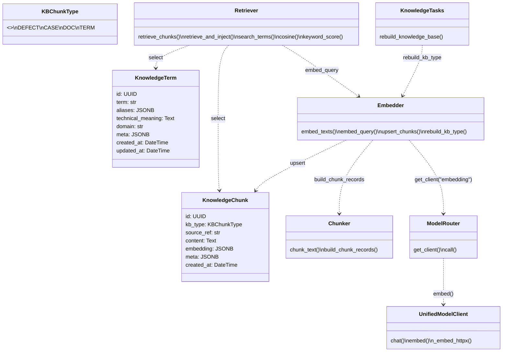
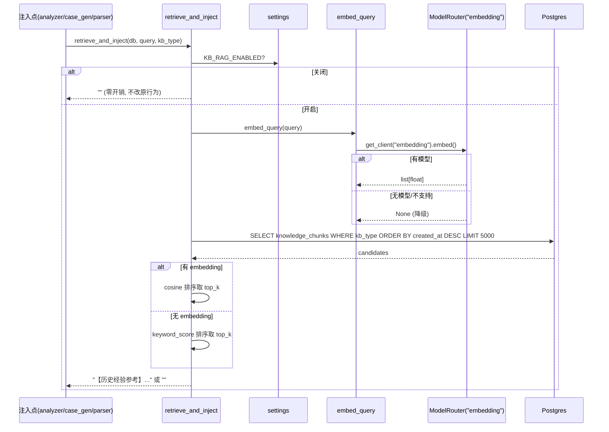

# 知识库 RAG 实现设计（能力12 · 编码契约）

> 状态：设计定稿（可直接编码）
> 前置方案：`docs/知识库RAG接入方案.md`（本设计在其基础上**推翻 pgvector 依赖**，改用 JSONB 浮点数组 + Python 侧检索）
> 适用范围：仅设计，**不写实现代码**（由 backend-dev / frontend-dev 落地）

## 0. 铁律（来自 team-lead，不可推翻）

1. **绝不引入 pgvector 强依赖**。`knowledge_chunks.embedding` 用 **JSONB 存 float[]**（SA `JSONB`），禁止 `Vector(1536)`。`init_db()` 中 best-effort `CREATE EXTENSION IF NOT EXISTS vector`（失败仅记日志），当前代码不依赖它。
2. **无嵌入模型必须可降级**：走关键词检索（token 重叠 / BM25-lite），零配置也能出结果。
3. **全局开关 `KB_RAG_ENABLED`（默认 False）**。关闭时 3 处注入点**完全不改变原行为**（不查库、不调模型、不抛异常）——统一入口 `retrieve_and_inject` 在开关关闭时直接 `return ""`。
4. 注入点复用现有 `use_case` 模型路由，不改动 `ModelRouter.call` 整体结构。
5. 项目铁律：API 统一返回 `{"code":0/1,"data":...,"message":...}` 且 HTTP 恒 200；索引路由写 `@router.get("")` 不能写 `("/")`；`APIRouter()` 不带 prefix（由 `main.py` 的 `include_router` 给）。

---

## 1. `app/modules/knowledge/` 文件划分与精确函数签名

新增目录 `backend/app/modules/knowledge/`，共 5 个文件：

### 1.1 `chunker.py` — 文本切片
```python
"""知识库文本切片。纯函数，无 IO。"""
from typing import Any


def chunk_text(
    text: str,
    *,
    max_chars: int = 1000,
    overlap: int = 100,
) -> list[str]:
    """按字符窗口切片，带 overlap 重叠；返回非空片段列表。"""


def build_chunk_records(
    text: str,
    kb_type: str,
    source_ref: str | None,
    meta: dict[str, Any] | None = None,
    *,
    max_chars: int = 1000,
    overlap: int = 100,
) -> list[dict[str, Any]]:
    """
    切片并生成 knowledge_chunks 行(dict)列表。
    每条含: {id, kb_type, source_ref, content, embedding(null), meta, created_at}
    embedding 初始为 None，由 embedder 回填。
    """
```

### 1.2 `embedder.py` — 嵌入与落库
```python
"""嵌入层：复用 ModelRouter 的 'embedding' use_case；无模型时返回 None 降级。"""
import uuid
from datetime import datetime, timezone
from sqlalchemy.ext.asyncio import AsyncSession
from sqlalchemy import select
from app.config import settings
from app.modules.ai.model_router import get_model_router, ModelNotConfiguredError
from app.modules.knowledge.chunker import build_chunk_records
from app.models.database import KnowledgeChunk


async def embed_texts(texts: list[str]) -> list[list[float]] | None:
    """
    批量嵌入。返回 list[float[]]；若未配置 embedding 模型或 provider 不支持嵌入，
    捕获异常后返回 None（调用方改用关键词检索）。
    """


async def embed_query(text: str) -> list[float] | None:
    """单条查询嵌入；无模型返回 None。"""


async def upsert_chunks(db: AsyncSession, records: list[dict]) -> int:
    """
    将 build_chunk_records 产出的 dict 列表写入 knowledge_chunks。
    若记录已带 embedding(list[float]) 则落 JSONB；否则 embedding 存 None。
    返回写入条数。
    """


async def rebuild_kb_type(db: AsyncSession, kb_type: str) -> int:
    """
    对一个 kb_type 执行全量重建：
    1) 按 kb_type 从对应源表取数据（见 §5 数据源映射）
    2) build_chunk_records 切片
    3) embed_texts 嵌入（None 安全）
    4) 先 DELETE 该 kb_type 旧 chunks，再 upsert_chunks
    返回总切片数。
    """
```

### 1.3 `retriever.py` — 检索与注入（核心入口）
```python
"""检索 + 注入。所有注入点只调用 retrieve_and_inject / search_terms。"""
import math
from sqlalchemy.ext.asyncio import AsyncSession
from app.config import settings
from app.utils.database import AsyncSessionLocal
from app.models.database import KnowledgeChunk, KnowledgeTerm
from app.modules.knowledge.embedder import embed_query


async def retrieve_chunks(
    db: AsyncSession,
    query: str,
    kb_type: str,
    top_k: int = 5,
    candidate_limit: int = 5000,
) -> list["RetrievalHit"]:
    """
    候选集: SELECT ... WHERE kb_type=:kb ORDER BY created_at DESC LIMIT 5000。
    有 embedding → Python 侧余弦相似度排序取 top_k；
    无 embedding(None) → 关键词打分(token 重叠/Jaccard) 取 top_k。
    返回 RetrievalHit(chunk, score)。
    """


def cosine(a: list[float], b: list[float]) -> float:
    """余弦相似度；维度不一致或零向量返回 0.0。"""


def keyword_score(query: str, content: str) -> float:
    """BM25-lite / token 重叠打分；返回 >0 表示命中。"""


async def search_terms(
    db: AsyncSession, query: str, top_k: int = 10
) -> list[KnowledgeTerm]:
    """
    业务术语表检索（零配置必可用）：对 knowledge_terms 做 term/aliases 的
    ILIKE / token 重叠匹配，返回 top_k。不依赖嵌入。
    """


async def retrieve_and_inject(
    db: AsyncSession | None,
    query: str,
    kb_type: str,
    top_k: int = 5,
) -> str:
    """
    统一注入入口（3 处注入点唯一调用）。
    - KB_RAG_ENABLED=False → 直接 return ""（零开销，不改变原行为）
    - query 空 → return ""
    - db 为 None 时自行开短生命周期 AsyncSessionLocal() 并在 finally 关闭
    - kb_type=='term' → 调 search_terms 拼【业务术语参考】
    - 其他 → retrieve_chunks 拼【历史经验参考】
    - 任何异常 → 记日志并 return ""（绝不抛出）
    """
```

### 1.4 `tasks.py` — Celery 重建任务
```python
"""知识库全量重建 Celery 任务。需加入 celery_app.py 的 include。"""
import asyncio
from app.celery_app import celery_app
from app.utils.database import AsyncSessionLocal
from app.modules.knowledge.embedder import rebuild_kb_type


@celery_app.task(name="app.modules.knowledge.tasks.rebuild_knowledge_base", bind=True)
def rebuild_knowledge_base(self, kb_type: str | None = None) -> dict:
    """
    触发指定 kb_type（或 None=全部）的全量重建。
    返回 {"task": id, "kb_type": ..., "chunks": n}。
    内部 asyncio.run(_rebuild(kb_type))。
    """
    return asyncio.run(_rebuild(kb_type))


async def _rebuild(kb_type: str | None) -> dict:
    types = [kb_type] if kb_type else ["defect", "case", "doc", "term"]
    total = 0
    async with AsyncSessionLocal() as db:
        for t in types:
            total += await rebuild_kb_type(db, t)
        await db.commit()
    return {"kb_type": kb_type or "all", "chunks": total}
```

### 1.5 `__init__.py`
```python
"""知识库模块导出。"""
from app.modules.knowledge.retriever import retrieve_and_inject, search_terms
from app.modules.knowledge.embedder import embed_texts, embed_query

__all__ = ["retrieve_and_inject", "search_terms", "embed_texts", "embed_query"]
```

---

## 2. 两张表的 SQLAlchemy 列定义 + 枚举

位置：`backend/app/models/database.py`（与现有表相邻）。

```python
# ---------- 能力12 枚举（SAEnum 必须显式 name=，PG 枚举名大小写坑）----------
class KBChunkType(PyEnum):
    DEFECT = "defect"
    CASE = "case"
    DOC = "doc"
    TERM = "term"


class KnowledgeChunk(Base):
    __tablename__ = "knowledge_chunks"
    id = Column(UUID(as_uuid=True), primary_key=True, default=uuid.uuid4)
    kb_type = Column(SAEnum(KBChunkType, name="kbchunktype"), nullable=False, index=True)
    source_ref = Column(String(200), nullable=True, index=True)
    content = Column(Text, nullable=False)
    # JSONB 存 float[]；无嵌入模型时为 NULL（关键词检索兜底）
    embedding = Column(JSONB, nullable=True)
    meta = Column(JSONB, default={})
    created_at = Column(DateTime, default=datetime.utcnow, index=True)
    __table_args__ = (
        Index("ix_knowledge_chunks_type_created", "kb_type", "created_at"),
    )


class KnowledgeTerm(Base):
    __tablename__ = "knowledge_terms"
    id = Column(UUID(as_uuid=True), primary_key=True, default=uuid.uuid4)
    term = Column(String(200), nullable=False, index=True)
    aliases = Column(JSONB, default=[])          # list[str]
    technical_meaning = Column(Text, nullable=False)
    domain = Column(String(100), nullable=True, index=True)
    meta = Column(JSONB, default={})
    created_at = Column(DateTime, default=datetime.utcnow)
    updated_at = Column(DateTime, default=datetime.utcnow, onupdate=datetime.utcnow)
```

`init_db()` 追加（沿用既有 AUTOCOMMIT 幂等兜底模式，放在现有 model_routing 补列段之后）：
```python
# 能力12：knowledge_chunks / knowledge_terms 新建表由 create_all 负责；
# 这里仅 best-effort 启用 pgvector 快路径（失败仅记日志，代码不依赖）。
try:
    async with async_engine.connect() as conn:
        ac = await conn.execution_options(isolation_level="AUTOCOMMIT")
        try:
            await ac.execute(text("CREATE EXTENSION IF NOT EXISTS vector"))
        except Exception as e:
            logger.info(f"pgvector extension not available (optional, skipped): {e}")
except Exception as e:
    logger.warning(f"Skip pgvector init: {e}")
```

---

## 3. `api/knowledge.py` 端点清单

路径前缀由 `main.py` 以 `prefix="/api/knowledge"` 注册；`APIRouter()` 不带 prefix；索引状态路由用 `@router.get("")`。

权限：`require_admin`（重建、术语增删改），`get_current_user`（状态/列表/搜索预览）。

| 方法 | 路径 | 权限 | 请求 | 响应 data | 说明 |
|------|------|------|------|-----------|------|
| GET | `""` | user | — | `{enabled, chunk_count, term_count, embedding_model_id, last_rebuild}` | 知识库状态 |
| POST | `/rebuild` | admin | `{kb_type?: string}` | `{task_id}` | 触发 Celery 重建 |
| GET | `/terms` | user | `?page=1&size=20&q=` | `{list:[...], total}` | 术语表列表 |
| POST | `/terms` | admin | TermCreate | `KnowledgeTerm` dict | 新建术语 |
| GET | `/terms/{term_id}` | user | — | `KnowledgeTerm` dict | 术语详情 |
| PUT | `/terms/{term_id}` | admin | TermUpdate | `KnowledgeTerm` dict | 更新术语 |
| DELETE | `/terms/{term_id}` | admin | — | `{deleted: true}` | 删除术语 |
| POST | `/search` | user | `{query, kb_type, top_k?}` | `{chunks:[{content, kb_type, score}]}` | 检索预览（调试/前端展示） |

请求模型（节选）：
```python
class TermCreate(BaseModel):
    term: str
    technical_meaning: str
    aliases: list[str] = Field(default_factory=list)
    domain: str | None = None
    meta: dict = Field(default_factory=dict)

class TermUpdate(BaseModel):
    term: str | None = None
    technical_meaning: str | None = None
    aliases: list[str] | None = None
    domain: str | None = None
    meta: dict | None = None

class SearchRequest(BaseModel):
    query: str
    kb_type: str            # defect/case/doc/term
    top_k: int = 5
```
所有端点返回 `{"code":0,"data":...,"message":"success"}`；参数/业务异常抛 `HTTPException`，由全局处理器包成 `{"code":1,...}` 且 HTTP 200。

`main.py` 追加：`app.include_router(knowledge_router, prefix="/api/knowledge", tags=["知识库RAG"])`，并 `from app.api.knowledge import router as knowledge_router`。

---

## 4. ModelRouter / UnifiedModelClient 嵌入能力改造

### 4.1 配置与路由（3 处同步改）
- `model_config.py` → `ModelRoutingConfig` 新增字段：
  ```python
  embedding_model_id: str = "default"
  ```
- `database.py` → `ModelRouting` 新增列（沿用 nullable=True 老库兼容模式）：
  ```python
  embedding_model_id = Column(String(64), ForeignKey("ai_model_configs.id"), nullable=True)
  ```
- `database.py` `init_db()` 新增幂等补列（AUTOCOMMIT 段）：
  ```python
  "ALTER TABLE model_routing ADD COLUMN IF NOT EXISTS embedding_model_id VARCHAR(64)",
  ```
- `model_router.py` `config_id_map` 新增项（紧接 report_analysis 之后）：
  ```python
  # 能力12：嵌入模型；未单独配置时降级到 fallback 插槽
  "embedding": self.routing.embedding_model_id or self.routing.fallback_model_id,
  ```
- `api/model_config.py`：① `ROUTING_FIELDS` 元组追加 `"embedding_model_id"`；② `UpdateRoutingRequest` 追加 `embedding_model_id: str | None = None`。
- `refresh_model_router_from_db` **无需改**：它用 `ModelRoutingConfig.model_fields` 反射读取，新增字段自动生效。

### 4.2 `UnifiedModelClient.embed()` 签名与各 provider 分支
在 `model_client.py` 中新增（不破坏现有 `chat()`）：
```python
async def embed(self, texts: list[str]) -> list[list[float]]:
    """
    批量嵌入，返回与 texts 等长的 list[float[]]。
    - OPENAI: self._client.embeddings.create(model=..., input=texts) → [d.embedding for d in resp.data]
              （无 _client 时走 _embed_httpx）
    - CUSTOM: _embed_httpx(texts)（POST {api_base_url}/embeddings）
    - ANTHROPIC: raise NotImplementedError("Anthropic 无 embedding API，请用 OPENAI/CUSTOM 嵌入模型")
    - 其他: raise ValueError(...)
    """

async def _embed_httpx(self, texts: list[str]) -> list[list[float]]:
    """POST {base}/embeddings，body {"model":..., "input": texts}，解析 data[*].embedding。"""
```
降级链：注入点 → `embed_query` → `get_model_router().get_client("embedding")`；若抛 `ModelNotConfiguredError` 或 `NotImplementedError` → `embed_query` 返回 `None` → `retrieve_chunks` 自动走 `keyword_score` 关键词路径。**无模型也能出结果。**

---

## 5. 3 处注入点的统一入口与插入位置

统一只调 `retrieve_and_inject(db, query, kb_type)`（或术语场景 `search_terms`），**开关关闭即空字符串，绝不影响原流程**。

| 文件 | 插入方法 / 位置 | 调用代码（在构建 prompt 之前） | kb_type | 降级 |
|------|----------------|-------------------------------|---------|------|
| `modules/defect_analyzer/analyzer.py` | `_analyze_api_defect` 等，在首个 `self.router.call(use_case="defect_analysis", ...)`（≈line 211）之前 | `kb = await retrieve_and_inject(self.db, error_summary, "defect", top_k=5)`；把 `kb` 拼到 prompt 顶部 | defect | 异常→"" |
| `modules/case_generator/case_generator.py` | `generate_api_cases`，在 `prompt = self._build_prompt(...)`（≈line 54）之前 | `kb = await retrieve_and_inject(self.db, f"{api_info.get('path')} {business_analysis}", "case", top_k=5)`；拼入 prompt | case | 异常→"" |
| `modules/doc_parser/ai_enhancer.py` | `enhance_with_ai`，在 `_split_chunks(raw_text)`（≈line 168）之前 | `glossary = await retrieve_and_inject(self.db, raw_text[:500], "term", top_k=10)`；注入 `_PROMPT_TEMPLATE.format(text=chunk, glossary=glossary)` | term | 异常→"" |
| `modules/doc_parser/requirement_parser.py` | `parse_requirements`，在 `_split_chunks(raw_text)`（≈line 188）之前 | `glossary = await retrieve_and_inject(self.db, raw_text[:500], "term", top_k=10)`；注入 prompt | term | 异常→"" |

- `self.db` 说明：`DefectAnalyzer`/`CaseGenerator` 当前未持有 session。改造最小代价：构造时注入 `db`（与已有的 `model_router` 注入同模式），或 `retrieve_and_inject` 传 `db=None` 让其自开 `AsyncSessionLocal()`。**优先传 None 让 retriever 自管 session**，避免改动调用方构造签名。
- 每个调用点**额外包一层 `try/except Exception: kb = ""`**，双保险（retriever 内部已兜底，外层仅防御）。
- 数据源映射（rebuild 用）：
  - `defect` ← `defects` 表（symptom+root_cause+fix 拼接）
  - `case` ← `test_cases` / `case_library`（用例标题+步骤+预期）
  - `doc` ← `api_endpoints` / `interface_docs`（接口路径+字段说明）
  - `term` ← `knowledge_terms`（每条 term 作为一条 chunk，content=term+technical_meaning）
  - 具体模型名以 `database.py` 现有定义为准，backend-dev 对齐列名。

---

## 6. 前端 API 契约（给 frontend-dev）

BASE = `/api/knowledge`，统一响应 `{code:0, data, message}`，HTTP 200。

1. **GET /** 知识库状态
   - 返回 `data`: `{enabled:bool, chunk_count:int, term_count:int, embedding_model_id:str|null, last_rebuild:str|null}`
2. **POST /rebuild** 重建（管理员）
   - body: `{kb_type?: "defect"|"case"|"doc"|"term"}`（省略=全部）
   - 返回 `data`: `{task_id:string}`
3. **GET /terms** 术语列表
   - query: `page=1&size=20&q=`（q 可选模糊搜）
   - 返回 `data`: `{list:[{id, term, aliases:[], technical_meaning, domain, created_at, updated_at}], total:int}`
4. **POST /terms** 新建（管理员）
   - body: `{term:string, technical_meaning:string, aliases?:string[], domain?:string, meta?:object}`
   - 返回 `data`: 完整术语对象
5. **GET /terms/{id}** → `data`: 术语对象
6. **PUT /terms/{id}**（管理员）→ body 同 TermUpdate（字段均可选），`data`: 术语对象
7. **DELETE /terms/{id}**（管理员）→ `data`: `{deleted:true}`
8. **POST /search** 检索预览
   - body: `{query:string, kb_type:string, top_k?:int}`
   - 返回 `data`: `{chunks:[{content:string, kb_type:string, score:number}]}`

前端页面建议：①知识库状态卡片（enabled 开关提示、chunk/term 计数、重建按钮）；②术语表维护表格（增删改查 + 搜索）。

---

## 7. Celery 注册（必做）

`backend/app/celery_app.py` 第 12 行 `include=[...]` 追加一项，否则 worker 收不到任务：
```python
include=[
    "app.modules.execution.engine",
    "app.modules.pipeline",
    "app.modules.scheduler.tasks",
    "app.modules.knowledge.tasks",   # 能力12 新增
],
```

---

## 8. 全局开关配置

`backend/app/config.py` `Settings` 新增（默认关闭）：
```python
KB_RAG_ENABLED: bool = os.getenv("KB_RAG_ENABLED", "false").lower() == "true"
```
代码读取：`from app.config import settings; settings.KB_RAG_ENABLED`。

---

## 9. 类图 / 时序图（内联）

### 类图（mermaid）


### 时序图（注入点检索，mermaid）

